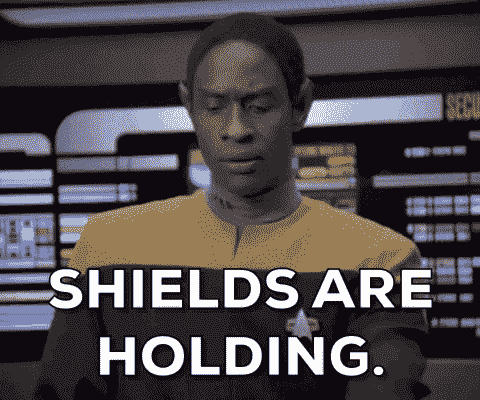
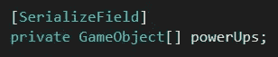
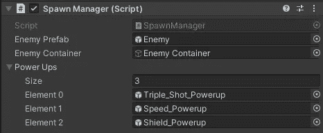
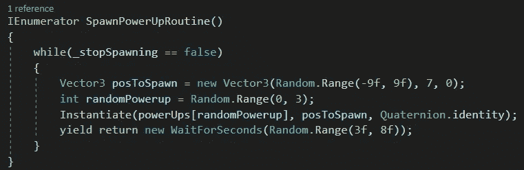
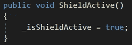
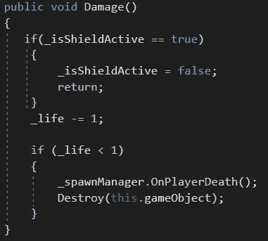

# 2D 射手:产生护盾能量并增加行为

> 原文：<https://medium.com/nerd-for-tech/2d-shooter-spawning-the-shield-powerup-and-adding-behavior-805c2471bf73?source=collection_archive---------21----------------------->

**目标:**将护盾能量增加到种子管理器和脚本行为中，这样玩家在激活时不会受到伤害。

一旦我们在脚本中添加了数组的功能，那么在 spawn manager 中添加 powerup 就非常简单了。我将在另一篇文章中讨论数组，但现在我们想将 spawn manager 脚本中的 tripleshotpowerup 变量改为“powerUps”。我们还需要给变量类型添加括号。

这将允许我们将检查器中的多个对象添加到变量中。

完成后，更改实例化对象的代码，如下所示:

这将使得繁殖管理器随机选择一个数字(包括 0，但不包括 3)并产生匹配的能量。

现在说说盾牌的行为:

我们想要达到的效果是防止玩家在盾牌激活时受到伤害。所以基本上，我们希望伤害方法在这段时间里不做任何事情。我们可以通过在播放器脚本中创建一个新变量“_isShieldActive”并添加一个新的公共方法来实现。

现在转到损坏方法，我们需要添加一个 if 语句:

这将使得当盾牌激活时什么都不会发生，然后一旦玩家被击中一次,_isShieldActive 变量将被设置为 false。“回归”是为了不让剩下的代码被执行。如果护盾没有激活，那么返回会被跳过，玩家会像往常一样受到伤害。

之后，确保在第二种情况下调用 powerup 脚本中的 ShieldActive()方法。