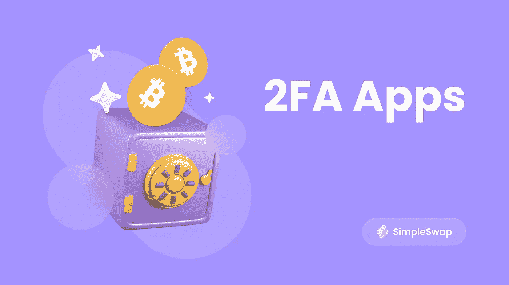
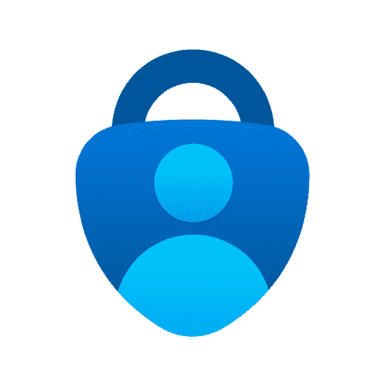
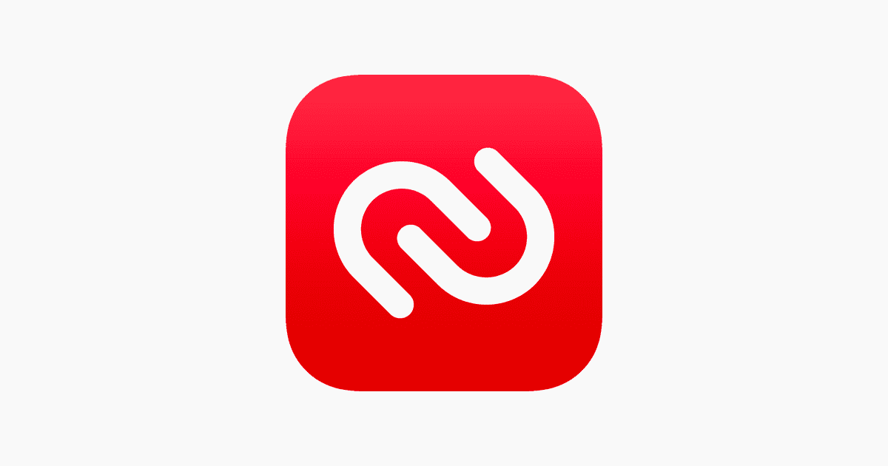
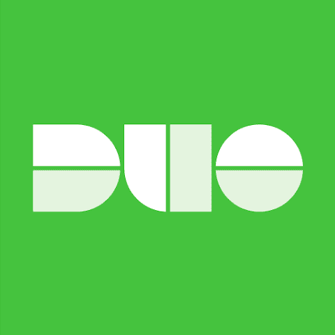

# 2FA 应用程序保护您的加密资金

> 原文：<https://medium.com/nerd-for-tech/2fa-apps-to-protect-your-crypto-funds-df83a86fdc89?source=collection_archive---------2----------------------->

你还记得那段时间，10，000 BTC 你只能买得起一个比萨饼吗？现在你可以用它买车买房了！因此，随着区块链技术和数字货币的发展，加密资产的安全性变得越来越重要。在本文中，我们将了解双因素身份验证(2FA ),它可以帮助您保护您的加密钱包。

# **什么是双因素认证(2FA)？**

身份验证是您需要分两步确认您是帐户所有者的过程。当然，一个账户只需要一些复杂的密码就可以得到保护，但总有被骗子发现的风险，例如，如果你点击一个钓鱼链接。为了确保您的资金安全，不要忘记打开双因素身份验证。

使用 2FA，您必须通过两个步骤才能访问您的帐户。第一种通常是输入密码。对于第二步，您可以使用不同的确认方法，例如:

**短信**。代码将发送到您的手机。然而，这不是第二步验证最安全的选择，因为黑客可以通过一些恶意软件访问你的 SIM 卡。

**电子邮件**。代码将发送到您的电子邮件中。但是请注意，如果黑客有您的 exchange 登录信息，他们也可能有您的电子邮件登录信息。

**基于硬件的认证**。这可能是最好的解决方案，因为你资金的所有代码都在一个物理硬件设备上，你可以把它保存在一个安全的地方。

**特殊应用**。这些应用程序会不断生成用于登录您的帐户的一次性代码。他们中的一些人甚至可以在没有互联网连接的情况下工作。

大概现在 2FA 用起来最方便的就是一个专门的 app 了。你可以把它安装在你的设备上，然后开始免费使用它。让我们仔细看看 2FA 的应用程序。

# 有哪些 2FA 的 app 可以用？

## 排名第一的谷歌认证

用于[安卓](https://play.google.com/store/apps/details?id=com.google.android.apps.authenticator2)、 [iOS](https://apps.apple.com/app/google-authenticator/id388497605) 的应用

谷歌认证是一个非常受欢迎的应用程序，因为它简单。它只是生成代码，没有任何额外的东西，所以弄清楚如何使用它真的很容易。你在这里找不到任何设置-如果你想更改界面或使用一些其他功能，你必须安装另一个 2FA 应用程序。

## 排名第二的微软认证器

[安卓](https://play.google.com/store/apps/details?id=com.azure.authenticator)、 [iOS](https://apps.apple.com/app/microsoft-authenticator/id983156458) 的 App

Microsoft Authenticator 提供了更多功能。它隐藏了屏幕上的代码，所以没有人会意外地看到它们。为了看到代码，你需要点击屏幕。此外，您可以轻松地从不同的设备访问该应用程序，您可以将令牌(特定帐户的代码生成器的名称)保存在云中。此外，要登录微软账户，你只需按下应用程序中的“接受”确认按钮。

## #3 Twilio Authy

用于[安卓](https://play.google.com/store/apps/details?id=com.authy.authy)、 [iOS](https://apps.apple.com/app/authy/id494168017) 、 [Windows](https://authy.com/download/) 、 [macOS](https://authy.com/download/) 的 App

Authy 提供了很多其他 2FA apps 没有的便捷功能。例如，您可以从不同的设备访问它，因为您的所有令牌(生成代码)都存储在云中。别担心，代码是用密码加密的，所以你的数据是受保护的。您也可以设置进入应用程序的代码。这个应用程序有一个问题，你必须使用你的电话号码来注册。因此，如果你不喜欢将你的手机链接到认证者，Authy 不是你的好选择。

## #4 免费游戏

用于[安卓](https://play.google.com/store/apps/details?id=org.fedorahosted.freeotp)、 [iOS](https://apps.apple.com/app/freeotp-authenticator/id872559395) 的应用

如果你不希望你的 2FA 应用程序占用你的设备太多空间，这是你的选择。iOS 版的 FreeOTP app 只有 750 KB，和 Authy (44 MB)相比不算什么。它的接口很简单，但是可以隐藏代码。此外，如果需要，还可以选择手动添加令牌。

## #5 双核移动设备

[安卓](https://play.google.com/store/apps/details?id=com.duosecurity.duomobile)、 [iOS](https://apps.apple.com/app/duo-mobile/id422663827) 的 App。

你喜欢推送消息吗？那你会喜欢这个 app 的。它使 2FA 认证过程变得非常简单:用户只需按下“yes”按钮，而不是打开应用程序复制生成的代码，然后输入到输入窗口中。此外，您可以使用智能手表来接收推送通知。

# 我真的需要 2FA 应用程序来保护我的密码吗？

2FA 应用程序帮助我们妥善保护我们的加密资产免受许多威胁。它们既方便又简单。另外，有很多这样的钱包，你可以选择一个最适合你的来保护你的[加密钱包](https://simpleswap.io/blog/how-to-create-a-crypto-wallet)。

要访问你的 2FA 应用几乎是不可能的。黑客必须从物理上窃取你的智能手机，或者(再次从物理上)在你的设备上安装恶意软件，让你可以远程查看屏幕。2FA 应用程序的代码会不断更新，这样就没有人可以访问你的加密帐户。我们希望这篇文章能帮助你更好地理解 2FA。一定要小心，保证资金安全！

**购买或兑换硬币最简单的方法是使用** [**SimpleSwap 服务**](https://simpleswap.io/?utm_source=medium&utm_medium=portal&utm_campaign=bitcoinetfs) **。**

**SimpleSwap 提醒您，本文仅供参考，不提供投资建议。所有购买和加密货币投资都是你自己的责任。**

**原载于我们的** [**Publish0x 博客**](https://www.publish0x.com/simpleswap-blog/2fa-apps-to-protect-your-crypto-funds-xkppqgw) **。**