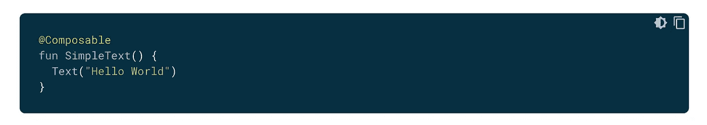
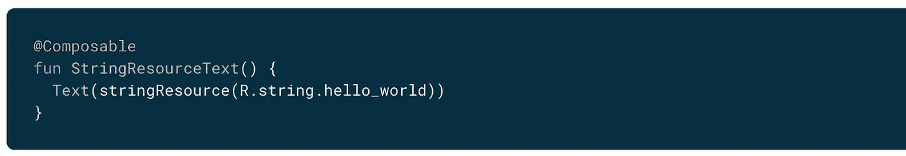
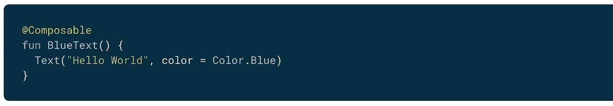
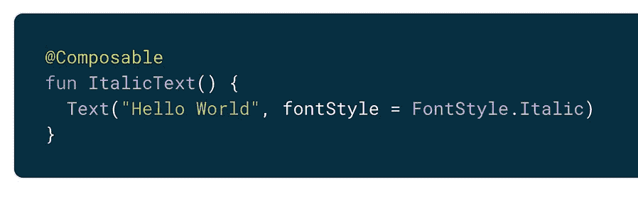
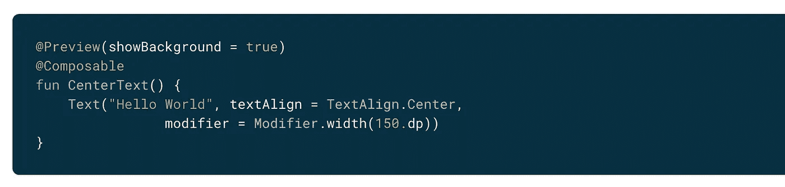
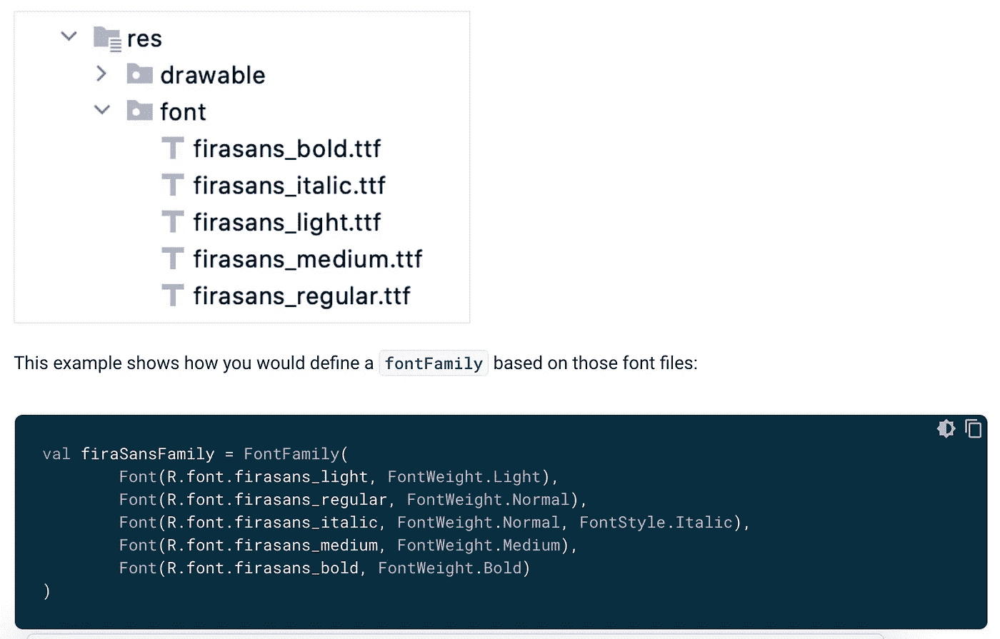
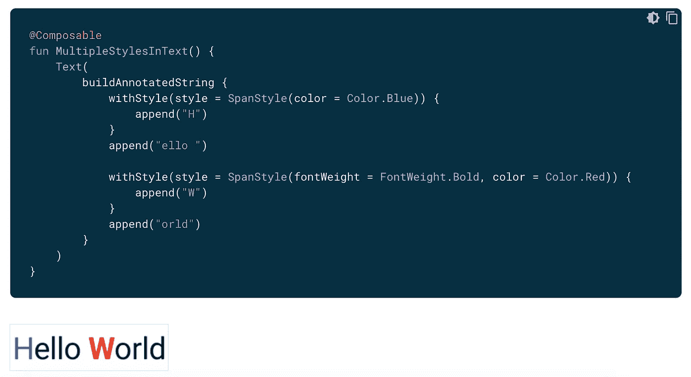
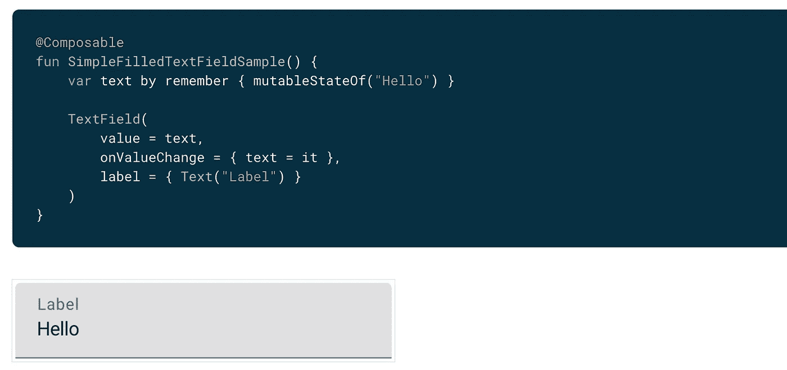
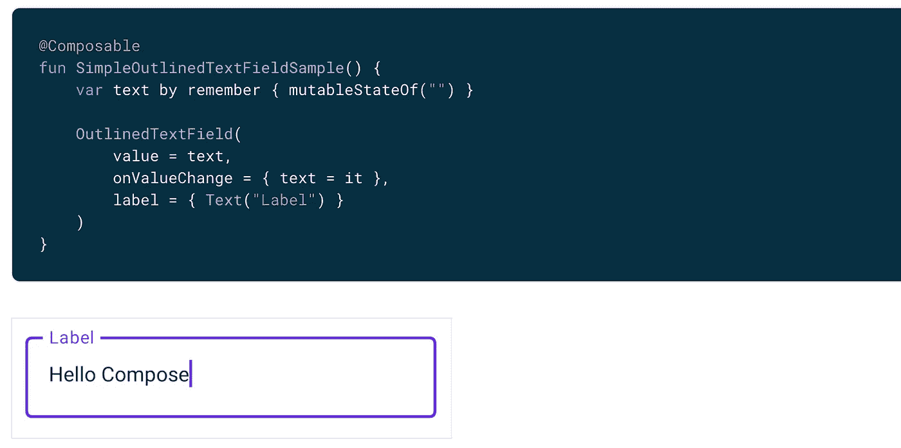

# 可在 Jetpack 撰写中撰写的文本

> 原文：<https://medium.com/nerd-for-tech/2nd-day-of-learning-jetpack-compose-text-411ff103a09e?source=collection_archive---------28----------------------->

大家好，😀
如果您还没有设置基本合成项目，请跳转到第一天学习的 [**合成简介&设置**](https://gondhalesatyam-28082.medium.com/1st-day-of-learning-jetpack-compose-db3865bc5ca4) [🏗️](https://emojipedia.org/building-construction/)

## 撰写中的文本简介

文本是 UI 设计中最重要的核心元素之一。一切从文本开始，以一些复杂的元素结束。在开发过程中，需求总是不满足于普通的元素，但可能会出现对复杂形式的文本和其他元素的需求。

Compose 提供了一个`BasicText`和`BasicTextField`，它们是显示文本和处理用户输入的基本元素。此外，Compose 还提供了`Text`和`TextField`，它们可以按照材质设计准则进行组合。最好使用它们，因为它们提供了一个好的外观和感觉，并且允许用更少的代码进行定制。

使用 Composable 显示文本的基础是[🙂](https://emojipedia.org/slightly-smiling-face/)

图片来自谷歌

大多数情况下，建议使用 String.xml 资源文件中的字符串，这可以通过使用

图片来自谷歌

如果我们进入一些更深层的属性，首先我们可以想到的是用
**1 对文本进行样式化(颜色、大小、样式、背景、对齐、字体等)。文本颜色**

图片来自谷歌

**2。文本大小**

图片来自谷歌

**3。文本样式(斜体、粗体)**

图片来自谷歌

**4。文本对齐**

图片来自谷歌

**5。文本字体** 文本有一个字体系列参数设置为可组合使用的文本。默认情况下，包括衬线字体、无衬线字体、等宽字体和草书字体系列。我们可以将文件放在 Android 的字体资源文件夹中，通过引用来设置字体家族

图片来自谷歌

如果我们想在同一个文本中设置不同的样式，我们必须使用一个`AnnotatedString`，一个可以用任意注释样式进行注释的字符串。
`AnnotatedString`是一个数据类，包含:

*   一个`Text`值
*   `SpanStyleRange`中的`List`，用于位置范围在文本值内的内嵌样式
*   第`List`页，共`ParagraphStyleRange`页，用于文本对齐、文本方向、行高和文本缩进样式

> 注:`TextStyle`用于`Text`组合，而`SpanStyle`和`ParagraphStyle`用于`AnnotatedString`。
> 
> 注:`SpanStyle`和`ParagraphStyle`的区别在于`ParagraphStyle`可以应用于整段文字，
> `SpanStyle`可以应用于文字层面。

图片来自谷歌

哎呀，这完全是关于文本显示文本。但是**入文呢？**🤔🤔

`TextField`允许用户输入和修改文本。有两个层次的`TextField`实施:

1.  `TextField`是材料设计实现。

*   默认样式是[填充](https://material.io/components/text-fields#filled-text-field)
*   `OutlinedTextField`是[轮廓](https://material.io/components/text-fields#outlined-text-field)造型版

2.`BasicTextField`允许用户通过硬件或软件键盘编辑文本，但不提供任何装饰，如提示或占位符

图片来自谷歌

图片来自谷歌

文字基础就这些了。本文可能不会涵盖基于您的复杂实现和用例的所有内容，但是您可以从这里开始。万事如意。[😃](https://emojipedia.org/grinning-face-with-big-eyes/)
您可以克隆此存储库进行基本设置。此外，源代码中所有概念都可以根据相同内容进行更新。
[**https://github.com/SatyamGondhale/LearnCompose**](https://github.com/SatyamGondhale/LearnCompose)

 [## 订阅最新内容并保持更新。

### 订阅最新内容并保持更新。通过注册，您将创建一个中型帐户，如果您还没有…

gondhalesatyam-28082.medium.com](https://gondhalesatyam-28082.medium.com/subscribe) 

如果你认为这对你有帮助，请随意[👏🏻](https://emojipedia.org/clapping-hands-light-skin-tone/)【鼓掌】&分享。谢了。😄