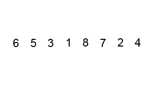
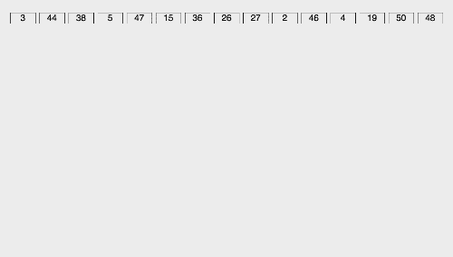

# 3 种奇特的分类

> 原文：<https://medium.com/nerd-for-tech/3-fancy-sorts-d1da76689ed2?source=collection_archive---------23----------------------->

## 合并、快速和基数排序


上个月我写了一篇关于 3 种排序算法的博客。被称为*天真排序*，这三个都有 O(n)的最坏情况时间复杂度。这个星期，我又看了 3 种排序算法，这些算法有点花哨，可能会执行得更快。让我们快速看看这三种*花式*排序是如何工作的，以及为什么它们对我们来说可能工作得更快一点！

## 合并排序


感谢 tajpouria 对算法和数据结构的伟大贡献。真的值得一查！

> *时间复杂度(最好/一般/最差):O(n * Log n)*
> 
> *空间复杂度:O(n)*

“各个击破”是 Merge Sort 的座右铭。Merge Sort 的算法策略依赖于能够将我们的可排序数组分成更小的数组，这使得递归实现变得流行。

无论如何实现，合并排序首先将数组分解为单个值。将数组拆分为单个值后，它开始重新构建数组，首先构建成对的排序值。

在第一次迭代中，它对相邻的索引对进行排序。接下来，它对*对相邻的索引对*进行排序，依此类推，直到它按照排序的顺序重新构建整个数据集。合并本身花费了 *O(n)* 的时间，而在排序过程中跟踪的[二叉树](https://en.wikipedia.org/wiki/Binary_tree)给算法带来了 *O(log n)* 的时间，给出了 *O(n*log n)的总时间复杂度。*

## 快速排序



[谢谢维基共享！](https://commons.wikimedia.org/wiki/File:Quicksort-example.gif)

> *时间复杂度(最差):O(n )*
> 
> *时间复杂度(最佳/平均):O(n * Log n)*
> 
> *空间复杂度:O(Log n)*

理解快速排序的关键是它对*枢轴的使用。*在快速排序算法的每次迭代中，从数组中选择一个值作为中枢。在整个迭代过程中，我们围绕轴心对其余的值进行排序，因此较低的值在轴心的左侧，较高的值在右侧，有效地将轴心放在最终排序数组所需的位置。在第一次迭代之后，我们在枢轴的左边有一个未排序的部分，在右边有一个，在每个部分中，我们选择一个新的枢轴并继续排序。一旦每个值都被用作枢纽，我们就知道数组已经排序了。

在迭代中我们正在处理的子节中，我们实际上对每个轴心周围的值进行排序的方式是通过查看轴心左侧和右侧的值。我们找到左边的第一个值，它比我们的枢纽大，然后把它和右边的第一个值交换，它比我们的枢纽小，我们继续这样做，直到所有比枢纽小的值都在左边，所有比枢纽大的值都在右边。

像合并排序一样，快速排序有可能以 *O(n*log n)的时间复杂度执行。*然而它的表现可以和 *O(n)一样差。*快速排序运行良好的关键是明智地选择支点。我们的目标是选择一个尽可能均匀地划分数组的枢纽，这样我们就可以平均分配工作。选择支点的一种流行方法叫做*三中值*法，即查看第一个值、中间值和最后一个值，对它们进行排序，并使用中间值作为支点。在上面 gif 的未排序数组中，我们选择了[1，4，6]作为我们的三个值，而[4]将是我们的第一个支点。令人惊讶的是这种方法的效果如此之好。

## 基数排序



[谢谢 programmersought.com](https://www.programmersought.com/article/18455289497/)

> *时间复杂度(最好/一般/最差):O(nk)*
> 
> *空间复杂度:O(n+k)*

基数排序用于对值进行排序的策略是根据它们的[](https://en.wikipedia.org/wiki/Radix)*基数对它们进行排序，即根据每个数字中数字的位置，从最低有效数字开始，一直到最高有效数字。*

*对于基数排序来说，我们需要为基数中的每个数字设置*队列*。因此，如果我们要对人类友好的十进制数值进行排序，我们将为每个数字从 0 到 9 建立队列。但是……什么是队列？*

*把队列想象成一条线，无论你把什么放在第一个*第一个*里，第一个*就会出来。正如你将看到的，我们放入队列的顺序和取出的顺序对于基数排序来说是非常重要的。**

*例如，对于这组十进制值:`[3,44,38, 5,47,15,36, 26,27,2,46, 4,19,50,48]`，在第一次迭代中，我们将按照*位的*位将这些值排序到队列中。我们会看到这样的队列:*

```
*0: [50]
1: []
2: [2]
3: [3]
4: [44,4]
5: [5,15]
6: [36,26,46]
7: [47,27]
8: [38,48]
9: [19]*
```

*…当我们*将这些值出队*时，从 0 队列开始，回到数组中，我们最终得到:*

```
*[2,3,44,4,5,15,36,26,46,47,27,38,48,19]*
```

*然后我们开始第二遍，这一次根据第二个最不重要的数字(十位)创建队列，得到:*

```
*0: [2,3,4,5]
1: [15,19]
2: [26,27]
3: [36,38]
4: [44,46,47,48]
5: []
6: []
7: []
8: []
9: []*
```

*…这一次，当我们出队时，我们有一个排序数组:*

```
*[2,3,4,5,15,19,26,27,36,38,44,46,47,48]*
```

*所以当我们使用基数排序时，我们在集合上进行 *k* 次迭代，每次排序在 *O(n)* 时间内，这就是我们得到 *O(nk)* 时间复杂度的地方。*

*好花哨！*

*这三种比我们上个月[讨论的](https://s-satsangi.medium.com/insertion-sort-selection-sort-and-bubble-sort-5eb16d55a4de)要快得多，而且它们……嗯……有点花哨。实现 Merge &快速排序给了我们一个在递归上工作的机会，基数排序上的队列也很酷。我要去看看我是否能编写一个 Merge 或 Radix 排序的例子，利用它们是稳定排序的事实。下周见！*