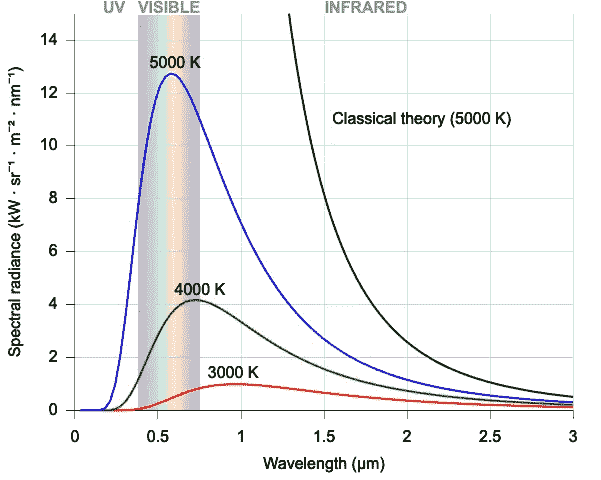
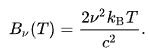
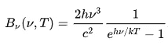
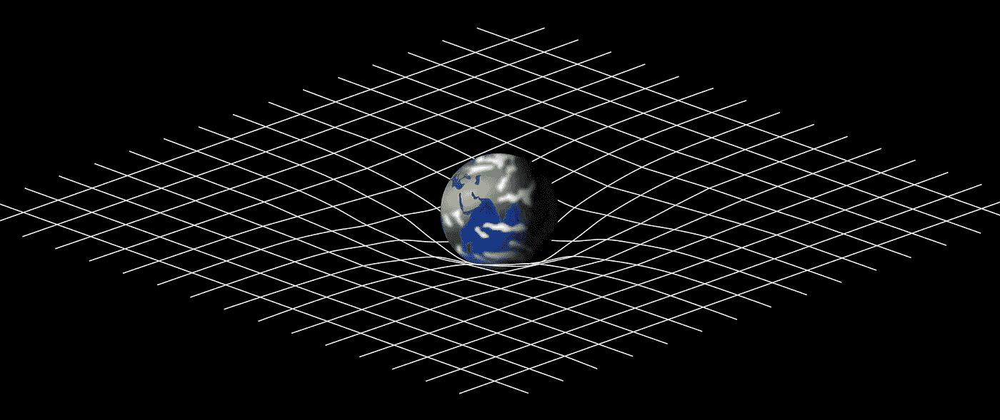
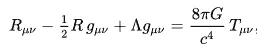
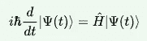
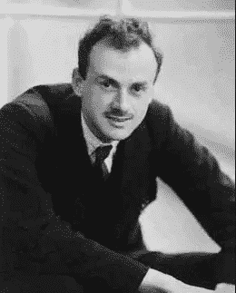
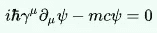

# 意外揭开自然奥秘的方程式

> 原文：<https://medium.com/nerd-for-tech/3-mathematical-equations-which-accidentally-uncovered-the-mysteries-of-nature-69460a271ef0?source=collection_archive---------29----------------------->

今天，我们将讨论 3 个方程，一个导致了量子力学(QM)的诞生，另一个奠定了广义相对论的基础，最后，非常恰当地，一个首次成功尝试将 QM 和相对论结合起来的方程。

理论物理学家的追求是用一个共同的基础理论来解释不同的现象。一个理论将由解释观察结果的数学规则组成。通常的方法是将实验数据与数学模型进行拟合。然而，在许多情况下，数学和它的美丽迫使这些物理学家的手(或者我应该说，头脑)去看方程，并试图在此基础上“适应自然”。我们将会看到它导致了什么，尽管最初会很奇怪的暗示，以及它是如何展开来发现一些关于自然本身的基本的东西。

> **量子力学的起源**

正常物质，由于其内部粒子的内部运动，会发出电磁辐射(姑且称之为热辉光)。像太阳(表面温度~6000K)发出黄色光，我们人体(表面温度~300K)发出低频红外光等等物质。

[根据瑞利-金斯定律预测的黑体辐射](https://en.wikipedia.org/wiki/Black-body_radiation#:~:text=Black%2Dbody%20radiation%20is%20the,%2C%20non%2Dreflective%20body).)

上图是恒温黑体亮度随频率变化的实验曲线图。

直到 20 世纪初，这条曲线还是一个数学迷。Rayleigh 和 Jeans 开始用一个[新概念](https://en.wikipedia.org/wiki/Equipartition_theorem)来解释这一点，即一个物体的热能将在粒子振动的所有可能能量状态中平均分配。他们假设粒子可以用任何能量振动，越低越好。

由此得出的方程(如上图所示，图中黑色曲线所示)预测，随着频率的增加，强度最终将趋近于无穷大。(这就是俗称的[紫外线灾难](https://en.wikipedia.org/wiki/Ultraviolet_catastrophe))

马克斯·普朗克认为这场灾难是一场意外。在他描述为绝望的时刻，他试图引入一个数学技巧，假设一个粒子只能以最小能量的倍数振动。他给这个最小能量分配了一个数字( *h* ν)，其中 *h* 是一个非常小的数字，ν是频率。他不相信量子化的能量状态，相反他相信术语'*' h '*会在最终的方程中被抵消，因为不应该有最小能量状态。但事实并非如此。

更确切地说，他提出的这个方程完美地预测了黑体曲线。最初被介绍为一个技巧的东西，现在暗示了 h 是一个真实的、基本的自然实体。这导致了能量实际上是量子化的想法。 *h* 是著名的普朗克常数。这是量子力学的起源，后来导致了像玻尔、海森堡和薛定谔的量子理论。

> **广义相对论**

时空曲率示意图(维基百科)

爱因斯坦最初相信静态宇宙的概念，这个概念在当时被认为是正确的。1915 年，他提出了广义相对论。他对他的方程不满意，因为他们预测整个宇宙最终会在重力的作用下收缩，预测宇宙的末日会塌缩。

为了抵消这种可能性，1917 年，爱因斯坦增加了一个宇宙常数(λ)。他赋予它一个正好抵消重力的值，这样宇宙就保持静止(尽管处于不稳定的平衡状态)。他后来称这个想法为“他一生中最大的愚蠢”。1931 年，哈勃望远镜发现宇宙实际上是在膨胀而不是静止的，从而颠覆了物理学界。

所以，宇宙不是静止的。爱因斯坦做了什么？他抛弃了(λ)的概念，提出了一个宇宙不断膨胀的模型，其中λ= 0。

*注* : *这是很有可能的，所有的力都有吸引力并不意味着宇宙现在不能膨胀。就像可以观察到一个球尽管受到向下的力(由于初始速度)仍在向上运动一样，宇宙也可能在只有重力的情况下膨胀。爱因斯坦的宇宙膨胀模型λ= 0 一直被认为是正确的，直到 1998 年，我们的理解将永远改变。*

两个天文学家小组对遥远的超新星进行了观察，以表明星系不仅仅是在远离我们，而是在加速远离我们。这意味着有一种潜在的能量迫使他们远离我们。这意味着宇宙常数λ确实存在，并且λ> 0。这个常数λ是存在的，但从未被直接观测到，它被称为真空的暗能量。

对初始 GR 方程进行数学调整，以产生一个静态宇宙，但后来由于观察到一个膨胀的宇宙而被放弃，在近一个世纪之前不会重新出现，以预测真空最奇异的属性，即**暗能量**，这是一个“突然出现”的术语对我们理解宇宙的影响。

> **狄拉克方程**

到 20 世纪初，我们理解了物质的粒子波性质。薛定谔方程预言了任何量子系统波函数的演化。然而，它也有自己的问题。

含时薛定谔方程

1.  薛定谔方程只能预测慢速运动粒子的波函数。从狭义相对论中我们知道，距离和经历时间的值依赖于观察者。这是一个大问题，因为亚原子粒子确实以非常高的速度运行。
2.  *薛定谔方程对磁场中存在的电子预测了错误的结果* 物理学家已经确定了电子的隐藏量子态(称为电子自旋，可以取 2 个值)，这在薛定谔波函数中没有考虑到，在磁场中，自旋方向非常重要。

study.com 保罗·狄拉克

1928 年，天才的保罗·狄拉克解决了薛定谔方程中的这些问题。试图用两种可能的自旋状态来模拟电子，他从爱因斯坦的方程开始，试图用量子形式中各自的项来代替能量和动量。由此产生的方程非常复杂，可以称之为数学上的“丑陋”。

在试图解决混乱的过程中，他偶然发现了一个好主意。他意识到，一个四分量的系统把复杂的方程简化成了一种优美的形式，而不是求解一个两分量的电子系统。

[狄拉克方程](https://en.wikipedia.org/wiki/Dirac_equation) (μ假设值为 0，1，2，3)

他刚刚在四分量电子中引入了两个新的自由度，甚至没有意识到它们代表了什么。由此得出的方程如此优雅，让他相信自己走在了正确的道路上。
他的方程在预测磁场中快速移动的电子的演化方面获得了广泛的成功(解决了上面的问题 1 和 2)。

*   *但是这两个额外的组件是什么呢？*

通过计算这两种新状态的能量，狄拉克发现这些粒子可以表现出负能量和电荷，与电子的电荷完全相反。姑且称之为反电子。解释这些现象的理论暗示，如果一个电子与一个反电子相互作用，它们都会湮灭并释放出所有的能量。

狄拉克方程的额外分量已经预言了反物质的存在。1928 年后不久，实验物理学家成功地观察到宇宙射线中的反电子(称为正电子)。**反物质是真实存在的，甚至在我们意识到它的存在之前，狄拉克就能够预测和计算它们的性质。**

*对数学美的追求为狄拉克和我们其他人结出了果实。没有预先定义的方法，追求某种形式的理论美或优雅而不是实验含义，这是物理学中最优秀的头脑之间长期的哲学辩论。*

干得好，如果你到了这里。谢谢你的耐心。