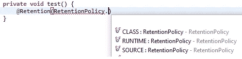
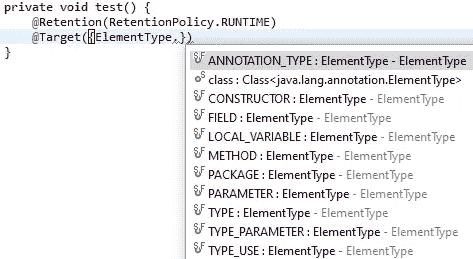
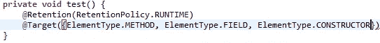
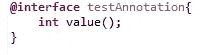
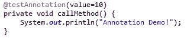

# 在 Spring Boot 创建自定义注释的 3 个快速步骤

> 原文：<https://medium.com/nerd-for-tech/3-quick-steps-to-create-custom-annotations-in-spring-boot-2ef9ba2a04b7?source=collection_archive---------0----------------------->

注释是向源代码添加元数据信息的一种方式。有时，需要根据需求在 java 框架中创建定制注释。这个博客为你提供了一套快速创建的简单步骤。

让我们从理解 3 个注解开始，来达到这个目的！

# 1)@保留时间:

这个注释基本上告诉编译器我们需要注释的类型保留多长时间。以下是它的 3 个可用值:

顾名思义，带有保留策略 **SOURCE** 的注释将只与源代码一起保留，并在编译时被丢弃。具有保留策略**类**的注释将保留到编译代码，并在运行时丢弃，而具有保留策略**运行时**的注释将通过运行时对 JVM 可用。默认保留策略类型是类。

# 2)@目标:

这指定了我们希望在什么级别上拥有我们的注释。它可以是类级别、方法级别等等，如下所示:

我们可以为单个注释指定多个元素类型，如下所示:

# 3)@界面

@interface 基本上是用来创建自定义注释的。因此，它定义了将与其属性一起使用的注释名。

现在，我们可以像任何内置 java 注释一样实现自定义注释，如下所示:

# 结论:

Java 注释是为程序员、库或第三方 API 创建额外数据的一种神奇方式。但是，我们需要注意运行时编译和查找注释的额外开销。

希望你喜欢。

如果您有任何相关的疑问，请随时联系我。我很乐意帮助你。保持联系:)

## 如果你喜欢这篇文章，请为它鼓掌。对我来说，这将是真正的升值。

## 推特:[https://twitter.com/SakshiKhandlwl](https://twitter.com/SakshiKhandlwl)
领英:[www.linkedin.com/in/sakshikhandelwal276](http://www.linkedin.com/in/sakshikhandelwal276)