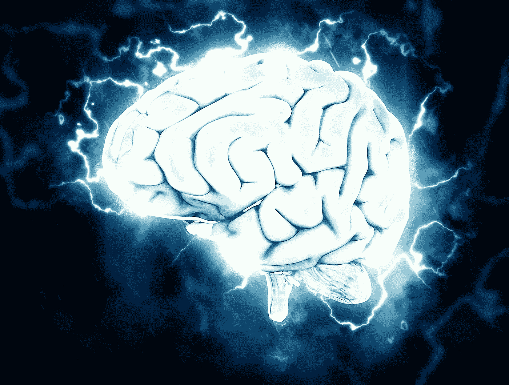
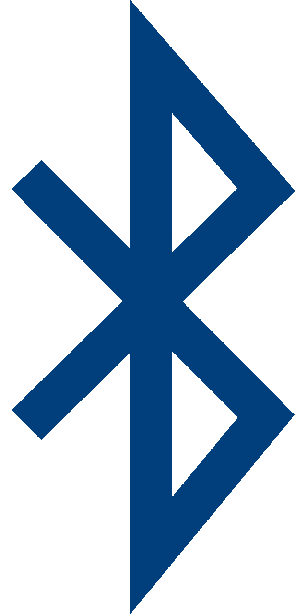

# 3 个理由——neural ink 不应商业化

> 原文：<https://medium.com/nerd-for-tech/3-reasons-neuralink-should-not-be-commercialized-cb004566da71?source=collection_archive---------24----------------------->

## 未来危险吗？

## 技术进步太多是对人类的威胁吗？

有多少次我们发现自己在想或说*“哦..太酷了！我希望，我也可以用我的大脑和我的设备互动。我希望这是未来”*看完每一部科幻电影。

来自 [Pixabay](https://pixabay.com/?utm_source=link-attribution&utm_medium=referral&utm_campaign=image&utm_content=1845962) 的[皮特·林弗斯](https://pixabay.com/users/thedigitalartist-202249/?utm_source=link-attribution&utm_medium=referral&utm_campaign=image&utm_content=1845962)的图片

我们都是这么说的，或者希望现实生活中存在一些东西。忽略了现实世界的挑战和犯罪方面。我们一直在想象一个美好的未来，它是在电影或书籍中创造并展示给我们的。

现有的技术被滥用的范围已经超过了它被善用的范围。随着最近美国财政部和许多其他科技巨头一起受到黑客攻击，因为太阳风公司的一个程序有一个恶意代码，几个月来一直未被注意到。

毫不犹豫地说一句就够了——在这个现代时代，一切都是腐败的(可以被黑客攻击的)。

让我们看看 Neuralink 不应商业化的 3 个原因。

# 蓝牙

蓝牙一生都因其薄弱的安全因素而臭名昭著。事实上，蓝牙一直被认为是最弱的通信设备之一。

图片来自 [Pixabay](https://pixabay.com/?utm_source=link-attribution&utm_medium=referral&utm_campaign=image&utm_content=5306027)

这是复杂的可能通过蓝牙跟踪，干扰，欺骗，或嗅探。

Neuralink 使用蓝牙连接到我们的智能手机进行所有通信、数据传输或任何类型的交互。

很难想象，有这么多的安全漏洞和一个像 Neuralink 这样连接到我们大脑的设备——它可以访问我们的思想、记忆等等，正在研究一种像蓝牙这样有着坏名声和安全问题的技术。

# 记忆

回忆是美好的，也是痛苦的。人类忘记生活中某些记忆或事件的能力是一种福气。Neuralink 承诺拥有超人的能力，即极其强大的大脑，这将允许我们超快速地思考，准确地记住我们的记忆和时刻，等等。

阿德里安·斯旺卡在 [Unsplash](https://unsplash.com?utm_source=medium&utm_medium=referral) 上拍摄的照片

问题是蔑视人性，试图将人类机械化。技术和人类物种的混合或融合——所谓的“类人生物”可能看起来很酷，可能对世界有所帮助。但是我们生活在现实中，我们没有一个编剧可以把一个特定的事件改变成我们喜欢的样子。

# 监控—云上的数据

在 [Unsplash](https://unsplash.com?utm_source=medium&utm_medium=referral) 上[科普高清](https://unsplash.com/@scienceinhd?utm_source=medium&utm_medium=referral)照片

同时，每个人都熟悉黑镜的“你的全部历史”一集。这一集和这项技术并没有完全脱离 Neuralink 被植入我们大脑的现实，以及我们的未来可能会变得如何，是好是坏。事实上，这可能有一天会发生——以一种不可想象的方式。

此外，云并不完全安全，不会受到任何威胁或攻击。我们的记忆、数据等等将被政府强制上传到我们选择的云存储公司。

这将是强制性的，就像现在的人寿保险一样，人们必须将数据/内存云存储起来，以便获得服务，或者在极端情况下，被承认为公民。

在大多数国家，这甚至可以通过法律强制执行。

虽然这项技术总体来说还不错，但大规模商业化肯定会带来一个大规模监控的世界，这将比当今中国的监控更加恐怖，或者是一种彻底的奴隶般的生活。

# 残疾人神经链接

该产品的完美候选人是所有面临挑战的人——无论是精神健康疾病、瘫痪、失明，还是该设备可以帮助的任何事情。

这是一种改变生活的产品，最好是以限定的形式，面向有限的人群。

虽然这款产品是针对这部分人群设计和推出的。这项技术后来被商业化并不是一件奇怪的事情——因此，我想说的是。让 Neuralink 为其引入的目的而使用，并将市场扩展到其他人群——极有可能给我们自己带来浩劫。

# 最后说…

未来被认为是光明灿烂的。我们现在看到并意识到这种偏离有多远，以及我们如何处于自我毁灭的边缘。最近的突破，如人工智能、智能手机、智能设备——当科技行业空前繁荣时，我们都欢呼雀跃——我们现在已经看到它对我们的影响，无论是精神疾病、缺乏动力、网络欺凌还是身体形象问题。如今，每个人都希望生活能像过去一样简单。

而刚刚开始爬行的人工智能——全世界都怀疑它的用例，并担心它是否会对人类构成威胁。

我不是说电影或书籍决定了我们的未来或我们的技术进步。

事实上，埃隆·马斯克被全世界的公民欢呼为一个有远见的人，他被认为是在我们之前诞生的最伟大的头脑之一。他表达了对人工智能的担忧，以及对人类走向和可能结束的方式的担忧。乔·罗根的播客节目。

我只是在描绘另一个现实，同时也展示了我们有多少次让自己成为痛苦、毁灭、剥削的工具，以及为了更好的未来而在不知不觉中制造精神健康问题的产物。

我只希望我们有一个安全的未来！