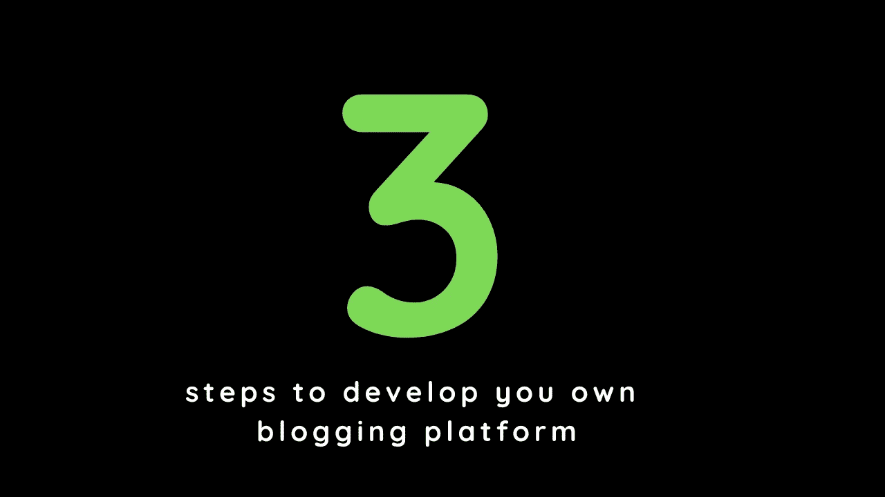

# 开发定制博客平台的 3 个步骤

> 原文：<https://medium.com/nerd-for-tech/3-steps-to-develop-your-custom-blogging-platform-28cd163694d0?source=collection_archive---------1----------------------->

[网站](http://ihatereading.in)

## 在后台

从开发一个编辑器到在数据库中存储数据和在网站上获取数据，这三个步骤我们可以建立自己的博客平台。

以下是步骤-

# 01

编辑器-开发编辑器来编写您的内容。你可以使用 Editorjs，Draftjs 甚至 UI 库，比如…