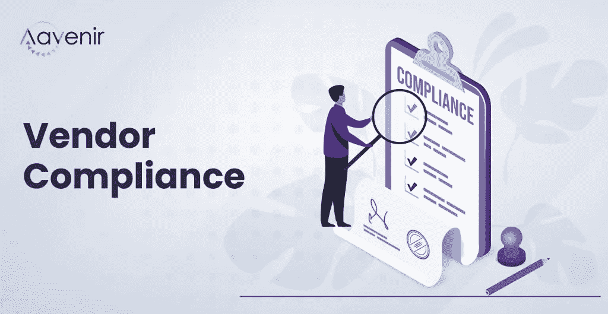

# 确保供应商合规的 3 种万无一失的方法(和成熟的技巧)

> 原文：<https://medium.com/nerd-for-tech/3-sure-fire-ways-and-proven-tips-to-ensure-vendor-compliance-40ceb2192351?source=collection_archive---------2----------------------->

您可以从两组方面来衡量供应商合规性— **基本合规性和监管合规性**。基本合规性检查通常发生在不受监管的行业，包括供应商合规性政策，该政策概述了法律要求和强制性义务，还包括定期评估。另一方面，法规遵从性在政府监管的行业中非常突出，如医疗保健、金融、银行和保险。

供应商合规性的两个方面都必须符合强制性法律法规以及政策规定。

以下是组织确保供应商合规性的 3 种万无一失的方法。

# **1-供应商评估**

组织必须在选择供应商之前进行供应商尽职调查..除此之外，审查他们的财务报表，经审计的年度报告，信用记录，资格分数，声誉等。，并对其进行彻底评估。

> **提示**:为了简化您的工作，请下载[供应商评估工作表](https://aavenir.com/resource/vendor-evaluation-worksheet/)，根据卡特的 10 Cs 模型评估您的供应商的整体表现。无论您是否已经与供应商接洽或计划与他们合作，它都会有所帮助

# **2-风险评估**

供应商风险评估确定并评估与供应商的运营和产品相关的潜在风险或危害，以及它们对您的组织的潜在影响。当您执行第三方供应商风险评估时，您将确定不确定事件最有可能产生的影响，然后识别、衡量并确定它们的优先级。此外，在启动供应商入职流程之前，您应该执行多项分析，以评估签订合同关系的风险(以及风险发生的可能性)。

> **提示**:利用此[供应商管理风险评估清单](https://aavenir.com/resource/vendor-management-risk-assessment-checklist/)立即了解供应商管理风险，涵盖企业级供应商风险评估计划的关键组成部分。

# **3-供应商合规政策创建**

供应商合规性政策的内容因组织和行业而异。企业使用它们的主要原因之一是为了涵盖有助于确保从开始到结束的平稳过程的主题。除了遵守法规要求和其他要求外，一份精心制定并经双方同意的**供应商合规政策**有助于您更好地与供应商接触和沟通，以避免不可挽回的损失并以最高标准执行。

> **提示**:快速开始使用这份[供应商合规性清单](https://aavenir.com/resource/vendor-compliance-checklist/)来识别、减轻和更好地控制供应商风险，同时提高您组织的安全性。

# **最后但同样重要的是，持续的供应商管理**

借助供应商管理解决方案，实现自动化和优化供应商入职，克服协作效率低下的问题，遵守法规要求，并在整个供应商生命周期中提供令人愉快的体验，该解决方案可提供互联的供应商管理体验，同时在所有级别遵守供应商合规性。

## **使用 Aavenir Vendorflow，供应商在 SLA 和合同义务方面的合规性提高了 60%。** [**学习如何**](https://aavenir.com/resource/aavenir-vendorflow-centralized-vendor-management-portal-on-servicenow//)

# **补充如下:**

[供应商合同中可提高 CCPA 合规性的 10 个条款](https://aavenir.com/ccpa-clauses-vendor-contract-management/)

[供应商合规政策包括哪些内容，谁来定义合同条款？](https://aavenir.com/glossary/vendor-compliance/)