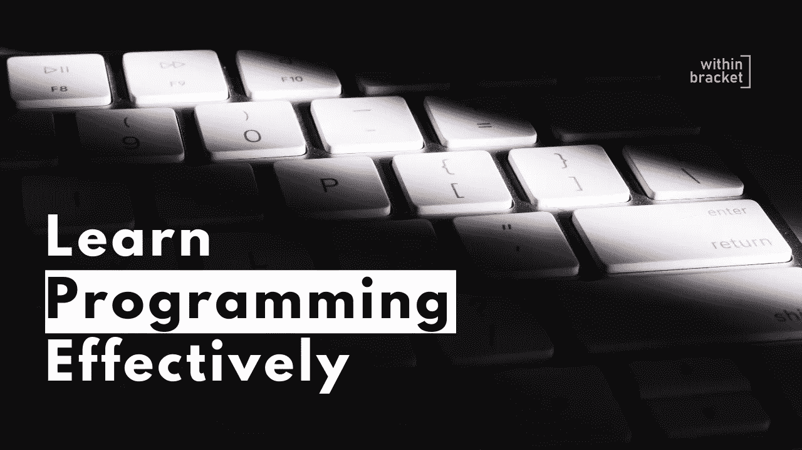

# 编程时要学的 3 件事。

> 原文：<https://medium.com/nerd-for-tech/3-things-to-learn-while-programming-2e9b42d8b014?source=collection_archive---------5----------------------->

当谈到编程时，大多数人认为这只是一种编程语言，他们需要加速他们的编程之旅。但现实远非如此。

是的，人们通常认为程序员只是坐在角落里写代码，但是作为一名程序员，你也需要一些软技能，比如沟通和协作——我们将在未来的文章中讨论软技能，但是在这一篇文章中，我们将讨论一些编程时需要学习的基本知识。

让我们开始吧:

# 1.对英语的理解:

作为一名程序员，你需要了解英语，因为大部分文章和内容都是英语的——如果你懂英语，最好能找到相关的内容。这也有助于提高你的沟通技巧。所以你最好有。

# 2.逻辑思维:

程序是建立在逻辑之上的，作为一名程序员，你要花大部分时间思考，而不仅仅是编码。所以你需要训练你的大脑进行逻辑思维；否则你将很难写出有点复杂的代码。

在我看来，解决问题和逻辑思维是程序员应该具备的重要工具之一。

# 3.了解伪代码:

正如我前面提到的，您不需要担心选择第一种编程语言，但是您应该知道如何编写伪代码。

伪代码只是编写逻辑的简单方法，不需要使用任何复杂的语法。从长远来看，了解伪代码也会帮助你。因为它是独立于语言的，所以任何编程背景的人都可以很容易地理解你的逻辑。

所以你有它。在我看来，这是一个程序员从一开始就应该知道的三件重要的事情，如果你知道其他的事情，请在评论中告诉我。

还有 btw，我也有这篇文章的视频版。所以如果你更喜欢视频，那么你也可以看看。这里是链接。

感谢阅读。下期再见:)

https://media.giphy.com/media/xUySTVNHpdACknfKuc/giphy.gif