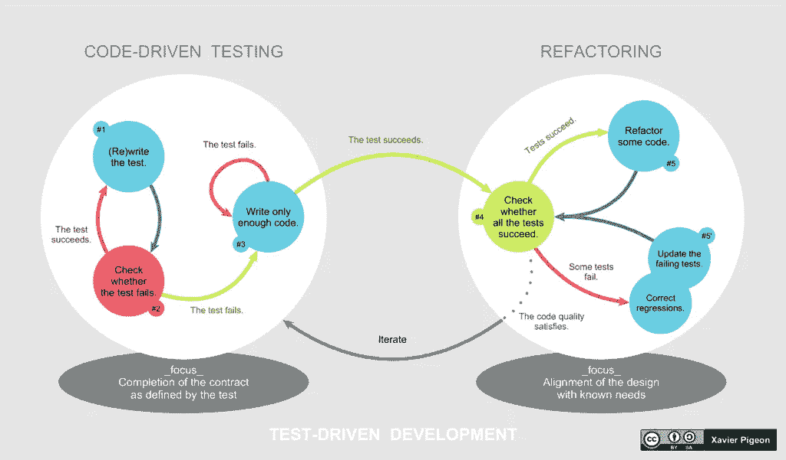
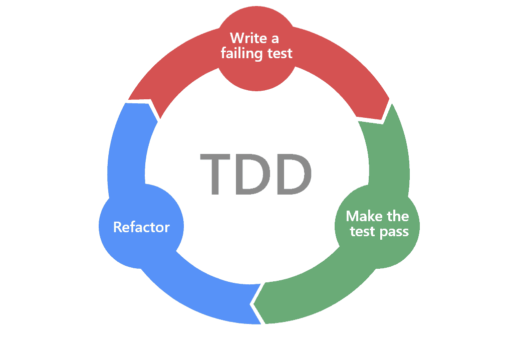

# 作为数据科学家，你应该知道 TTD 的 3 件事

> 原文：<https://medium.com/nerd-for-tech/3-things-you-should-know-about-ttd-as-a-data-scientist-108038c2a96a?source=collection_archive---------6----------------------->

> *“测试显示存在，而不是不存在 bug”*~ e . w . Dijkstra

你会同意我的观点，测试我们的代码在数据科学或软件项目中非常重要。例如，如果你现在用参数写一个函数，你将需要用一些值来调用你的函数，以确保你的函数能完美地工作。这就是单元测试的用武之地。它允许您验证您的代码是否如您所愿。然而，在单元测试中，您在编写代码之后测试您的案例，那么在编写代码之前编写案例来测试您的代码呢？这是*测试驱动开发的基石。*测试有助于在部署后造成任何重大影响之前发现错误和故障。这就是为什么 Dijkstra 说:“*测试显示了 bug 的存在，而不是不存在。”*

出于多种原因，数据科学家需要在部署之前执行测试。在软件工程和数据科学的过程中，可能会出现难以检测的问题，例如编码不正确的数据、意外的中断假设、对功能的不当使用等等。为了捕捉这些错误，对代码进行质量检查是不够的。还需要对分析的准确性进行适当的检查。因此，适当的测试将有助于减少意想不到的缺陷，并可以对我们的结果更有信心。你可以在这里了解更多信息

*测试驱动开发(TDD)是数据科学工作流程的一个重要方面，然而，许多数据科学家不知道 TTD 代表什么以及如何利用它的力量。在这篇文章中，我将带你了解作为一名数据科学家应该知道的关于 TTD 的五件事，不管你的水平如何(初学者、中级等)。*

1.  TTD 是一种软件方法，在这种方法中，你甚至在编写代码之前就为你的程序编写测试用例。TTD 鼓励简单的设计并激发自信。它让你在编写代码之前提前考虑用户将如何使用你的项目。根据维基百科的说法，“**测试驱动开发** ( **TDD** )是一个[软件开发过程](https://en.wikipedia.org/wiki/Software_development_process)，依赖于在软件完全开发之前将软件需求转换为[测试用例](https://en.wikipedia.org/wiki/Test_case)，并通过针对所有测试用例重复测试软件来跟踪所有软件开发。这与先开发软件，后创建测试用例相反。
2.  TTD 遵循三个相互交织的过程:代码、测试和设计(或者重构意味着重写你的代码)。这三个过程让我们清楚地了解了 TDD 的优势。

TDD 的主要优点是它确保开发团队为他们的每一段代码创建测试用例。这是确保我们代码满足所有需求的好方法。

这种方法的另一个优点是，它迫使开发人员在为软件的特定部分编码时查看失败的案例。最后，TDD 确保你对你编码的每一个需求/功能都有测试用例。

3.TTD 允许我们捕捉两种主要类型的错误:数据科学生命周期中的实现错误和解释错误。执行错误是由于我们的代码未能正确执行而产生的。例如，使用错误的运算符或值等，而错误的解释是对我们的报告或结果的错误解释和误解。