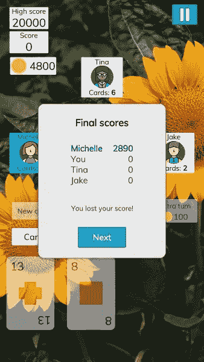
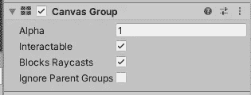

# 在 Unity 中隐藏/显示画布元素的 4 种方法

> 原文：<https://medium.com/nerd-for-tech/3-ways-to-hide-show-canvas-elements-in-unity-ecf47d74f945?source=collection_archive---------0----------------------->

在 [Whot 卡上显示最终分数](https://whotcards.page.link/QEjB)

当使用 Unity 画布时，有时你需要改变 UI 元素的可见性。例如，您可能需要使一个对话框对用户可见，然后在用户与它交互时隐藏该对话框。Unity 允许我们以不同的方式做到这一点，当它们派上用场时，它们各有各的情况。以下是其中的一些:

# 1.使用游戏对象。SetActive()

方法激活/去激活场景中的游戏对象，这取决于你作为参数传递给它的布尔值。

关于这种方法需要注意的一点是，由于游戏对象被停用，因此没有任何附加到它的组件被启用。因此，当我们有一些代码需要运行时，无论 UI 元素是否可见，这种方法都不合适。

例如，我们可能试图通过使用像 [UniRx](https://github.com/neuecc/UniRx) 这样的编程库来实现代码中的数据和视图分离。我们可能有一个类似于`DialogOpen`的布尔反应属性。我们希望场景中的某个对话框基于`DialogOpen`的值来切换其可见性，因此我们从附加到该对话框的`Dialog`脚本订阅对`DialogOpen`的更改。如果我们试着这样实现呢？

不幸的是，如果默认情况下游戏对象在场景中被设置为非活动状态，那么这段代码将无法正常工作。因为对象被停用，所以`Dialog`组件不会被启用，所以我们的`Start()`方法永远不会被调用。

我们可以通过在场景中默认启用对话框，然后从`Start()`调用`SetActive()`来取消激活它来解决这个问题。因为`Start()`在第一次框架更新之前被调用，所以在我们隐藏它之前，用户看不到对话框。

# 2.使用图像。启用

在画布中显示/隐藏 UI 元素的另一种方式是设置其`Image`组件的`enabled`属性。当然，这只适用于游戏对象实际上有一个`Image`组件的情况，所以它不适用于文本之类的东西。

现在在我们的对话中使用这种方法:

还值得注意的是，这不会影响游戏对象的子对象的可见性，所以当您需要隐藏对象及其所有子对象时，这种方法没有帮助。

# 3.使用 CanvasGroup

我们将讨论的第三种方式是将一个`CanvasGroup`组件附加到 UI 元素上。`CanvasGroup`有一些属性，您可以从编辑器或代码中设置。

`Alpha`属性控制 UI 元素的透明度。`Interactable`属性，顾名思义，决定了元素在检测到输入时是否应该接受我们的输入。`Block Raycasts`基本上决定了元素是否应该检测任何输入。

现在让我们在对话中尝试一下。当`DialogOpen`的值变为`false`时，我们希望对话框变得不可见，并允许我们与画布中呈现在它后面的元素进行交互。

# 4.使用 CanvasElementVisibility

你也可以使用 [CanvasElementVisibility](https://github.com/tariibaba/CanvasElementVisibility) ，这是一个小的 Unity 包，里面有我写的脚本，所以如果你选择使用上面的方法，你可以避免重复。

现在我们可以缩短前面的代码:

这是在 Unity 画布中隐藏或显示 UI 元素的 4 种有用的方法。

你对更多的方法有什么见解吗？如果是的话，请给我回复。

您可能会发现有用的其他文章:

 [## 如何在 Unity 中为游戏录制视频

### 如何为你的 Unity 游戏制作宣传片和预告片

medium.com](/nerd-for-tech/how-to-record-videos-for-your-game-in-unity-bfb172c073a6)  [## 利用这种脉冲效果吸引用户的注意力

### 如何用 Unity 打造一个吸引眼球的脉冲动画？

medium.com](/nerd-for-tech/grab-your-users-attention-with-this-pulse-effect-3ce1aae5f9df)  [## 让我们团结一致制造塔皮飞机！

### 了解如何使用 Unity 创建 Flappy Bird 的克隆！

medium.com](/codex/lets-make-tappy-plane-with-unity-bdcde93f2705)