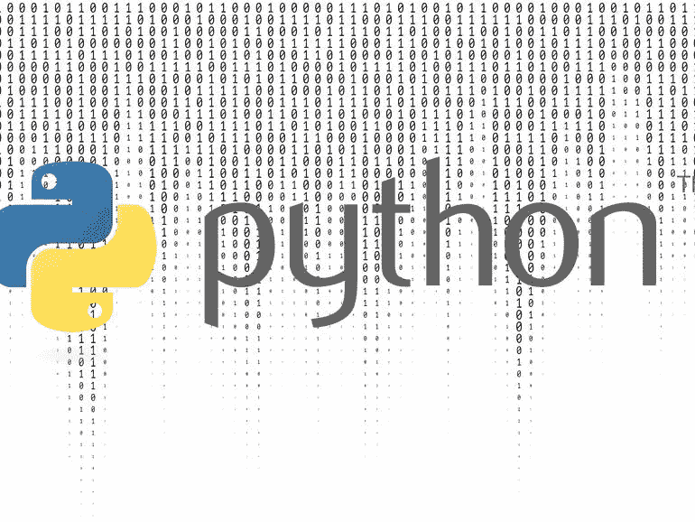

# 3 个 YouTube 频道来提升你的 Python 技能

> 原文：<https://medium.com/nerd-for-tech/3-youtube-channels-to-boost-your-python-skills-6b7ef7f1271d?source=collection_archive---------16----------------------->

图像[来源](https://www.techrepublic.com/article/python-programming-language-a-cheat-sheet/)

在学习 Python 的过程中，触手可及的资源数不胜数。根据你的学习方式，视频确实可以强化你在书上读过的东西。我发现，与我的学习风格相适应的是阅读概念，编写相关的代码，概述正确的语法，并通过观看视频来巩固它。也就是说，我想列出我最喜欢的三个 YouTube 频道，这三个不同的原因会帮助你提高你的 Python 游戏。

 [## 科里·斯查费

### 欢迎来到我的频道。这个频道专注于为软件开发人员创建教程和演练…

www.youtube.com](https://www.youtube.com/channel/UCCezIgC97PvUuR4_gbFUs5g) 

第一个频道是科里·斯查费。这家伙是学习 Python 的底细的人！他对 Python 有着非常深刻的理解，并且很好地解释了语法以及编写好的、干净的代码的正确方法。他简化了复杂的概念，并提供了帮助您真正理解逻辑和语法的例子。这是观看编码示例和更好地理解 Python 概念和逻辑的渠道！

 [## 卡勒·哈尔登

### 嗨，我已经 300 岁了。我用月亮来计算一切，这让人们很困惑。我喜欢用代码构建东西…

www.youtube.com](https://www.youtube.com/channel/UCWr0mx597DnSGLFk1WfvSkQ) 

下一个频道是卡勒·哈尔登的。这个人是一个很好的观察者，因为他提供了他用 Python 创建的各种项目的洞察力。他有很棒的 b-roll，让编程看起来很牛逼！他的频道让我兴奋不已。他有各种初级、中级和高级项目示例，包括 [Python 自动化](https://www.youtube.com/watch?v=qbW6FRbaSl0&t=6s)、[初学者项目](https://www.youtube.com/watch?v=Gf1QaBReA2I)、[树莓派服务器](https://www.youtube.com/watch?v=6gkoDQUQSLc)和[创建交易机器人](https://www.youtube.com/watch?v=-MHhA-Y3DSk)。这个渠道不仅限于项目创意。它还涵盖了各种主题，并对软件开发进行了深入的研究。这是寻找新的项目想法和更好地理解软件开发的一个频道。

 [## freeCodeCamp.org

### 免费学习编码。

www.youtube.com](https://www.youtube.com/channel/UC8butISFwT-Wl7EV0hUK0BQ) 

最后一个频道叫做 freeCodeCamp.org。这是完整编码教程的一站式商店。如果你想提高你的其他编程语言技能，这个渠道并不局限于 Python。该频道挤满了精彩的视频，包括完整的 [4 小时课程](https://www.youtube.com/watch?v=rfscVS0vtbw&list=PLWKjhJtqVAbnqBxcdjVGgT3uVR10bzTEB)或[美汤教程](https://www.youtube.com/watch?v=87Gx3U0BDlo)(网络搜集)。这个渠道让你成为一个全栈开发者。你可以学习必要的技能，将一个想法变成一个功能齐全的网络应用。如果你正在寻找一个从开始到结束学习软件开发的一站式商店，这是值得观看的频道。

我希望这些信息对您的 Python 学习之旅有所帮助。另一个需要熟悉的重要来源是 python.org 的**。这是 Python 的官方网站，包括官方的 Python 文档。理解如何阅读软件文档并将概念/语法应用到您自己的代码中是至关重要的。别忘了看看我的其他关于学习 [**Python**](/nerd-for-tech/python-scripting-85ed0d1cd19a) 的 [**文章。感谢支持，祝学习愉快！**](/nerd-for-tech/tips-for-learning-python-ea9eb25fc03d)**

 **[## BeginnersGuide - Python 维基

### 编程新手？如果你知道从哪里开始，Python 是免费且容易学习的！本指南将帮助您获得…

wiki.python.org](https://wiki.python.org/moin/BeginnersGuide)** 

**干杯！**