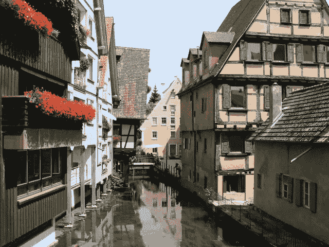
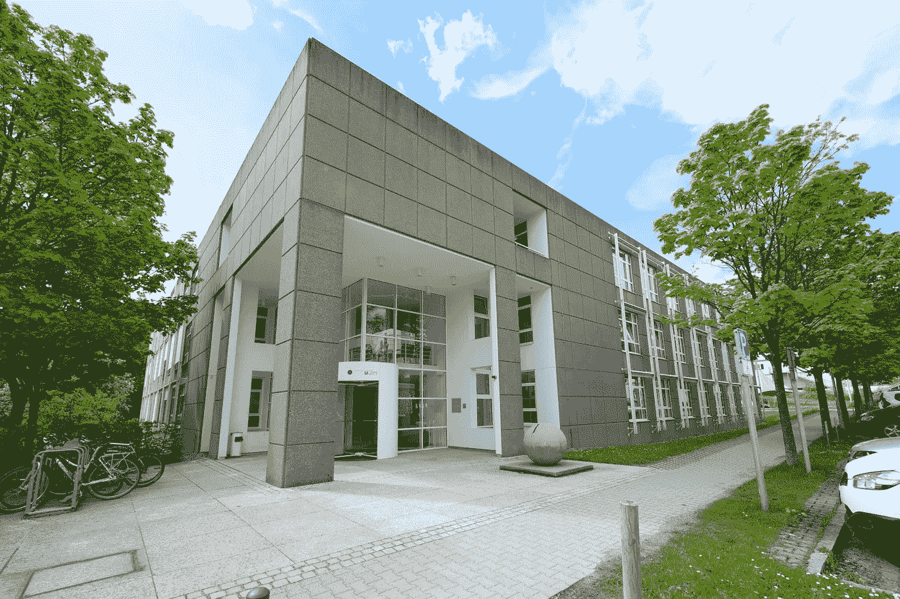

# 30 年技术经验:乌尔姆的研究助理

> 原文：<https://medium.com/nerd-for-tech/30-years-in-tech-research-assistant-in-ulm-6baf94b8c1d5?source=collection_archive---------16----------------------->

乌尔姆的渔民区

回想起来，1991 年对我来说是相当忙碌的一年；我不仅建立了我的第一个“数据仓库”，我还设法完成了我所有的必修课程，并参加了一次到德国南部的学习旅行。这次旅行的主题是 CIM(计算机集成制造),我们参观了几家公司和工厂，包括西门子和宝马。其中一次比较有趣的参观是去美丽城市乌尔姆的一汽。一汽？如果你没听说过，我不怪你；它是“Forschungsinstitut für anwendungsonoritierte Wissensverarbeitung”的简称，或者说白了就是:应用知识工程研究所。它成立于 1987 年 10 月，是德国第一个独立的人工智能研究所。创始人是巴登符腾堡州和几个商业方，如戴姆勒-克莱斯勒和惠普参与了合资企业。

我们开车到入口处的那一刻，我就被迷住了。我喜欢这座建筑，这里的氛围和能量，这里的人们，当然还有他们所做的工作和研究。我们受到了研究所创始人 Radermacher 教授的欢迎，他向我们介绍了研究所和项目的情况。后来，我很大胆地去找他，询问关于学院实习的事情。他人很好，鼓励我保持联系，等我准备好论文的时候再联系他。这正是我在那年秋天所做的。令我惊讶的是，他不仅记得我，还告诉我在一个新项目中有一个研究助理的空缺职位！时机是完美的；该项目将于 1992 年 1 月开始，我将获得 6 个月的合同。该项目被命名为“Godot ”,其目标是在商用面向对象数据库(OODB)的基础上开发一个地理信息系统的原型。在这个一直持续到 1996 年的项目期间，发表了几篇论文，例如[这一篇](https://citeseerx.ist.psu.edu/viewdoc/download?doi=10.1.1.50.4813&rep=rep1&type=pdf)关于空间访问方法和查询处理。

我工作过的原一汽大厦(他们 2004 年搬的)

项目的第一阶段旨在确定哪个 OODB 最适合这项任务。因为我有一些使用面向对象语言的经验，比如 Smalltalk 和 C++，所以我可以直接投入进去。OODB 在当时非常热门，被视为数据世界的“下一个大事件”。其中有 9 个需要评估，6 个团队成员中的每个人都有 1 到 2 个产品需要关注。我的工作是测试[客观性/DB](https://objectivity.com/products/objectivitydb/) ，这被认为是一个有趣的局外人。我们需要解决的问题包括 C++接口的完整性、对复杂地理对象和关系建模的能力，当然还有:性能！

当时几乎没有任何面向对象数据库的评估方法或标准基准，所以我们也必须自己开发。对我有帮助的是，这栋建筑可以全天候访问，所以我经常在晚上 9 点或 10 点骑自行车去那里，一直工作到凌晨 3 点或 4 点。那是我可以独自拥有大部分计算能力的宁静时光。我也有自己的烦心事，最终成为我硕士论文的主题:“在面向对象的地理信息系统中集成时间”。在 GIS 中表示时间，尤其是随时间的变化，是一个非常有趣的话题。我提出了“移动框架”的概念，可以用来分析地理空间对象的状态和随时间的变化。这并不完全是我所希望的科学突破，但对我的推广人[Oliver günther](https://en.wikipedia.org/wiki/Oliver_G%C3%BCnther)博士来说足够有趣，他同意了我的工作，这样我就可以最终完成我的学业。

因为我提到了奥利弗(“就叫我奥利吧”:他既聪明又友好，而且他真的很聪明:-))这似乎是分享我在乌尔姆生活的一个好地方。问题是奥利弗大部分时间都不在那里。在项目的前四个月，他是伯克利的客座教授，猜猜在那段时间，他让谁住在他的公寓里？没错。当他在我准备旅行的时候提到这一点时，我想呆在城里会是一个方便的选择。但是当我在 1991 年 12 月拜访他，走到他的住处时，我很快放弃了这个想法。原来是在中世纪的[渔民区](https://www.ulm.uno/index.php/ulm-city/fischerviertel-ulm?2287)简直太棒了！更不用说公寓本身，木地板，现代家具，当然还有客厅里的大钢琴。不用说，我欣喜若狂，无论是工作还是私人生活都过得非常愉快。事实上，当我六个月后毕业时，我的 Ulmer ' Stammkneipe '(我最喜欢的酒吧)的老板兼酒保 Jan 从学院接了朋友和同事，一路开车到荷兰参加毕业派对。我仍然时不时地想为什么我没有回来，留在德国。(考虑到我甚至得到了研究所的永久职位……)

现在你可能想知道我的 OODB 客观性/DB 在比赛中表现如何？嗯，实际上相当不错:出乎所有人的意料，它是一个强有力的亚军，只是输给了最终被选中的产品: [ObjectStore](https://ignitetech.com/objectstore/) 。正如你所看到的:这两种产品今天仍然存在，这说明了面向对象概念在专业数据库中的适用性。

ps。卡门、奥利、简、于尔根、安德烈亚斯、沃尔夫-弗里茨、弗朗兹，以及所有让这成为我生命中难忘的一段时间的人:非常感谢你们，我仍然想念你们所有人！