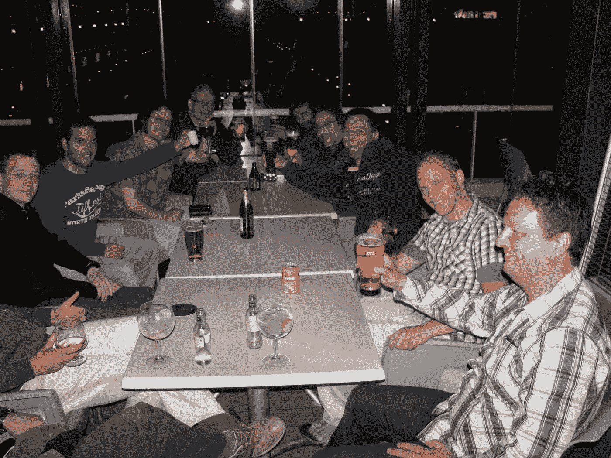

# 科技 30 年:这些是我最喜欢的东西

> 原文：<https://medium.com/nerd-for-tech/30-years-in-tech-these-are-my-favorite-things-6f86626940d7?source=collection_archive---------2----------------------->

为各种各样的组织工作的好处之一是所使用的技术和工具不断变化。这种变化是一种额外的好处，不过这是一个观点问题:我总是很好奇想知道什么是新的、更好的和/或更快的，但是我知道新的、更好的和/或更快的不一定是你工作的项目或组织的改进。

更糟糕的是:我曾经遇到过这样的情况，完美的工作解决方案被放弃了，因为 X 或 Y 技术是作为替代品获得的。或者，市场领先的供应商用更“现代”(无论是什么)的解决方案替换他们的旗舰工具，但缺少大量使原始产品成为如此优秀的工具的特性和功能。有人记得[业务对象](https://en.wikipedia.org/wiki/BusinessObjects) (BO)吗？他们是最初的 BI mega 供应商之一，在 90 年代中期拥有 35–40%的市场份额。他们出名的原因是能够从报告工具动态生成 SQL，以便非程序员可以轻松创建精美的报告:自助 BI“avant la letter”。这让我想到了我的第一个“最爱”:BO Reporter 于 2004 年推出了最新的 6.5 版本，无疑是有史以来最好的“经典”报告写作工具。最大的竞争对手 Cognos 通过 PowerPlay 在(桌面)OLAP 领域保持了自己的地位，但他们的即席报告工具不是 BO 的对手。

然后网络出现了……两个竞争对手都推出了他们旗舰产品的网络版本，但对我来说，BO 作为一家公司是如何生存下来的至今仍是一个谜。就功能性而言，BO XI (WebIntelligence)的第一版不是倒退了一步，而是倒退了六七步，花了很多年才恢复过来。Cognos 的情况要好得多；他们已经在秘密开发一个革命性的新的基于网络的报告工具，Report Studio，它成为了新的 Cognos 8 平台的基石。在一次概念验证之后，我被吸引住了，并且很幸运地在后来的几次参与中使用了 Cognos 解决方案。 [Cognos Report Studio](https://en.wikipedia.org/wiki/IBM_Cognos_Analytics) 最终成为我最喜欢的网络报告工具。

然而，报告和分析只是故事的一部分；没有良好的数据基础，所有其他努力都白费了。在这个领域，无论是数据库技术还是数据转换工具都发生了巨大的变化。90 年代中期到末期标志着 ETL 工具的引入，如 Informatica 和 Ascential/IBM Datastage，通过提供元数据驱动的工具来生成代码(如 SAS 的 DI Studio)或使用自己的引擎，将开发人员从编写容易出错的 SQL 脚本的乏味工作中解放出来。那时我最喜欢的一个？[Business Objects Data Integrator](https://en.wikipedia.org/wiki/BusinessObjects_Data_Integrator)(最初是 Actaworks)，当时最用户友好、灵活和易于使用的基于流的 ETL 工具。

但是，看起来我们现在正在使用 Python、SQL、Apache Airflow 等等开发“数据管道”,这是一个完整的循环。也许我变老了，但这对我来说不像是进步，尽管这对每个按小时计酬的人来说可能都很棒。对于希望以可预测的成本完成工作的组织而言？在我看来没有那么多。

到目前为止，我提到了几个 90 年代和 00 年代最受欢迎的产品，并非巧合的是它们都可以买到(而且大部分都很贵！)工具。但是在 2007 年左右，我发现了一件让我非常感兴趣的事情:开源 BI 工具！这为我打开了一个全新的世界，在我意识到之前，我已经深深地融入了 Pentaho 社区。

Pentaho 社区聚会 2010

我说的“严重”是指:白天和(大部分)晚上，因为我合著了两本书，这是另一个帖子的好主题。但是在工具方面，我被 BI 套件的数据集成组件 [Kettle](https://help.hitachivantara.com/Documentation/Pentaho/9.1/Products/Pentaho_Data_Integration) 深深吸引。我太喜欢它了，以至于在 2013 年加入 SAS 时，我很难过不再使用它。是时候坦白了:我没有。每当我需要争论一些数据时，Kettle 将是我的首选工具。也就是说，直到我发现并习惯了使用桌面数据辩论的终极瑞士军刀& analytics，无与伦比的 [SAS 企业指南](https://www.sas.com/nl_nl/software/enterprise-guide.html)，我一直使用到今天。但即便如此:我仍然关注开源世界中发生的事情，在那里 Kettle 被重新发明，并作为 Apache Hop 继续存在。

我现在最喜欢的其他工具？嗯，我没有在 SAS 逗留太久，因为那里的午餐太棒了(的确是！)，办公室就是这么酷的地方(确实是！)或者说我的同事是最棒的(他们就是！).即便如此，如果没有一流的分析软件，我早就离开了。说真的，如果你很好奇为什么我这么喜欢这个东西，请查看一下 [SAS Viya](https://www.sas.com/nl_nl/software/viya.html) ！