# 3D 环境和照明| Unity

> 原文：<https://medium.com/nerd-for-tech/3d-environment-lighting-unity-d7deee1aaebf?source=collection_archive---------8----------------------->

## Unity 3D

## 快速浏览使用 Unity 可以完成的不同任务

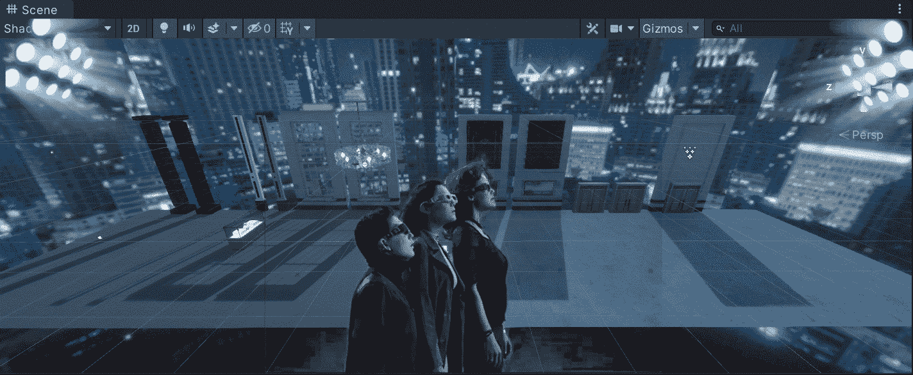

**目标**:查看使用 Unity 在 3D 环境中可以做的一些不同的事情。

在上一篇文章中，我介绍了[如何在 Unity](/nerd-for-tech/creating-a-skybox-in-unity-9399eff6a7b7) 中创建和实现一个 skybox。现在，是时候看看在 3D 环境中使用 Unity 可以做些什么了。

# 定制材料

有了 Unity，我们可以用不同的方式定制材质。作为一名游戏开发人员，我需要知道如何处理技术艺术家在不同类型的软件中创建的纹理和网格。例如，我们有以下几列:

*   第一个(左)是在另一个软件中制作的模型，它使用默认的标准材料。
*   第二个(右)是相同的模型，但使用了定制的材料，看起来好像是由大理石制成的。

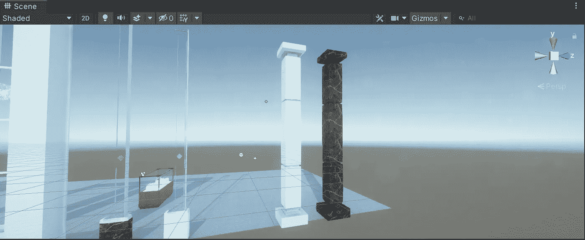

因此，为了使第一个模型具有与第二个模型相似的外观，让我们自定义标准材料的下一个属性:

*   着色程序

该选项确定材质将使用哪种类型的着色器。在这种情况下，我们需要模型具有粗糙度和金属属性，因此我们需要选择一个名为 *Autodesk Interactive* 的不同着色器(其工作方式类似于标准着色器，但具有粗糙度)。

如果您想了解更多关于内置着色器的信息，您可以访问 Unity 文档:

 [## 内置着色器

### 你如何在整个工作流程中使用文档？请参加本次调查，与我们分享您的体验。团结来了…

docs.unity3d.com](https://docs.unity3d.com/Manual/shader-built-in.html) 

*   星体反照率

该选项决定了材质的基本颜色或基本纹理。在这种情况下，我们需要通过单击参数左侧的点，从项目文件夹中选择相应的大理石纹理。

如果您想了解反照率参数的更多信息，可以访问 Unity 文档:

 [## 反照率颜色和透明度

### 你如何在整个工作流程中使用文档？请参加本次调查，与我们分享您的体验。反照率…

docs.unity3d.com](https://docs.unity3d.com/Manual/StandardShaderMaterialParameterAlbedoColor.html) 

*   金属的

该参数决定了材料表面的金属样程度。如果材质的金属感更强，环境的反射会对表面产生更大的影响。

如果您想了解更多关于金属参数的信息，您可以访问 Unity 文档:

 [## 金属模式:金属参数

### 你如何在整个工作流程中使用文档？请参加本次调查，与我们分享您的体验。当…

docs.unity3d.com](https://docs.unity3d.com/Manual/StandardShaderMaterialParameterMetallic.html) 

*   粗糙

该参数决定了材质如何处理光反射。与“平滑度”参数相反,“粗糙度”使灯光反射从表面以大范围的角度反弹。

如果您想了解更多关于粗糙度/光滑度参数的信息，您可以访问 Unity 文档:

 [## 平滑

### 你如何在整个工作流程中使用文档？请参加本次调查，与我们分享您的体验。这个概念…

docs.unity3d.com](https://docs.unity3d.com/Manual/StandardShaderMaterialParameterSmoothness.html) 

*   盖瓦

此参数决定材料的纹理以水平和垂直方式重复填充模型的次数。

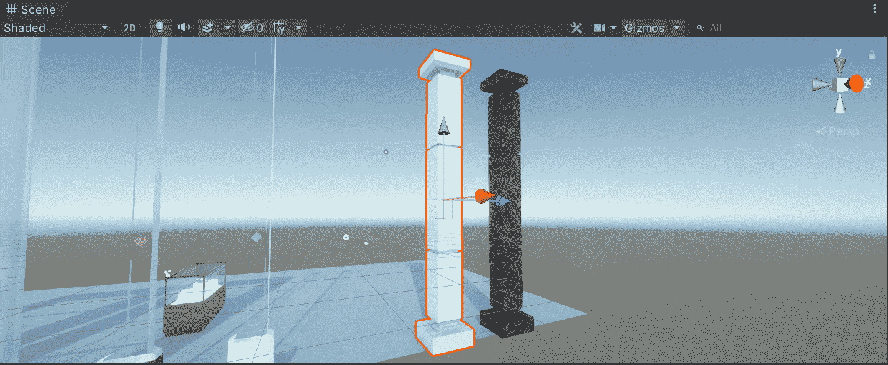

通过这种方式，我们能够通过使用具有几种不同属性的材料来修改模型的外观，从而优化我们游戏的外观。

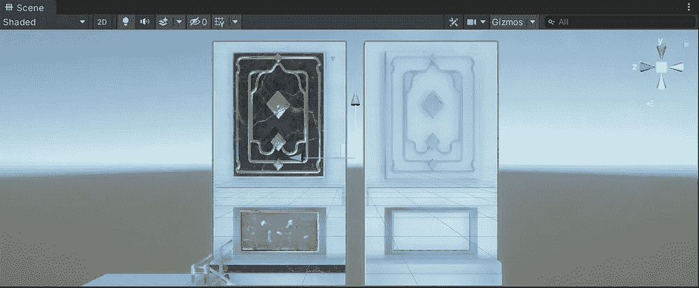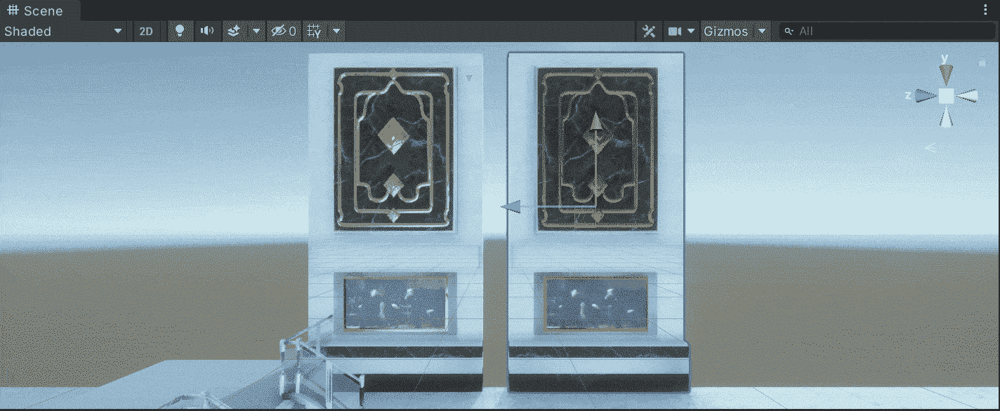

不同材质和网格的模型。

例如，我们可以在材质中修改的另一个属性是遮挡，以便为模型提供更多细节。遮挡属性决定了模型的哪些区域应该接收间接光。要定制一个有遮挡的材质，我们需要提供一个纹理贴图:

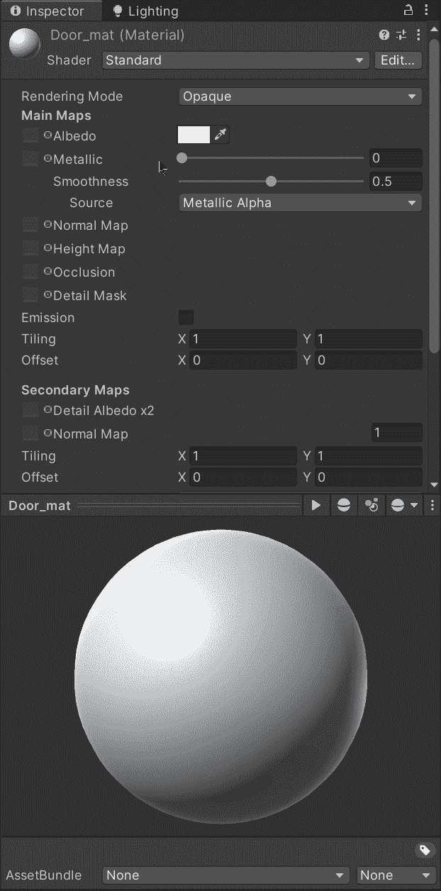

正如你在下面的 gif 中看到的，当我们使用纹理贴图修改遮挡级别时，门模型(右)显示“假阴影”:

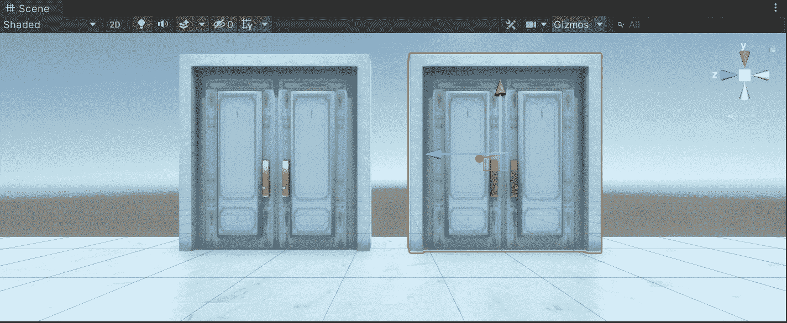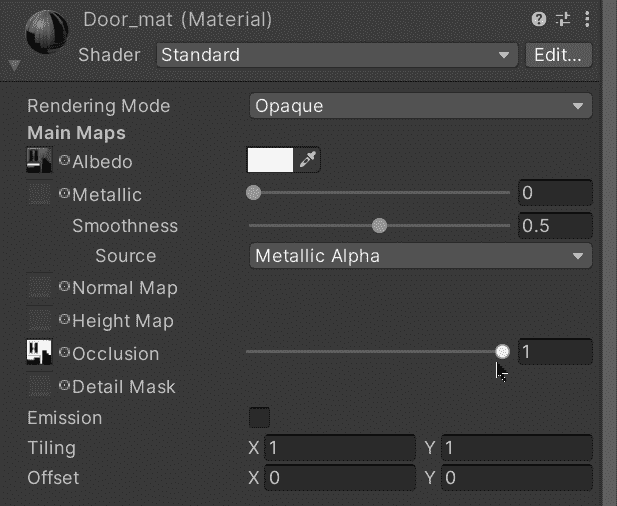

如果您想了解更多关于遮挡参数的信息，您可以访问 Unity 文档:

 [## 遮挡贴图

### 你如何在整个工作流程中使用文档？请参加本次调查，与我们分享您的体验。的…

docs.unity3d.com](https://docs.unity3d.com/Manual/StandardShaderMaterialParameterOcclusionMap.html) 

# 照明设备

再来说说另一个重要的话题，Unity 中的灯光。有 2 种主要的方法来处理和显示统一之光的变化。

下一个场景是几个原始的游戏物体，一个立方体和一个球体。立方体有一个自定义材质，使用发射参数发射烘焙光。

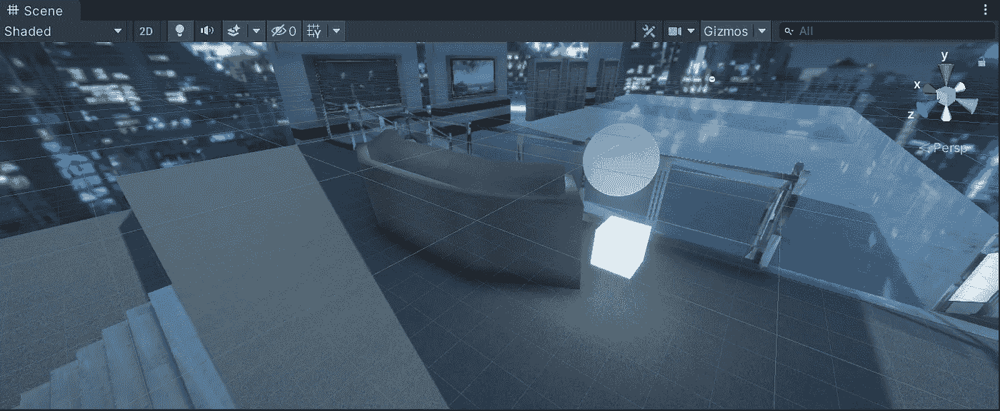

让我们打开灯光选项卡，进入*窗口* > *渲染* > *灯光:*

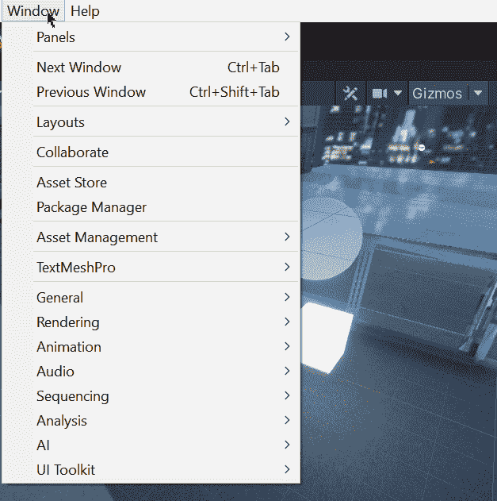

## 启发光照贴图

首先，我们有 Enlighten lightmapper(不推荐使用)。如果我们选择使用这种方式来处理和显示场景中的光线变化，我们需要等到场景烘焙后才能看到任何变化。

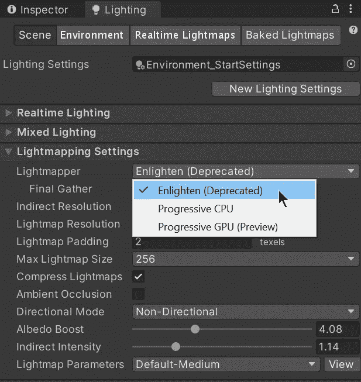

在接下来的 gif 中你可以看到，如果我们把发光的立方体移动到另一个位置，用它烤出来的光仍然会在原来的位置。因此，通过使用启发模式，我们需要等到场景再次烘焙后，才能在立方体的新位置显示新的光线。

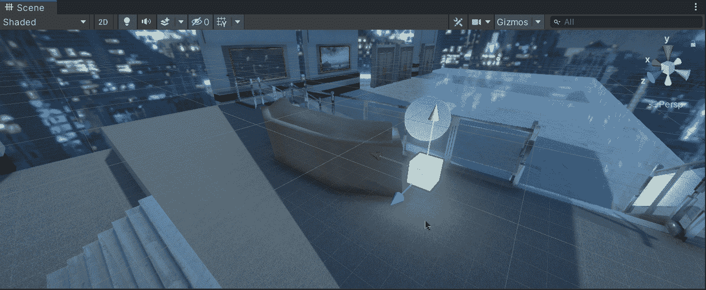

烘烤新灯需要很多时间:

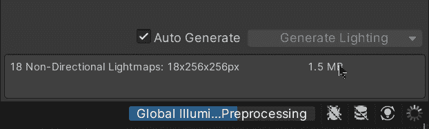

## 渐进式光照贴图

另一方面，如果我们选择使用渐进式光照贴图，我们将能够实时烘焙灯光，并快速看到结果。在渐进模式中有两个选项，我们可以选择用 CPU 或 GPU 来烘焙灯光。一般来说，使用 GPU 更快，所以我们选择它:

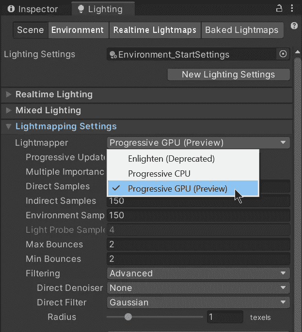

在下一张 gif 中，我们将能够注意到使用渐进模式时光线烘焙的速度有多快。通过使用它，我们几乎可以立即分辨出立方体新位置的光线变化:

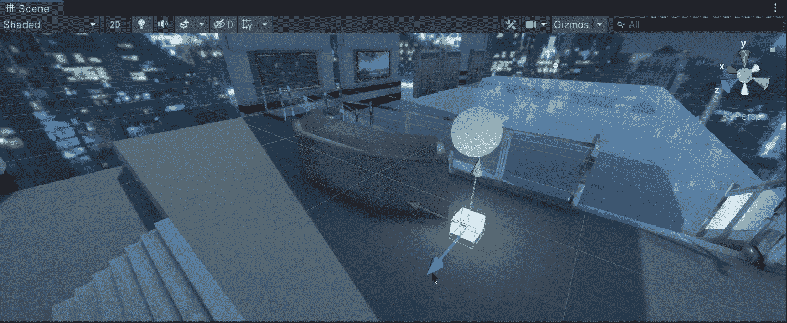

烘焙灯只需要一点点时间:

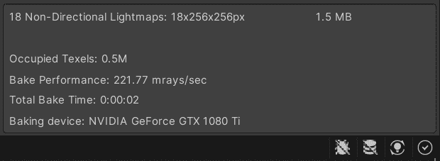

就这样，我们看了一些我们可以在 3D 环境中用 Unity 做的事情！:d .下一篇文章再见，我将展示如何用 Unity 创建和实现光探测器。

> *如果你想更多地了解我，欢迎登陆*[***LinkedIn***](https://www.linkedin.com/in/fas444/)**或访问我的* [***网站***](http://fernandoalcasan.com/) *:D**