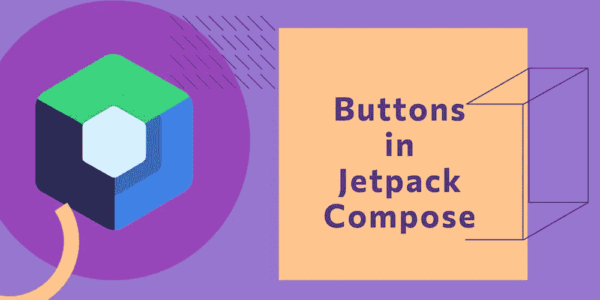
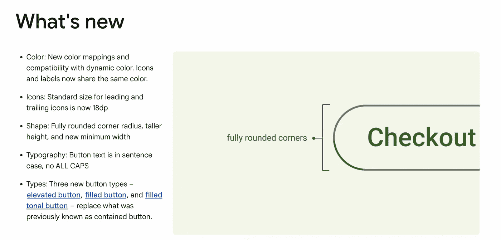
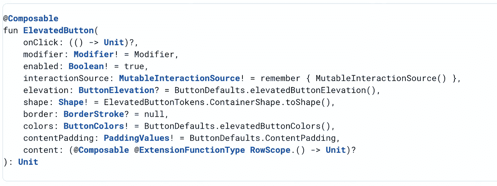
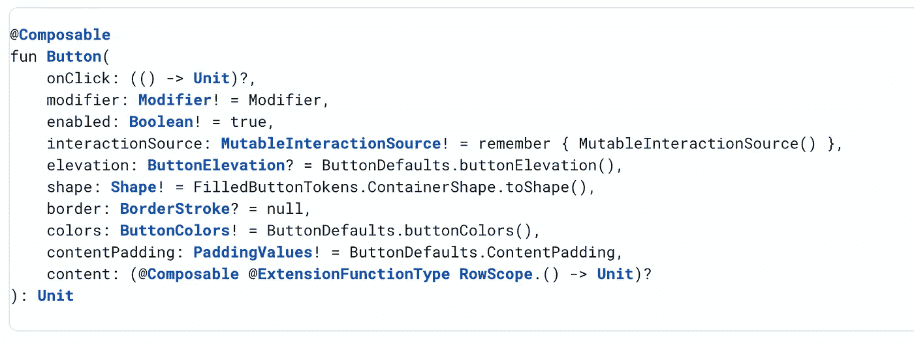
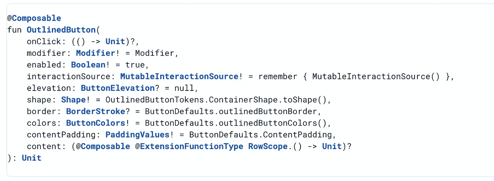
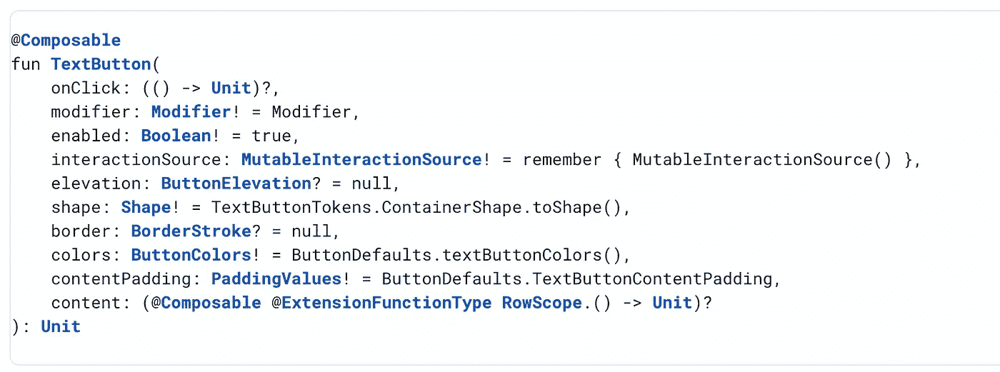
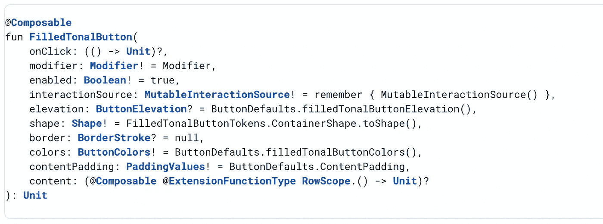

# 可在 Jetpack Compose 中组合的按钮(带有更新的材料设计 3)

> 原文：<https://medium.com/nerd-for-tech/3rd-day-of-learning-jetpack-compose-button-material-design-3-d1f3dae46e39?source=collection_archive---------0----------------------->

来源于谷歌

大家好，😀
如果您还没有设置基本作曲项目，请跳转到第 1 天学习的 [**作曲简介&设置**](https://gondhalesatyam-28082.medium.com/1st-day-of-learning-jetpack-compose-db3865bc5ca4) [🏗️](https://emojipedia.org/building-construction/)

## 撰写中的按钮介绍

按钮是 Android 中最常用的 UI 元素。几乎 80 %的动作都是由按钮发起的。按钮包含文本，可点击的属性，图像等。

在**材质设计 3** 中，我们可以有 5 个版本的按钮作为提升、填充、填充色调、轮廓&文本。

> 注意:材质设计是一个适应性很强的指导方针、组件和工具系统，支持用户界面设计的最佳实践。材料设计简化了设计师和开发人员之间的协作，并帮助团队快速构建漂亮的产品。

我们已经有一个材料设计 2 按钮规格。但是最近，材料设计 3 发布了。看看*上有什么新消息*

图片来自谷歌资源

> **注意:**要开始使用 Material Design 3 组件，请在
> 实现“androidx . compose . Material 3:Material 3:1 . 0 . 0-alpha 12”中添加一个依赖项

所有按钮类型的一般信息和语法类似于[👇](https://emojipedia.org/backhand-index-pointing-down/)

**高架按钮**带阴影的基本轮廓按钮。仅在需要与背景分离时使用。

图片来自谷歌资源

**装满按钮
和**装满容器按钮。它的对比色表面使它成为最突出的按钮

图片来自谷歌资源

**轮廓按钮** 它们多用于非主要动作。这是一种按钮，我们描绘用户给一些机会来执行动作或从流中逃脱

图片来自谷歌资源

文本按钮
这是一种当我们想把动作描绘得不那么引人注目时使用的按钮。当我们向用户展示多个选项时，我们可以考虑使用这种类型的按钮。

图片来自谷歌资源

**FilledTonalButton
这是浅色背景&深色标签颜色。它们可以用来描述不如填充按钮那样引人注目的动作。**

这是最基本的🙄，我们还可以用按钮参数做什么[🤔](https://emojipedia.org/thinking-face/)
在每个按钮的可组合语法中，都有一些公共参数，您可以使用它们来满足您的用例，例如

1.  启用/禁用按钮
    这可以使用**启用**参数来控制
2.  设置仰角以区分按钮和背景
    这可以使用**仰角**参数来控制
3.  为按钮
    设置不同的形状，这可以使用**形状**参数进行控制
4.  设置按钮
    的边框颜色，这可以使用**边框**参数进行控制
5.  设置不同的背景/内容/禁用/启用颜色
    这可以使用**颜色**参数进行控制
6.  在按钮中传递不同的文本和图像(以行的方式)
    这可以使用**内容**参数来控制

您可以查看代码内部的用法。
以上就是**按钮**的基本情况。本文可能不会涵盖基于您的复杂实现用例的所有内容，但是您可以从这里开始。万事如意。[😃](https://emojipedia.org/grinning-face-with-big-eyes/)
您可以克隆此存储库进行基本设置。此外，源代码中所有概念都可以根据相同内容进行更新。
**(切换到分支按钮撰写)**

** [## 订阅最新内容并保持更新。

### 订阅最新内容并保持更新。通过注册，您将创建一个中型帐户，如果您还没有…

gondhalesatyam-28082.medium.com](https://gondhalesatyam-28082.medium.com/subscribe) 

如果你认为这对你有帮助，请随意[👏🏻](https://emojipedia.org/clapping-hands-light-skin-tone/)【鼓掌】&分享。谢了。😄**