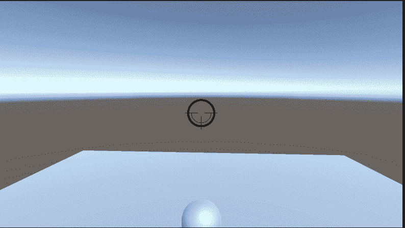

# 第三人称摄像机清理

> 原文：<https://medium.com/nerd-for-tech/3rd-person-camera-cleanup-a303587810b1?source=collection_archive---------5----------------------->

## 开始 Unity 3D 游戏开发

## //添加光标锁定和相机夹紧

最终摄像机设置

在过去的几天里，我们已经建立了一个摄像系统，可以跟踪我们的球员，并允许球员环顾四周。我们留下了一些需要完成的最后的事情。所以今天我们要做清理工作。