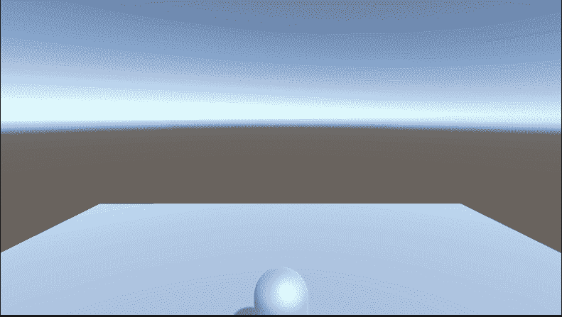

# 第三人称摄像机统一跟随

> 原文：<https://medium.com/nerd-for-tech/3rd-person-camera-follow-in-unity-8c70ff0874d3?source=collection_archive---------9----------------------->

## 开始 3D 游戏开发 Unity

## //从头开始设置

第三人称摄像机在工作…注意到结尾的 bug 了吗？

当从第三人称视角创作游戏时，我们知道我们需要一个跟随玩家并且可以平移的摄像机。今天我们来看看一种方法。有许多优秀的第三方控制器和相机可供使用，但我们有兴趣学习，所以为了那个…