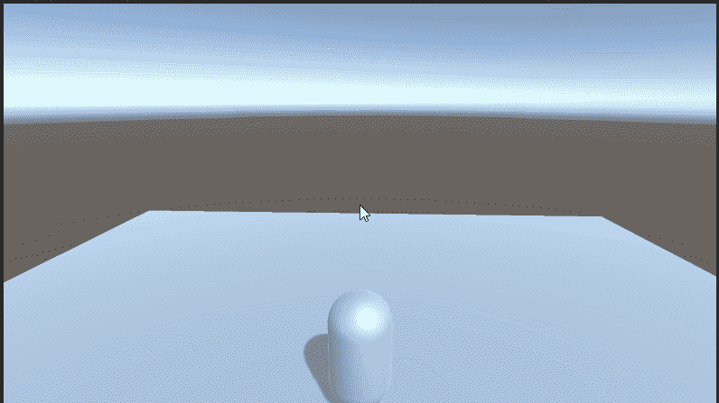

# 统一的第三人称摄像机外观

> 原文：<https://medium.com/nerd-for-tech/3rd-person-camera-look-in-unity-5732522c1091?source=collection_archive---------1----------------------->

## 开始 Unity 3D 游戏开发

## //将摄像机平移添加到摄像机系统

相机外观

昨天我们看了给玩家添加跟随摄像头有多简单。今天的任务有点困难，但是，我们需要添加左和右的外观以及上和下。

## 基础