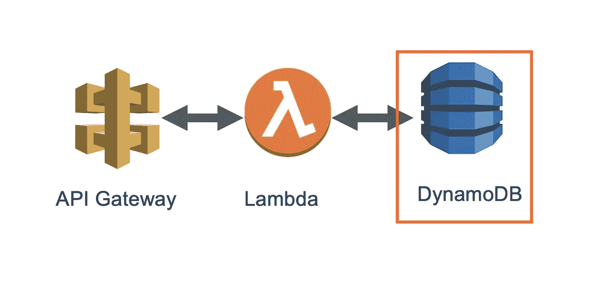
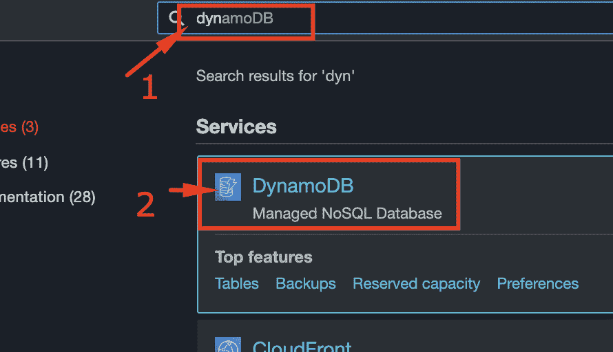
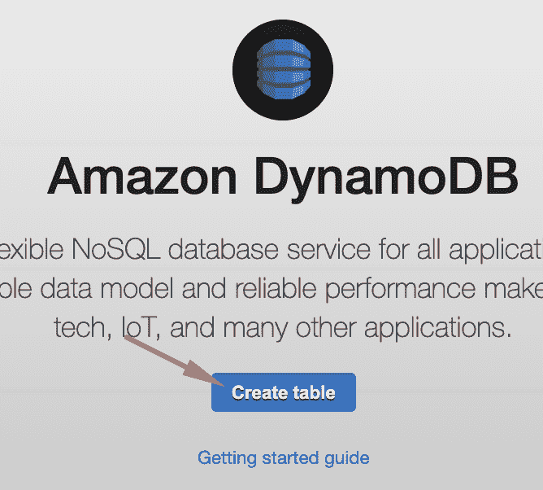
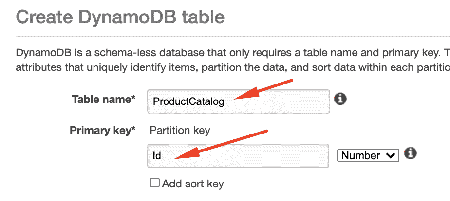
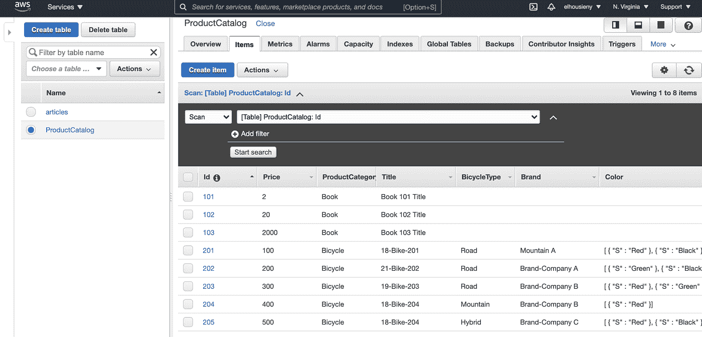

# 4.向无服务器微服务添加 DynamoDB

> 原文：<https://medium.com/nerd-for-tech/4-adding-dynamodb-to-serverless-microservice-2bbb02e610b3?source=collection_archive---------4----------------------->



本文是解释微服务设计模式系列的一部分

1.[打造无服务器微服务“Hello World”:一步一步来](https://www.linkedin.com/pulse/create-serverless-microservice-hello-world-step-elhousieny-phd%25E1%25B4%25AC%25E1%25B4%25AE%25E1%25B4%25B0/?trackingId=3xdxZckTF8ML9xqjVXYxLQ%3D%3D)

[](https://www.linkedin.com/pulse/create-serverless-microservice-hello-world-step-elhousieny-phd%25E1%25B4%25AC%25E1%25B4%25AE%25E1%25B4%25B0/?trackingId=3xdxZckTF8ML9xqjVXYxLQ%3D%3D) [## 创建无服务器微服务“Hello World”REST API:循序渐进

### 基本微服务的基本元素包括一个 API 端点和一个数据库。在这篇文章中，我将…

www.linkedin.com](https://www.linkedin.com/pulse/create-serverless-microservice-hello-world-step-elhousieny-phd%25E1%25B4%25AC%25E1%25B4%25AE%25E1%25B4%25B0/?trackingId=3xdxZckTF8ML9xqjVXYxLQ%3D%3D) 

# [2。向微服务添加 Lambda](https://www.linkedin.com/pulse/create-serverless-microservice-hello-world-step-elhousieny-phd%E1%B4%AC%E1%B4%AE%E1%B4%B0-1c/)

[](https://www.linkedin.com/pulse/create-serverless-microservice-hello-world-step-elhousieny-phd%E1%B4%AC%E1%B4%AE%E1%B4%B0-1c/) [## 逐步创建无服务器微服务“Hello World ”:向微服务添加 Lambda

### 本文是解释微服务设计模式 1 系列文章的一部分。创建无服务器微服务“你好…

www.linkedin.com](https://www.linkedin.com/pulse/create-serverless-microservice-hello-world-step-elhousieny-phd%E1%B4%AC%E1%B4%AE%E1%B4%B0-1c/) 

3.[为 Mac 设置 AWS 无服务器开发环境](https://www.linkedin.com/pulse/setting-up-aws-serverless-dev-environment-mac-elhousieny-phd%E1%B4%AC%E1%B4%AE%E1%B4%B0/)

[](https://www.linkedin.com/pulse/setting-up-aws-serverless-dev-environment-mac-elhousieny-phd%E1%B4%AC%E1%B4%AE%E1%B4%B0/) [## 为 Mac 设置 AWS 无服务器开发环境

### 本文是解释微服务设计模式 1 系列文章的一部分。创建无服务器微服务“你好…

www.linkedin.com](https://www.linkedin.com/pulse/setting-up-aws-serverless-dev-environment-mac-elhousieny-phd%E1%B4%AC%E1%B4%AE%E1%B4%B0/) 

4.[【本文】向无服务器微服务添加 dynamo db](https://www.linkedin.com/pulse/4-adding-dynamodb-serverless-microservice-rany-elhousieny-phd%E1%B4%AC%E1%B4%AE%E1%B4%B0/)

[](https://www.linkedin.com/pulse/4-adding-dynamodb-serverless-microservice-rany-elhousieny-phd%E1%B4%AC%E1%B4%AE%E1%B4%B0/) [## 4.向无服务器微服务添加 DynamoDB

### 本文是解释微服务设计模式 1 系列文章的一部分。创建无服务器微服务“你好…

www.linkedin.com](https://www.linkedin.com/pulse/4-adding-dynamodb-serverless-microservice-rany-elhousieny-phd%E1%B4%AC%E1%B4%AE%E1%B4%B0/) 

完整代码可以在[https://github . com/ranyelhousieny/micro services _ AWS _ server less](https://github.com/ranyelhousieny/Microservices_AWS_Serverless)找到

=====================================



我将使用 AWS 提供的样本数据。创建名为“ProductCatalog”的表，确保使用此名称，因为我们将使用 AWS CLI 从文件中加载日期

表名:产品目录

主键:分区键:Id(数字)

确保将主键的类型更改为数字



从 AWS 或从[https://github . com/ranyelhousieny/micro services _ AWS _ server less/blob/master/sampledata/product catalog . JSON](https://github.com/ranyelhousieny/Microservices_AWS_Serverless/blob/master/sampledata/ProductCatalog.json)下载示例文件

如果您没有设置 AWS CLI 环境，请参考此[文章](https://www.linkedin.com/pulse/setting-up-aws-serverless-dev-environment-mac-elhousieny-phd%25E1%25B4%25AC%25E1%25B4%25AE%25E1%25B4%25B0/?trackingId=UeJzrhfyyMwUrQxM6X65MA%3D%3D)

[](https://www.linkedin.com/pulse/setting-up-aws-serverless-dev-environment-mac-elhousieny-phd%25E1%25B4%25AC%25E1%25B4%25AE%25E1%25B4%25B0/?trackingId=UeJzrhfyyMwUrQxM6X65MA%3D%3D) [## 为 Mac 设置 AWS 无服务器开发环境

### 本文是解释微服务设计模式 1 系列文章的一部分。创建无服务器微服务“你好…

www.linkedin.com](https://www.linkedin.com/pulse/setting-up-aws-serverless-dev-environment-mac-elhousieny-phd%25E1%25B4%25AC%25E1%25B4%25AE%25E1%25B4%25B0/?trackingId=UeJzrhfyyMwUrQxM6X65MA%3D%3D) 

切换到包含 ProductCatalog 的目录，并运行以下命令

```
> aws dynamodb batch-write-item --request-items file://ProductCatalog.json{ "UnprocessedItems": {}}
```

列表

```
> aws dynamodb list-tables { "TableNames": [ "ProductCatalog"
    ]}
```

您可以在控制台上看到内容



# 发布者


[状态在线](https://www.linkedin.com/in/ranyelhousieny/)

[phdᴬᴮᴰ雷尼·埃尔豪斯尼](https://www.linkedin.com/in/ranyelhousieny/)

高级经理软件工程师，AWS 解决方案架构师认证，PSM，ACSA，MIS，UPE，MSCA