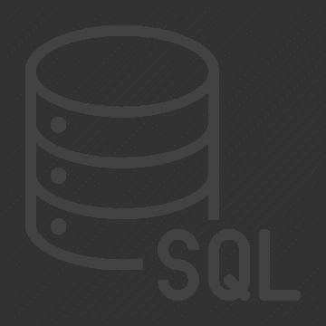
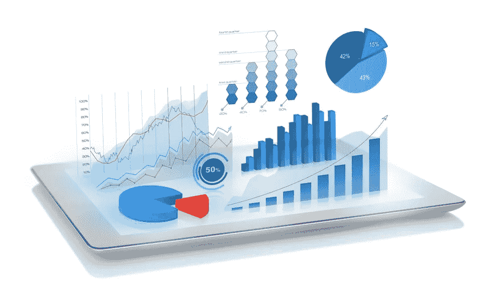

# 数据分析生态系统的 4 项必备技能

> 原文：<https://medium.com/nerd-for-tech/4-must-have-hard-skills-for-the-data-analytics-ecosystem-37296dcac318?source=collection_archive---------21----------------------->

## 成为数据分析生态系统一部分所需的基本技能列表

照片由 Unsplash 上的 Myriam Jessier 拍摄

> “如果你折磨数据的时间足够长，它就会招供。”罗纳德·科斯

我们生活在一个社会里，数据是当前世界的症结所在。关于一个人的生活方式的信息-数据。关于一家公司失败的财富数据的信息。关于何时下雨的信息-数据。随着世界围绕数据旋转，在**数据分析领域有无数的机会并不令人惊讶。**

没有一个人能够在一个特定的领域取得进步，除非他拥有这个领域所需要的基本技能，这些技能为他的进步奠定了基础。数据分析也不例外。入门级分析师应该具备的最重要的一组技能是 4 项技能。随着分析师职业生涯的进展，更多的高级工具将会出现，但是下面提到的技能仍然是这个生态系统的关键。

1.  **Excel**

> "没有人打算创建一个任务关键的电子表格，他们只是“碰巧发生了”. "-费莉恩·赫尔曼斯

*图片来自*[*https://www.logo.wine/logo/Microsoft_Excel*](https://www.logo.wine/logo/Microsoft_Excel)

无数行业中使用的最基本的工具之一。包含大量信息的电子表格，这是对 Excel 的过于简化的定义。但是 Excel 不仅仅是一个电子表格。尽管 Excel 不具备处理大型数据集的能力，但它被广泛用于更轻便、更快速的分析。当一个人刚开始作为入门级数据分析师时，微软 Excel 或谷歌工作表都很有用。

Excel 具有各种功能，通过各种设置突出了它的分析能力。它能够以不同的格式创建图表，这是一个非常重要的功能，可以省去硬编码这些可视化的麻烦。数据的清理和争论可以通过 Excel 轻松完成。消除不一致，检查重复值和缺失值，Excel 可用作预分析工具，以确保数据集符合标准。Excel 提供了几个数学和非数学的函数和指令，增加了数据集分析的便利性。

多年来，该工具一直是各行各业的中流砥柱，所以学习它是必须的。

2.**查询语言- SQL**

> “在 21 世纪，数据库就是市场。”斯坦·拉普

*图片来自*[*www . yourtechstory . com/2019/08/27/story-two-genius-scientists-SQL/*](http://www.yourtechstory.com/2019/08/27/story-two-genius-scientists-sql/)

SQL 或结构化查询语言的使用是分析师进入该行业时最需要也是最重要的技能之一。SQL 用于操作和访问来自不同数据库的数据。它基本上可以被视为 Excel 的高级版本，因为它可以处理比 Excel 可能处理的更大的数据集。SQL 有一组简单的命令来帮助操作数据，包括但不限于插入、更新、删除、创建等。

SQL 作为数据库语言如此流行的原因是因为它是独立于平台的。多个软件允许方便地使用 SQL，并且可以在任何环境中访问而没有太多限制。与其他编程语言相比，它相对更容易理解，因为它使用英语单词作为语法。SQL 还简化了解释器系统，允许代码一写就运行，从而使原型开发变得更加容易。

由于其庞大的用户群体和多年来积累的大量文档，它继续在全球范围内为所有用户提供统一的平台。

3.**统计编程语言- Python**

> “每个人都知道，任何没有显示 Python 是最佳语言的脚本语言竞赛都是设计上的缺陷。”-最大 M

*来自 python.org/community/logos 的照片*

没有统计编程语言，分析师就不能指望在职业生涯中取得进步。无论 excel 能做什么，它的速度都要快 10 倍。从数据清理的简易性到可视化的概念，这些语言都有。除了 Python 之外，市场也看到了对 R 语言的需求。Python 和 R 都是开源和免费的，没有规范说明为什么应该使用其中一种而不是另一种。

Python 有一个专门用于处理数据集的完整库——Pandas。它是最常用的软件包之一，因为它有很多功能，使数据分析过程变得更加容易。现在，除了传统的分析，这些语言执行的最重要的一种分析是预测分析。SQL 和 Excel 都不能创建分类器和模型来进行预测分析。例如，Python 具有内置功能，允许使用决策树、K-Means、回归模型和其他此类分类器和聚类模型。除此之外，它还有专门用于可视化的库，比如 Matplotlib。Jupyter Notebook 恰好是分析师使用 Python 进行分析的平台。

为了在分析领域持续发展，掌握任何一种统计编程语言都是非常重要的。

4.**数据可视化**

> “可视化数据的艺术和实践在弥合人机差距，以有意义的方式传递分析洞察力方面变得越来越重要。”艾德·邓比尔

尼基·霍恩在 Inzata.com 的照片

一千字一张图。每个人都知道一幅画值多少钱的老话。在分析领域，它可以成就一家公司，也可以毁掉一家公司。数据分析只不过是一个涉及数据的故事，要以适当的方式呈现它，需要一个讲故事的人。数据可视化是分析师用来确保房间里每个人都理解理论故事的工具。

没有数据、趋势和结果的可视化，整个数据分析过程是不完整的。当《泰晤士报》公布调查结果时，人们期望，如果不是强制性的，一份好的甚至是像样的报告将会有图表来给人们提供视觉上的吸引力。

有无数的软件可用于可视化的目的，如:微软 Excel，Jupyter 笔记本，Tableau，微软 Power BI 等。某些软件提供仪表板的功能，它接收实时数据并帮助跟踪所有已发生的过程。可视化可以固定在这些仪表板上，从而通过单一外观提供良好的洞察力。

所以，嘿，开始吧。从提升自己开始，用这些技能为自己打下基础。参加课程，获得认证，阅读文章，网上有大量的材料可以指导你理解这些工具并获得这些技能。您也可以查看这篇 [**文章**](https://towardsdatascience.com/4-insights-into-the-industry-of-data-science-978224c53699) ，它强调了数据科学和分析行业的当前情况。所以，努力吧，因为数据分析生态系统正等着欢迎你加入！