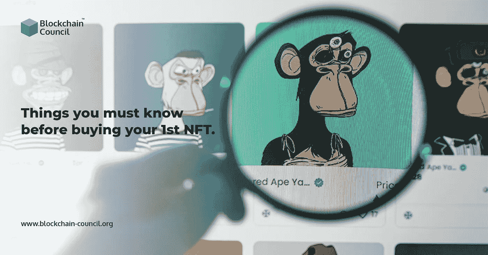

# 买第一台 NFT 前你应该知道的 4 件事

> 原文：<https://medium.com/nerd-for-tech/4-things-you-should-know-before-you-buy-your-1st-nft-a35c6292dfee?source=collection_archive---------0----------------------->

不可替代代币(NFT)的价值在过去一年出现了爆炸式增长。开始时，一些 NFT 在购买或拍卖时获得巨额资金。根据行业跟踪者的统计，2021 年 NFT 的交易增加了 300 亿美元。随着加密货币资产变得越来越受欢迎，从卡通卡带到视频片段都有。

据一些 [**NFT 专家**](https://www.blockchain-council.org/certifications/certified-nft-expert/)**dappardar 称，一些世界上最大最知名的公司，如可口可乐和古驰，也有营销 NFT。2021 年， **NFT 项目**总计 248 亿美元，高于前一年的 9470 万美元。越来越难避免对 NFT 相关讨论的炮轰。现在，它们基本上是什么？**

****

# **什么是不可替换的令牌？**

**首字母缩写词 NFT 的意思是“不可替代的令牌”一种可替代的物品，如纸币，与任何类似的美元纸币相同，并且可以交换。相反，不可替代的代币是独一无二的虚拟资产。此虚拟资产不能换成另一个不可替代的代币。因此，每个不可替换的令牌都是独一无二的。**

**NFT 基本上是通过区块链技术从一个人交换到另一个人。这项技术生成了一份数字记录，确认了所有权转移的交易。买方的具体所有权实际上就是这样编码的。**

# **这些不可替换的令牌是如何工作的？**

**稀有。Tools plus NFTcatcher.io 是两个在线市场，在那里不可替代的令牌通常被出售和共享。投资者可以先浏览一系列商品，然后再决定购买哪一种。要购买数字产品，需要有密码，并在平台上设置一个链接到包含硬币的加密钱包的配置文件。**

**以太坊 ERC-20 硬币是最广泛使用的区块链 NFT。区块链利用 ERC-20 硬币在以太坊区块链上创建了一个智能合约。NFT 也可以用 Solana、Polygon 或 Polkadot 获得。**

# **购买第一台 NFT 前你必须知道的事情**

**在购买第一批 NFT 代币时要记住的事情。**

**根据 [**nft developer**](https://www.blockchain-council.org/certifications/certified-nft-developer/) 购买 nft 时，您必须记住以下几点。**

# **卖方的验证。**

**像 OpenSea 这样的门户网站上的官方供应商通常会在他们的用户名旁边有一个蓝色的验证标记。它类似于 Instagram 或 Twitter。这表明它们是可以保证的，并且不是冒名顶替者配置文件。如果你想从一个知名的供应商那里购买，比如《女人的世界》或者《酷猫 NFT 》,确保你的个人资料是完全真实的。**

**然而，该验证标记并不总是被实际用来验证销售者的有效性。许多著名的 NFT 供应商在一些网站上还没有验证标记，就像某些社交媒体名人还没有他们的验证点击一样。如果你决定从一个未勾选的账户购买，作为预防措施，请验证 NFT 属性。**

# **市场动态和 NFT 持久性**

**重要的是要记住，NFT 可能没有加密货币那样的流动性。因为你不能像加密货币那样容易地将不可替代的代币转换成普通现金，所以任何人都很难从中受益。为了提高你的非功能性测试的可用率，一些非功能性测试专家建议将它们细分。这就像把你的 NFT 分成小块。**

**除了流动性之外，还应考虑不可替代令牌行业的市场容量。NFT 目前的交易量约为 110 亿美元，其涨跌高度依赖于每天获得的非金融交易。**

# **市场平台上的交易费用。**

**当你交换密码、购买 NFT 或在交易平台上做类似的事情时，通常会收取交易费。传统的电子商务平台，如易贝或 Depop，也有类似的费用，尽管根据网站的不同而不同。**

**例如，OpenSea 向买家收取 2.5%的服务费，销售额的 2.5%归 OpenSea 所有。另一方面，买家不需要支付佣金。**

# **NFT 的显著特征**

**收藏是一种常见的 NFT。例如，看看 MekaVerse、Bored Ape 游艇俱乐部或和平追星族。众多的人物 NFT 艺术品，每一个都有自己的一套属性，构成了这些不可替代的令牌集合。更多的属性有时会带来更好的价值。然而，情况并非总是如此。就像普通无聊的猿 NFT 一样，简化的头像可能是最贵的。**

# **结论**

**在数字投资和艺术品购买领域，非传统艺术正变得越来越受欢迎。绝对确保你有正确的硬币，以购买你想要的 NFT。一旦你有了 NFT，你可以保留它并以数字形式使用它，或者把它卖给另一个寻找独一无二资产的经销商。想了解更多，你可以去参加[**nft 培训**](https://www.blockchain-council.org/certifications/certified-nft-expert-instructor-led-training/) 课程。**