# 在 4 分钟内体验 4 年 IIT 生活

> 原文：<https://medium.com/nerd-for-tech/4-years-of-iit-life-in-4-mins-11039d5f2ea?source=collection_archive---------1----------------------->

## 是的，你会有一些大惊喜…

我最近在第 24 届毕业典礼上从 IIT 古瓦哈蒂大学毕业，获得了数学和计算的理学士学位。因为我已经等了将近 4 年了😂写这个故事，我真诚地希望你喜欢它。

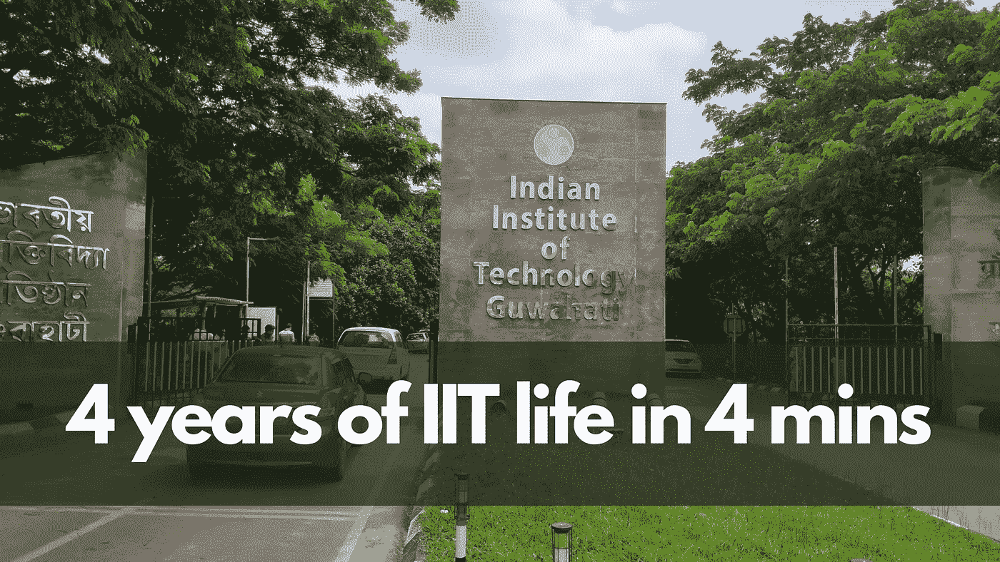

不过，在我们开始之前，我有一个小提示，我不会在这里谈论两件事——我的人际关系和我的成就。前者是方式太个人化，后者是上 [*Linkedin*](https://www.linkedin.com/in/absatyaprakash/) *。🙃*

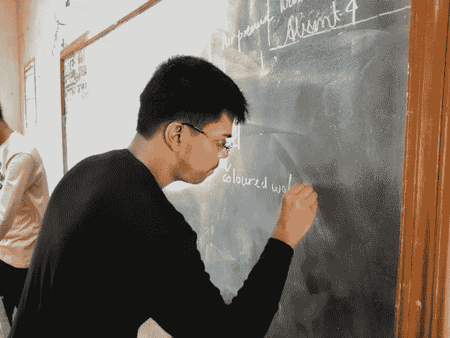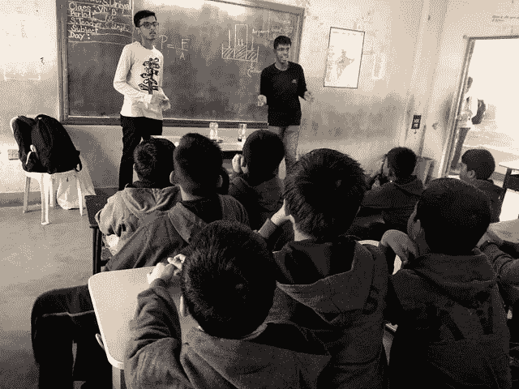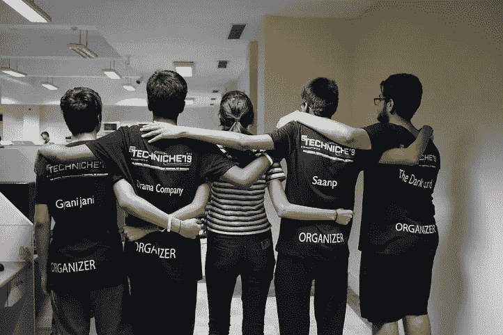

# 第一年

1.  我在 JEE 高级论文 2 中犯了一点小错误后来到这里，这使我进入了🦾⚙️机械工程学院
2.  第一学期进行到一半时，我意识到我的流的核心是“一条未选择的路”，我必须升级到一个不同的分支。😥
3.  尝试了一点编码——我很喜欢。
4.  我在几次 MA 101 测试中表现良好，并决定去参加 M&C。我不知道 MA 101 会在那年的下半年杀了我。😂
5.  遇到了一群热情、勤奋、了不起的朋友。我们称自己为潘达瓦斯。
6.  意识到我的声音已经恢复了青春期的损伤，又开始唱歌了！重新点燃了我对写作的热情。在*曼坦*演出并获奖…
7.  作为在线团队成员加入 Technothlon。在这个过程中，我遇到了我最好的朋友(尽管当时我并不知道)。😇

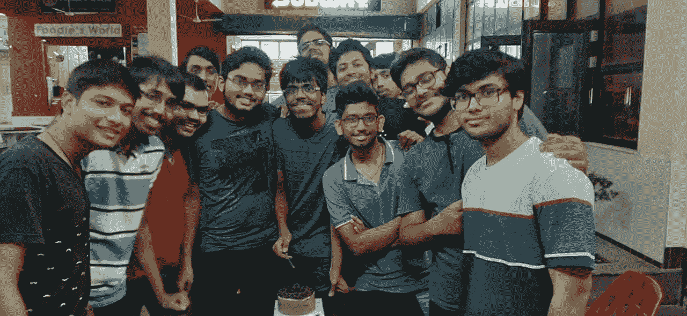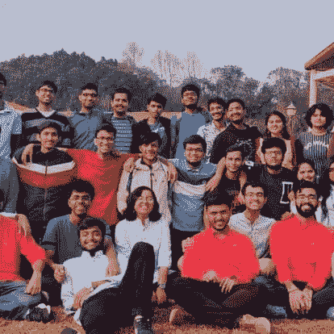

# 第二年

1.  有没有一个分支改成了数学和计算。那么多新人——过得很艰难。此外，没有人喜欢分支转换器(目前还没有)😂
2.  继续在技术竞赛中保持在线领先地位。奋斗过，也学到了很多。
3.  意识到我在纯数学科目上很糟糕——变得沮丧。开始质疑人生决策。有自杀的念头！😰
4.  第四学期中期，我意识到我在计算机科学和金融科目上做得更好。利用了这一点。
5.  在反复的争论和误解之后，做出了退出 Technothlon 的艰难决定。
6.  从抑郁症中恢复过来(对我的一些朋友❤️).大声喊出来意识到我有软件工程的天赋。开始与几个组织合作，并在这方面学到了很多东西。

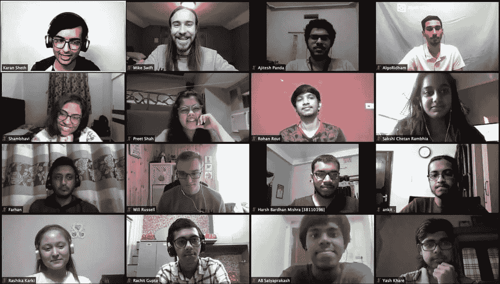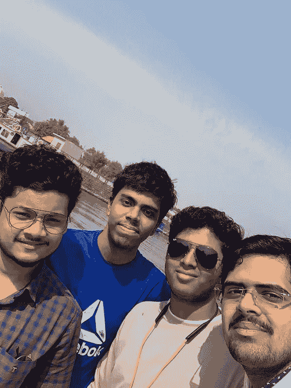

# 第三年

1.  Covid 命中！由于其他人都在做同样的事情，我屈服于通过一些考试作弊的方式。😂
2.  和 M&C 的人在一起更自在了。我意识到这是一群了不起的人。一路上交了几个好朋友。
3.  开始从事自由职业，为开源做贡献。一个全新的世界！
4.  进入 MLH 奖学金(01 批)是一次改变人生的经历。认识了很多不同的人，了解了这个行业。所有这些都帮助了我后来在甲骨文的实习。
5.  大约在这个时候，我进入 SWC，担任应用开发主管。将 Flutter 技术栈引入团队。后来，这将取代原生的 Android 文化。遇到一些很棒的三年级学生。🤗

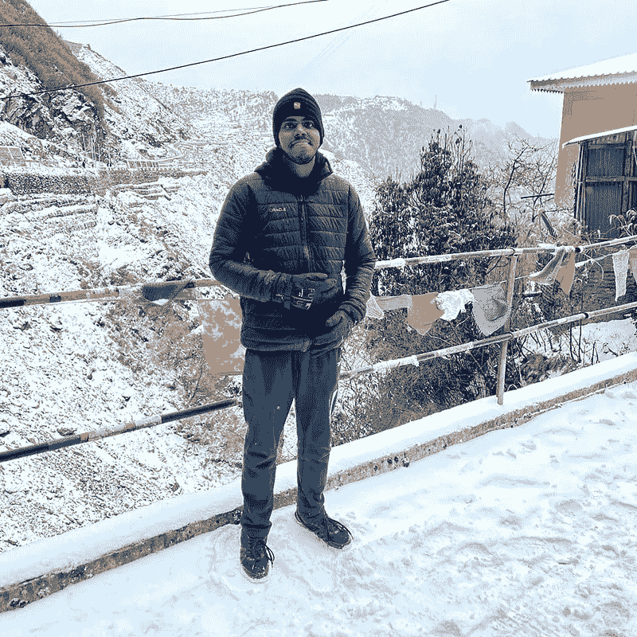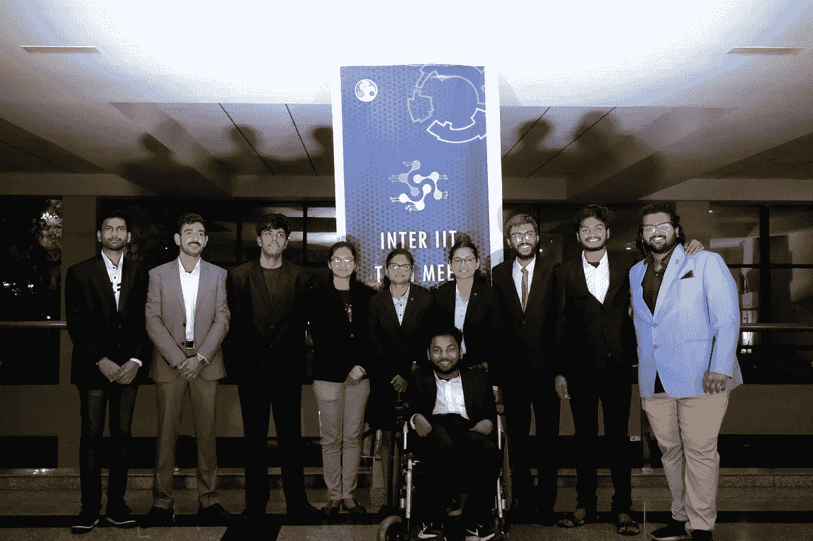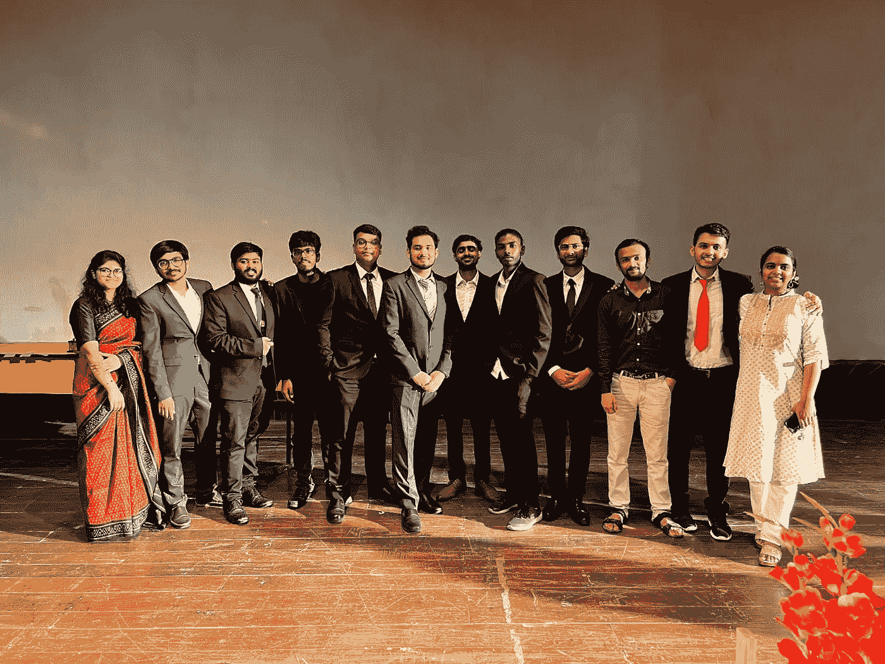

# 第四年

1.  从甲骨文的 FTE 邀请开始，所以我决定走出我的外壳，去寻找我真正喜欢的东西。一些能填满我 5-9 岁的东西。
2.  意识到内容创作就是那件事！我开始在 Medium 上写一些博客，人们似乎很喜欢它。我的 MLH 博客在谷歌上很受欢迎😂
3.  继续工作，帮助和指导人们。对金融产生了兴趣。股票市场看起来特别有趣！📈
4.  我第一次去锡金大学旅行。这是冒险超载。
5.  远离各种药物滥用——只是不喜欢这个主意。
6.  接下来校园开放了。我期末考试考得很好。最后得到了接近 9 的 CPI。带着 0 的遗憾和一吨的成熟快乐地毕业了！

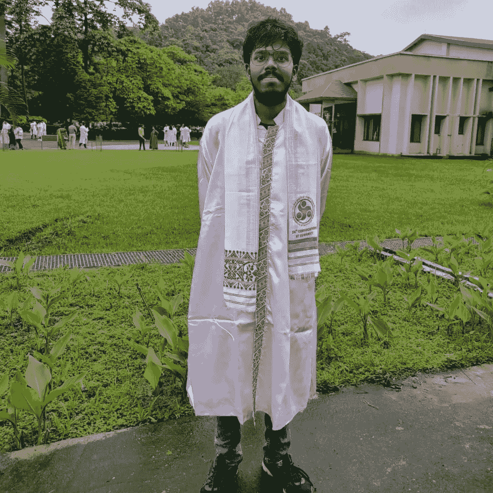

我决定坐在办公桌前，打开我的 MacBook，在 Medium 上写一篇博客，再次记录我在 IIT 的 4 年生活。🙃

所以最后，这是我得到的教训—

.

.

.

你还在看这个吗？😂这里没有课。这不是童话。这就是生活 ❤️

在这些社交媒体平台上，你可以随时联系并关注我——T2、LinkedIn、T4、YouTube、Twitter 和 Instagram。

一如既往！**快乐生活！😇**