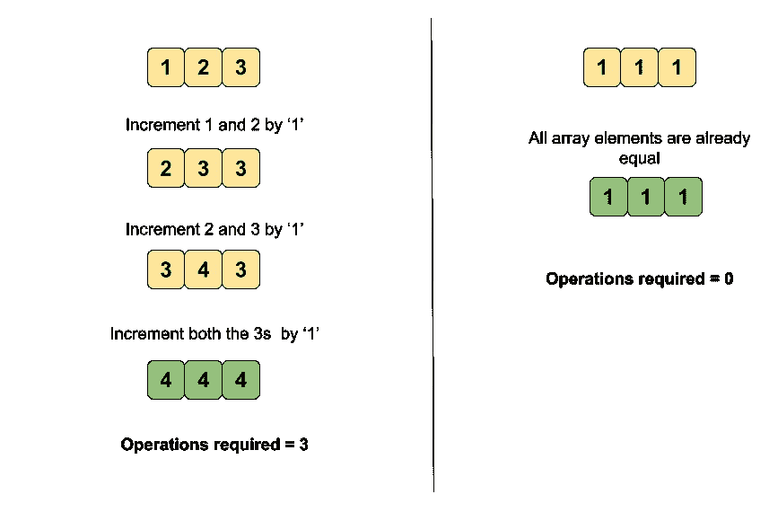
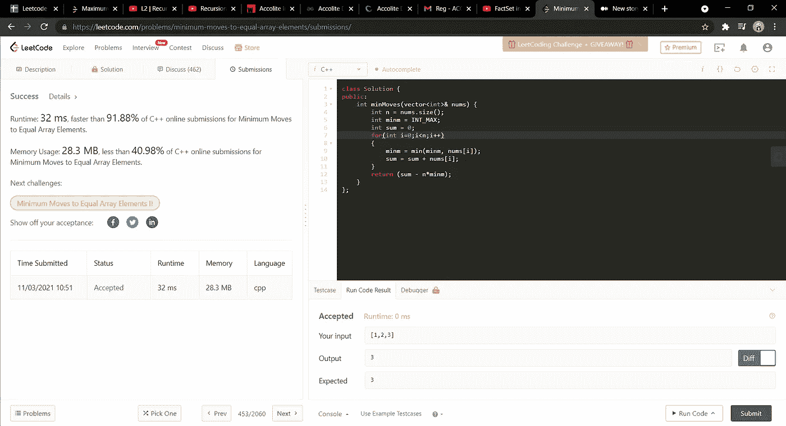

# 453.最小移动到相等的数组元素

> 原文：<https://medium.com/nerd-for-tech/453-minimum-moves-to-equal-array-elements-b79a23684f7f?source=collection_archive---------1----------------------->

(LeetCode 介质)



给定一个大小为`n`的整数数组`nums`，返回*使所有数组元素等于*所需的最小移动次数。

在一次移动中，您可以将数组的`n - 1`元素增加`1`。

**例 1:**

```
**Input:** nums = [1,2,3]
**Output:** 3
**Explanation:** Only three moves are needed (remember each move increments two elements):
[1,2,3]  =>  [2,3,3]  =>  [3,4,3]  =>  [4,4,4]
```

**例 2:**

```
**Input:** nums = [1,1,1]
**Output:** 0
```

**约束:**

*   `n == nums.length`
*   `1 <= nums.length <= 10^5`
*   `-10^9 <= nums[i] <= 10^9`
*   答案保证适合一个 32 位的整数。

首先让我们通过一个例子来理解这个问题的含义:nums = [1，2，3]。在这里，我们必须找到将这个数组转换成所有元素都具有相同值的数组的最少操作。每当我们选择一个数组元素，我们可以增加除它以外的所有元素。例如，我选择我的数组元素为 3，现在我可以增加 1 和 2。这是该方法遵循的方式。

这里有一个问题，如果我选择最小的数组元素，增加其他更大的数字会使它更大，对吗？所以最初我会选择最大的数字，即 3，现在增加其他数组元素，我们的数组变成 nums = [2，3，3]。

现在，我将选择最大的元素 3，因此增加其他元素，使 nums 变成 nums = [3，4，3]或[3，3，4]。现在再次选择最大的元素 4，并增加其他元素，这样数组就变成了 nums = [4，4，4]。

现在所有的数组元素都相等了。所以所需的操作总数是 3。

现在让我们讨论解决这个问题的方法。

# **强力方法**

这里我们将使用上述方法来解决问题。每次你将循环进入数组，找到最大的元素，并增加除它之外的所有其他元素。不断增加增量操作完成的次数，该计数将返回所需的答案。

***时间复杂度将是 O(n*n)*** 因为我们将首先循环查找最大的元素，然后我们将迭代到数组以递增其他元素的值。

***空间复杂度将为 O(1)*** 因为我们没有使用任何额外的空间来存储我们的输出。

PS:我已经分享了方法，现在尝试自己编码。🙌👻

# **优化方法**

这是优化的方法。我们将执行与问题中给出的操作完全相反的操作，即现在我们将从整个数组中选择最小的元素，即 nums = [1，2，3]中的 1。

现在，我们将找出将其他数组元素转换为最小值(即 1)需要多少次操作。

所以每个元素数组的操作将是，

将 arr[0]= 1 转换为 1 所需的运算是，arr[0]-最小数= 0，将 arr[1] = 2 转换为 1 所需的运算是，arr[1]-最小数= 1，类似地，将 arr[2]= 3 转换为 1 所需的运算是，arr[2]-最小数= 2，因此总答案计数将是，0+1+2 = 3，这是所需答案。

*答案= arr[0]-最小数+arr[1]-最小数+arr[2]-最小数*

*答案=数组元素之和— n*最小的数，其中 n 是数组的大小。*

**时间复杂度:O(n)因为我们只遍历数组一次，空间复杂度:O(1)。**

下面是给定的代码，非常简单易懂。

```
**class Solution {
public:
    int minMoves(vector<int>& nums) {
        int n = nums.size();
        int minm = INT_MAX;
        int sum = 0;
        for(int i=0;i<n;i++)
        {
            minm = min(minm, nums[i]);
            sum = sum + nums[i];
        }
        return (sum - n*minm);
    }
};**
```



希望这篇文章能帮助你有一个清晰的理解和解释。

> 如果你有任何疑问，欢迎在下面发表评论，或者你可以通过我的 Gmail 账户联系我:sukanyabharati823@gmail.com 或者我的 LinkedIn 账户:[https://www.linkedin.com/in/sukanya-bharati/](https://www.linkedin.com/in/sukanya-bharati/)

# 直到那时，继续编码&继续学习！记住一致性是关键！！🙌

既然你喜欢看我的博客，为什么不请我喝杯咖啡，支持我的工作呢！！[https://www.buymeacoffee.com/sukanyabharati](https://www.buymeacoffee.com/sukanyabharati)☕