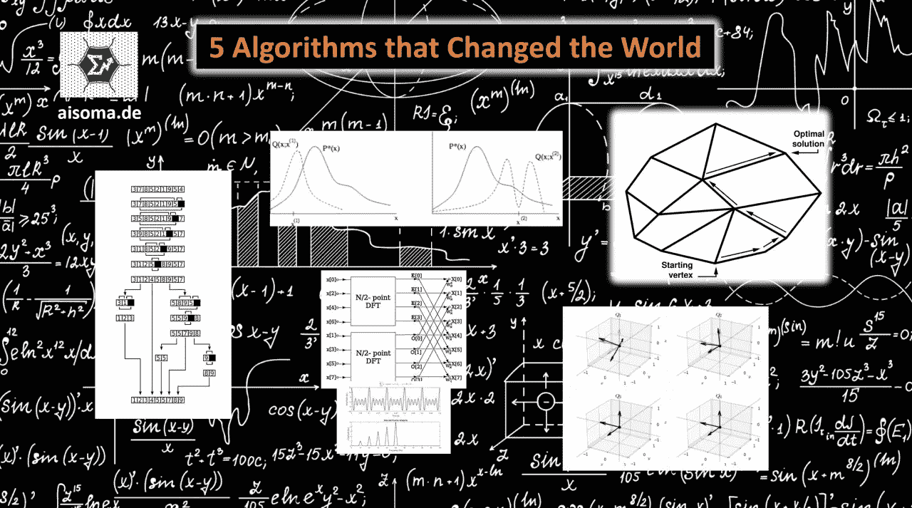

# 改变世界的 5 种算法

> 原文：<https://medium.com/nerd-for-tech/5-algorithms-that-changed-the-world-9a9c9fc4bcc4?source=collection_archive---------2----------------------->

改变世界的 5 种算法(穆拉特·杜马斯)

算法是解决一个问题或一类问题的简单规则。算法由有限数量的明确定义的单个步骤组成。因此，它们可以在用于执行的计算机程序中实现，并以人类语言表达。在解决问题时，特定的输入被转换成特定的输出。

下面列出了对我们的世界产生了重大影响的五种算法。

**1。蒙特卡洛大都会算法**

Metropolis 算法是一种马尔可夫链-蒙特卡罗方法，用于根据玻尔兹曼分布生成系统的状态。从该算法导出的更一般的 Metropolis-Hastings 算法使得模拟随机变量序列成为可能，更精确地说是模拟马尔可夫链，其具有作为平稳分布的期望分布，特别是在随机变量的分布不能被直接模拟的许多情况下。([更多信息](https://de.wikipedia.org/wiki/Metropolis-Algorithmus))

**2。线性规划的单纯形法**

单纯形法(也称为单纯形算法)是一种求解线性优化问题的数值优化方法，也称为线性规划(LP)。它在有限多个步骤后精确地解决了这样一个问题，或者确定了它的无解性或无界性。乔治·丹齐格在 1947 年介绍了单纯形法的基本思想；从那以后，经过无数次的改进，它们已经发展成为实践中最关键的线性优化求解方法。单纯形法是枢纽法。([更多信息](https://en.wikipedia.org/wiki/Simplex_algorithm))

**3。快速傅立叶变换**

快速傅立叶变换(FFT)是一种有效计算离散傅立叶变换(DFT)的算法。它可以用来将数字信号分解成频率成分，然后进行分析。类似地，对于离散傅立叶逆变换，存在快速傅立叶逆变换(IFFT)。IFFT 使用相同的算法，但是具有共轭系数。

FFT 在工程、自然科学和应用数学中有许多应用。它还用于 UMTS 和 LTE 等移动技术以及 WLAN 等无线数据传输。([更多信息](https://www.dspguide.com/ch12/2.htm))

**4。排序的快速排序算法**

Quicksort 是一种快速、递归、不稳定的排序算法，它基于部分和支配原则。它是由 C. Antony R. Hoare 在 1960 年左右以其基本形式开发的，此后被许多研究人员改进。该算法具有非常短的内部循环的优点(这显著提高了执行速度)。它不需要额外的内存(除了调用堆栈上递归所需的额外空间)。([更多信息](https://de.wikipedia.org/wiki/Quicksort))

**5。计算特征值的 QR 算法**

QR 算法是一种计算二次矩阵的所有特征值和可能的特征向量的数值方法。QR 方法或 QR 迭代基于 QR 分解，由 John G. F. Francis 和 Wera Nikolajewna Kublanowskaja 在 1961-1962 年独立提出。一个前身是 Heinz Rutishauser (1958)的 LR 算法，它不太稳定，基于 LR 分解。通常，QR 算法的迭代收敛于矩阵的舒尔形式。因此，最初的过程相当复杂——即使在今天的计算机上——对于具有成千上万行和列的矩阵是不可行的。

派生的变体，如 Z. Bai 和 James Demmel 1989 的多移位方法，以及 K. Braman、R. Byers 和 R. Mathias 2002 的数值上更稳定的变体，在大小矩阵中具有实际的运行时立方。后一种方法在数值软件库 LAPACK 中实现，该软件库在许多计算机代数系统(CAS)中用于数值矩阵算法。([更多信息](http://madrury.github.io/jekyll/update/statistics/2017/10/04/qr-algorithm.html))

> **如果让我选一个，我最喜欢的是快速傅立叶变换(FFT ),因为 FFT 在工程、自然科学和应用数学中有许多应用，并且有一种内在的美。~缪拉·杜尔穆斯**

木拉提

(文字摘自我的新书《[正念 AI——反射人工智能](https://www.amazon.com/dp/B0BKMK6HLJ)》)