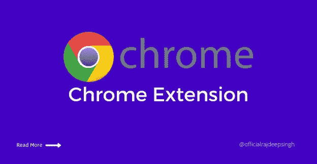
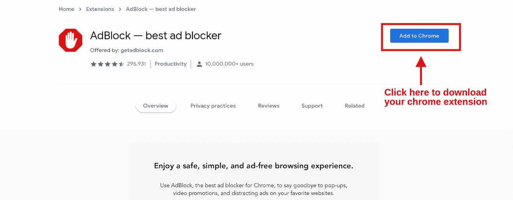
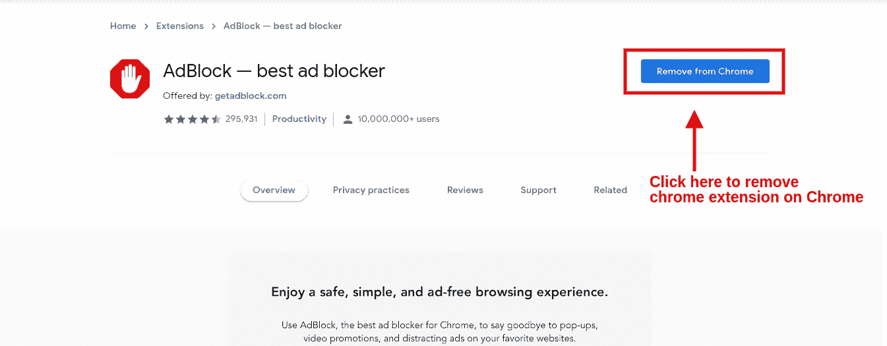
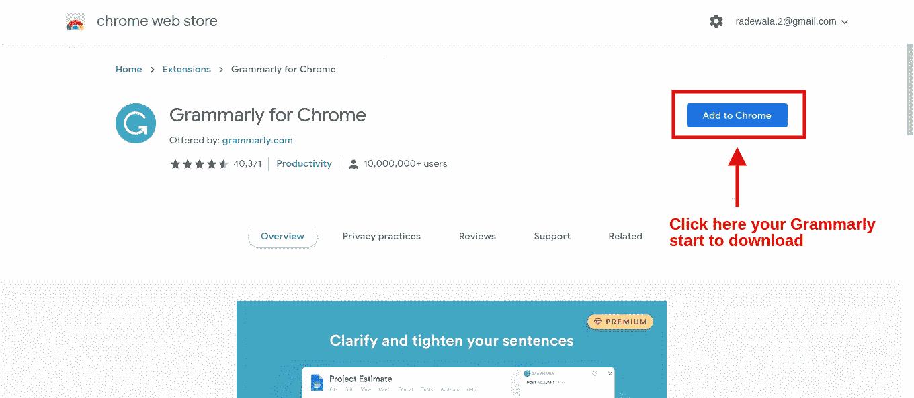
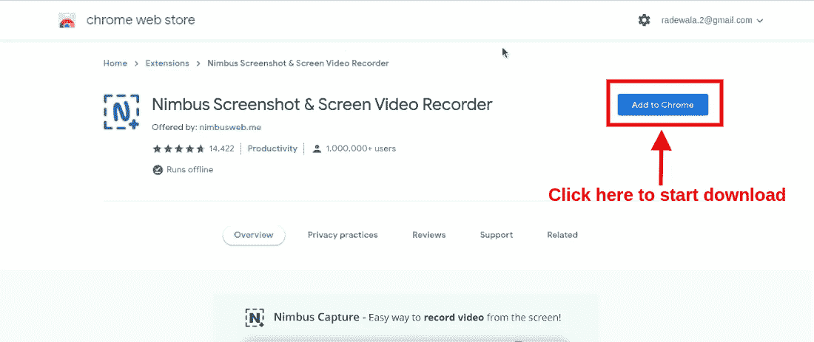
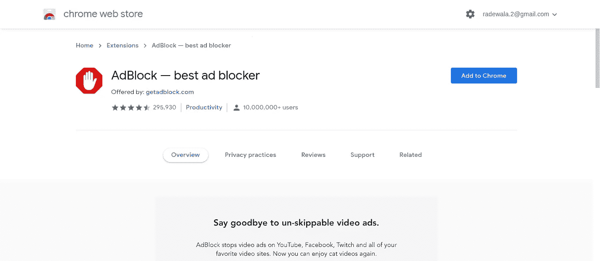
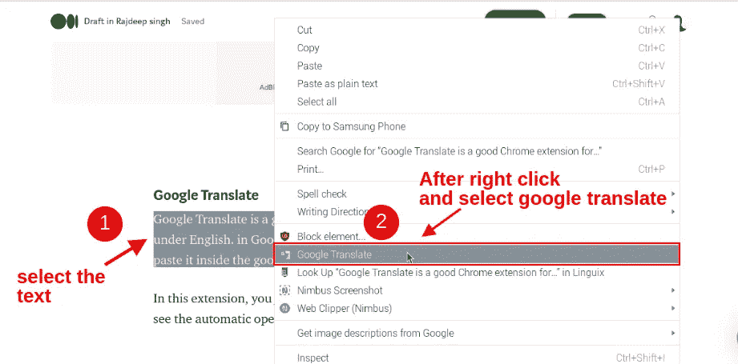
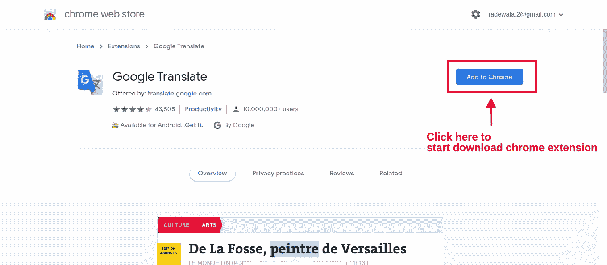

# 每个人的 5 个最佳 Chrome 扩展

> 原文：<https://medium.com/nerd-for-tech/5-best-chrome-extension-for-everyone-da36030f0878?source=collection_archive---------17----------------------->

## 铬

## Chrome 是目前市场上最好的网络浏览器。生活中每天都有很多人使用 chrome。我最喜欢的是 chrome，它是 chrome 的扩展。

每个人都在日常生活中使用 chrome。我知道 Chrome 很酷。你使用 chrome 服务于互联网，也许在互联网上获取信息，阅读文章和新闻。

所有的扩展，我告诉过你在 chrome 网上商店都是免费的。我每天使用的所有分机都是基于我的生活。所以我也推荐了你。如果您是程序员、设计师、前端开发人员、作家和探险家，您必须使用这个扩展来节省大量时间。

5 个最好的 Chrome 扩展。

## 如何安装 Chrome 扩展？

很简单，你去 chrome 网上商店浏览一下。如果你的扩展在第一页没有找到，点击搜索栏，选择你的扩展后找到它，点击**添加到 chrome** 按钮。现在你的扩展下载并显示在 chrome 标签中。

下载你的 chrome 扩展。

## 如何移除 Chrome 扩展？

很简单，在 chrome 网上商店进入你的扩展网页，点击从 Chrome 中删除。

移除你的 chrome 扩展。

## 我们开始吧

1.  语法上
2.  光轮截图
3.  Adblock
4.  谷歌翻译
5.  相似网站

## 语法上

Grammarly 是我一生中最喜欢的扩展。每天我都花很多时间在语法上。你写一篇文章或邮件。语法自动删除语法错误，也删除你的段落中的拼写错误。

Grammarly 为用户提供免费和付费计划。我的意见是自由地为你计划最好的。假设你购买语法付费计划。语法上提供了更多的特性。

语法上支持不同浏览器，如 firefox、chrome 和 chrome。

## 如何下载语法扩展？

下载 Grammarly Chrome 扩展的两种方式

## 第一种方式

简单的去 [chrome 网上商店](https://chrome.google.com/webstore/category/extensions)进行语法搜索。点击语法图标后。打开完整的语法网页。点击**添加到 chrome** 按钮后，开始下载 chrome 扩展。

## 第二种方式

 [## 铬的语法

### 用 Grammarly 为 Chrome 写你最好的。

chrome.google.com](https://chrome.google.com/webstore/detail/grammarly-for-chrome/kbfnbcaeplbcioakkpcpgfkobkghlhen) 

点击我们的链接，并在你重定向到语法主下载页面。只需点击**添加到 chrome 按钮。你的扩展会自动下载并显示在 chrome 标签上。**

下载语法

## 光轮截图

Nimbus 截图是我观点的很大延伸。Nimbus 屏幕截图扩展有助于使用 chrome 进行屏幕截图和录制视频。Nimbus 屏幕截图扩展在浏览器中提供了一个强大的完整图像编辑器和一个视频编辑器。但非常好的是，你不需要任何互联网连接来编辑你的截图。

Nimbus 截图扩展对用户来说也是一个免费和付费的计划。我的观点是免费计划对我们来说太好了。如果你买的是 Nimbus 截图 pro 版，根据你的计划，你要支付 29 到 40 美元左右。此外，在付费，你可以访问光轮截图，光轮笔记，和光轮快船。

## 如何下载 Nimbus 截图扩展？

下载 Nimbus 截图 Chrome 扩展的两种方式

## 第一种方式

简单的去 [chrome 网上商店](https://chrome.google.com/webstore/category/extensions)搜索光轮截图。点击光轮截图卡后。打开完整的光轮截图网页后。点击**后添加到 chrome** 按钮，开始下载 chrome 扩展。

## 第二种方式

 [## 光轮截图和屏幕录像机

### 截屏整个网页或任何部分。编辑截图。录制截屏视频-从您的屏幕上录制视频。

chrome.google.com](https://chrome.google.com/webstore/detail/nimbus-screenshot-screen/bpconcjcammlapcogcnnelfmaeghhagj) 

点击我们的链接，并在你重定向到光轮截图主下载页面。只需点击**添加到 chrome 按钮。**您的扩展会自动下载并显示在 chrome 选项卡上。

下载光轮截图和屏幕录像机

## Adblock

Adblock 有史以来最受欢迎的 chrome 扩展。每当一个搜索主题和文章，谷歌广告和其他广告在网站上反复显示我。有些时候，广告与主题无关，给人不安全感。因此，我每次都在 chrome 上使用 Adblock。

假设你每次都用 Adblock，访问任何一个网站。那个网站不挣钱，因为你屏蔽了网站上的广告。

## 如何下载 Adblock 扩展？

下载 Adblock Chrome 扩展的两种方式

## 第一种方式

简单地去 chrome 网上商店搜索 Adblock。打开完整的 Adblock 网页后，单击 Adblock 卡，然后单击添加到 chrome 按钮。你扩展后，开始下载。

## 第二种方式

 [## 最佳广告拦截器

### 阻止 YouTube、脸书、Twitch 和您最喜欢的网站上的广告和弹出窗口。

chrome.google.com](https://chrome.google.com/webstore/detail/adblock-%E2%80%94-best-ad-blocker/gighmmpiobklfepjocnamgkkbiglidom) 

点击我们的链接，然后重定向到 Adblock 主下载页面。只需点击**添加到 chrome 按钮。你的扩展会自动下载并显示在 chrome 标签上。**

下载 Adblock

## 谷歌翻译

对于不懂英语的人来说，谷歌翻译是一个很好的 Chrome 扩展。这个扩展由谷歌翻译团队正式提供。在谷歌翻译中，你不需要复制你的文本并粘贴到谷歌翻译网站中。

在这个扩展中，您选择文本并单击鼠标右键。你会看到自动打开的 chrome 菜单，选择**谷歌翻译**选项。谷歌翻译扩展后自动重定向到谷歌翻译网站。

你不需要在 chrome 中进行任何复制和粘贴工作。用谷歌翻译扩展就行了。

谷歌翻译 chrome 扩展工作

## 如何下载谷歌翻译扩展？

下载谷歌翻译 Chrome 扩展的两种方式

## 第一种方式

简单的去 [chrome 网上商店](https://chrome.google.com/webstore/category/extensions)搜索谷歌翻译。点击谷歌翻译卡后。打开完整的谷歌翻译网页后，点击**添加到 chrome** 按钮。你扩展后，开始下载。

## 第二种方式

 [## 谷歌翻译

### 浏览网页时轻松查看翻译。由谷歌翻译团队完成。

chrome.google.com](https://chrome.google.com/webstore/detail/google-translate/aapbdbdomjkkjkaonfhkkikfgjllcleb) 

点击我们的链接，并在你重定向到谷歌翻译主下载页面。只需点击**添加到 chrome 按钮。你的扩展会自动下载并显示在 chrome 标签上。**

下载谷歌翻译 Chrome 扩展

## 相似网站

如果你喜欢在互联网上阅读不同网站或来源的大量文章，一个类似的网站对每个人来说都是一个很好的扩展。那时类似的网络扩展会帮助你。一个类似的网络扩展告诉你网站流量和其他相关的东西。根据网站数据，你猜测网站是否可信。类似的网站并不提供互联网上每个网站的所有数据。只提供一些提供类似网站的网站。

## 如何下载类似的 web 扩展？

有两种方法可以下载类似的 web Chrome 扩展

## 第一种方式

简单的去 chrome 网上商店搜索 SimilarWeb。点击相似网页卡片后。打开完整的 SimilarWeb 网页后，点击添加到 chrome 按钮。你扩展后，开始下载。

## 第二种方式

 [## 相似网站-流量排名和网站分析

### 查看任何网站的网站流量和关键指标，包括参与率、流量排名、关键词排名和…

chrome.google.com。](https://chrome.google.com/webstore/detail/similarweb-traffic-rank-w/hoklmmgfnpapgjgcpechhaamimifchmp) 

点击我们的链接，并在你重定向到 SimilarWeb 主下载页面。只需点击**添加到 chrome 按钮。**你的扩展会自动下载并显示在 chrome 标签上。

下载一个类似的 web chrome 扩展。

## 结论

这篇文章中告诉你的所有扩展，对我们来说最有用的扩展。很多人在日常生活中使用这个扩展。所有的扩展都解决了我们日常生活中大大小小的问题。所以我建议你至少使用一个 chrome 扩展，并告诉我们你使用 chrome 扩展的体验。

所有扩展都适用于每个人，而不是一个人。假设你是一名程序员、开发人员、设计师，以及任何你的工作领域。这个扩展在日常生活中帮助你。这是我对你的承诺。

所有的扩展都支持免费和付费计划。在我看来，免费计划是我们最好的选择。

在下面的评论中告诉我你最喜欢的 chrome 扩展。也许你的建议扩展对我们来说更重要，更有价值。