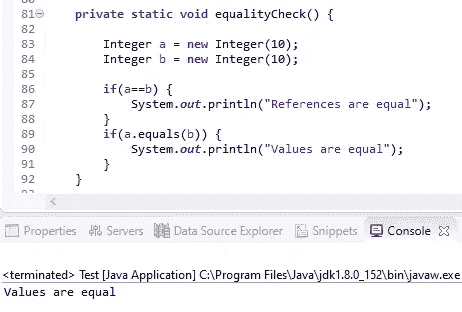
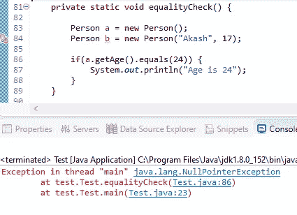
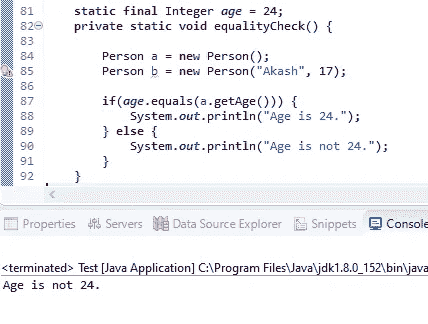
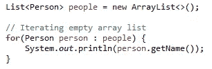
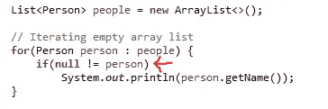
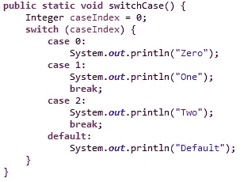
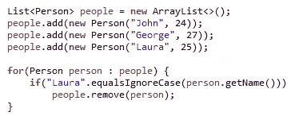
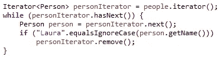

# JAVA 中的 5 个常见错误

> 原文：<https://medium.com/nerd-for-tech/5-common-mistakes-in-java-68542325a140?source=collection_archive---------2----------------------->

来源:https://www.oracle.com/

有时候常见不是很常见。不久前，我们知道或读过或学过一些东西，但随着时间的推移，我们往往会忘记这些基本概念。我见过许多开发人员犯这些错误。

所以，让我们刷新一下简单而常见的 java 概念。

## 1." ==" vs "equals()"

“==”和“等于()”之间有着巨大的区别。这两者在任何情况下都不能相互替代。“==”用于检查两个对象的引用，而“equals()”用于检查 java 中这两个对象内部的值。看看下面的例子:

## **2。**用 equals()方法出错

无论何时将任何值与文字或常量进行比较，请确保将文字放在 equals()方法之前。如果您首先放置 getter()方法，那么可能会出现 NullPointerException。

因此，正确的方法是先放入常量值，如下所示。或者 null check 也可以，但我想这只是一个额外的 if 语句。

## **3。最常见的异常:NullPointerException**

尽管采取预防措施是好的，但过度预防就不好了。为了避免 NullPointerException，有时开发人员倾向于对甚至在“for-each”循环中的所有内容进行空检查。但是不需要检查空的内部循环。“for-each”循环仅在列表中存在一个元素时迭代。请看下面的例子以获得肯定:

看，没有 NullPointerException！因此，不需要下面的空值检查。

## 4.休息一会儿

很多时候，在 switch 情况下缺少 break 语句直到在生产中运行时才被发现。

如果您忘记了代码示例中 case 0 的一个断点，程序将写“0”后面跟着“1”，因为这里的控制流将遍历整个 switch 语句，直到到达一个断点。因此，在编写开关盒时再次检查。

## **5。**并发修改异常

当集合在迭代过程中被修改时，会发生 ConcurrentModificationException。考虑一个实例，我们有一个人员列表，并希望

从其中删除一个人。如果我们运行这段代码，将会引发并发修改异常。要解决这个问题，有各种各样的方法。首先，收集对象并在另一个循环中删除它们。或者可以使用 Iterator.remove()方法。

这种方法更加简洁，并且不需要创建额外的集合。

就像我们在 java 中看到的 5 个常见错误一样，您也可以查看应用程序中的 5 个常见错误，网址是:[*https://sakshikhandelwal 276 . medium . com/5-common-missons-while-build-a-application-from-scratch-1b 117 b 7 FBA 4 c*](https://sakshikhandelwal276.medium.com/5-common-mistakes-while-building-an-application-from-scratch-1b117b7fba4c)

希望你喜欢。

如果您有任何相关的疑问，请随时联系我。如果可以的话，我很乐意帮助你。保持联系:)

## 如果你喜欢这篇文章，请为它鼓掌。我真的很感激。

## 推特:[https://twitter.com/SakshiKhandlwl](https://twitter.com/SakshiKhandlwl)领英:[www.linkedin.com/in/sakshikhandelwal276](http://www.linkedin.com/in/sakshikhandelwal276)