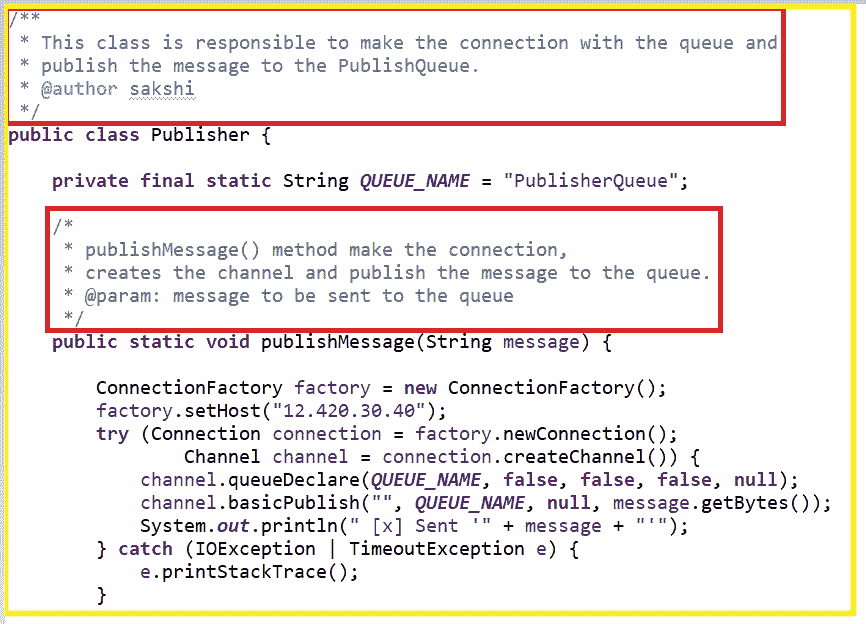
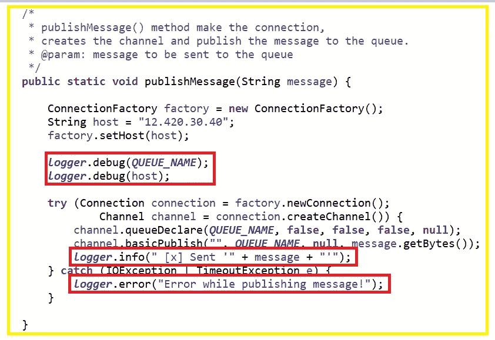

# 从头开始构建应用程序时的 5 个常见错误

> 原文：<https://medium.com/nerd-for-tech/5-common-mistakes-while-building-an-application-from-scratch-1b117b7fba4c?source=collection_archive---------0----------------------->

有时候常见不是很常见。不久前，我们知道或读过或学过一些东西，但随着时间的推移，我们往往会忘记这些基本概念。我见过许多开发人员犯这些错误。

那么，让我们刷新一下我们简单而常见的概念。

# **1。从不硬编码**

最简单的应用程序需要连接数据库。为此，在从头开始开发应用程序时，一些开发人员倾向于在代码中直接给出数据库 URL、用户名和密码。

或者对于某些业务逻辑，开发人员提供任何特定于环境的值，任何业务值如下面代码中所示:

这样对吗？显然，不是！我们不能在代码中给出这样的东西。

为此，我们可以通过以下任何一种方式提供这些值:

*   在 AWS、GCP 或 RedHat Openshift 中使用机密
*   使用环境变量
*   使用可配置文件

*参考*:[*https://medium . com/vaibhav-mal panis-blog/keep-your-secrets-to-your-your-secrets-yourself-AWS-secret-manager-f33d 627 bb 25 f*](/vaibhav-malpanis-blog/keep-your-secrets-to-yourself-aws-secret-manager-f33d627bb25f)

# 2.**添加描述性注释，而不仅仅是注释**

开发人员往往会忘记在代码中添加注释，或者为了同名而添加注释。我们认为为什么如此需要这样做？作为开发人员，我们认为代码很容易理解。但是，我们不能只为自己考虑，要为同一个班里其他要编码的开发人员考虑。我们应该编写易于理解的代码。我们应该在类级别和方法级别添加如下注释:

# **3。不要忘记伐木工**

上面的代码对吗？如果是，那就再考虑一下。我们没有在任何级别添加任何日志。对于开发和测试阶段，这看起来微不足道，但在生产中，这可能是一个救命稻草！很多时候，生产错误不容易在较低的环境中重现，在这种情况下，记录器是唯一的帮助。

# 4.制作未来可扩展代码

同样，不要只为你的任务写代码。考虑未来的附加产品。例如，如果您正在编写两个银行交易的代码，请考虑在将来添加另一个交易。为此，我们可以在主代码之外的可配置文件中定义事务列表，然后在需要时，可以在可配置文件的列表中添加其他事务。

# 5.永远不要提交任何密码

这是任何行业的任何应用的经验法则。该应用程序可以使用任何编程语言，但有一点是肯定的，任何人都不应该在代码库中提交任何密码。

密码应被视为一个独立的实体。它不应该与项目的所有涉众共享。为此，我们可以使用 AWS 或 GCP 等不同平台的秘密。

就像我们已经看到的应用程序中的 5 个常见错误一样，你也可以查看 java 中的 5 个常见错误:[*https://sakshikhandelwal 276 . medium . com/5-common-missons-in-Java-68542325 a140*](https://sakshikhandelwal276.medium.com/5-common-mistakes-in-java-68542325a140)

希望你喜欢。

如果您有任何相关的疑问，请随时联系我。如果可以的话，我很乐意帮助你。保持联系:)

**如果你喜欢这篇文章，请为它鼓掌。我真的很感激。**

**领英:**[**www.linkedin.com/in/sakshikhandelwal276**](http://www.linkedin.com/in/sakshikhandelwal276)**推特:**[**www.twitter.com/SakshiKhandlwl**](https://twitter.com/SakshiKhandlwl)