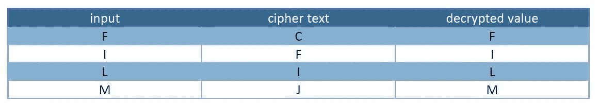
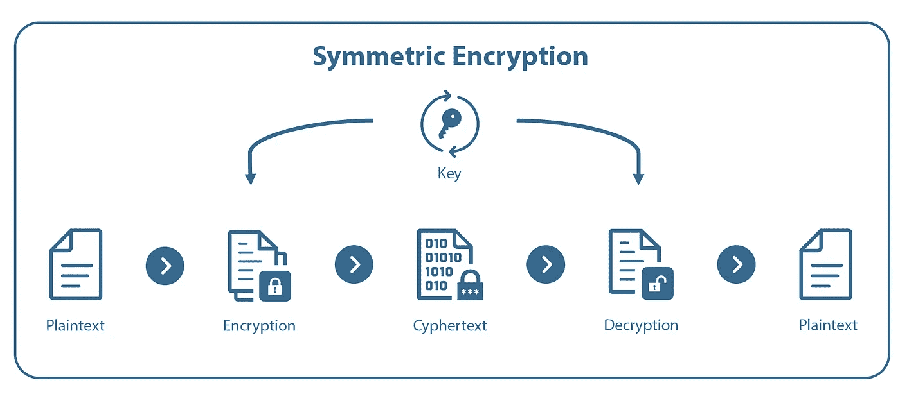
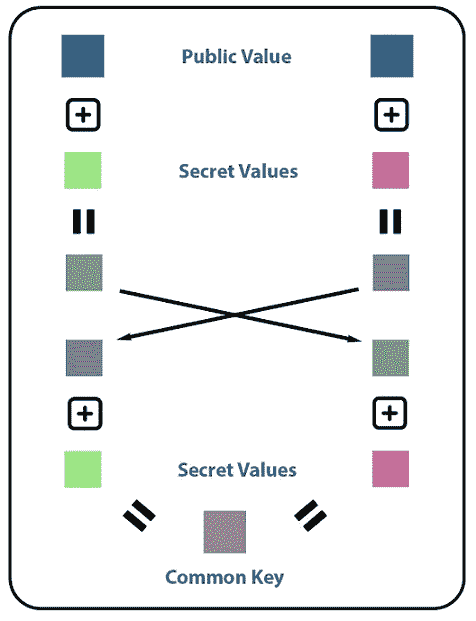
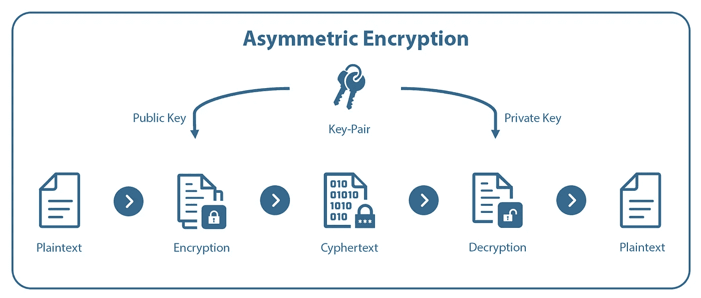
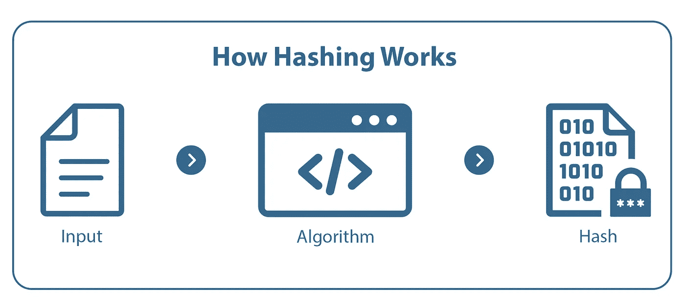
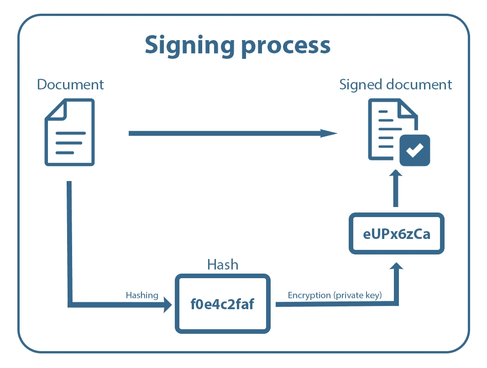
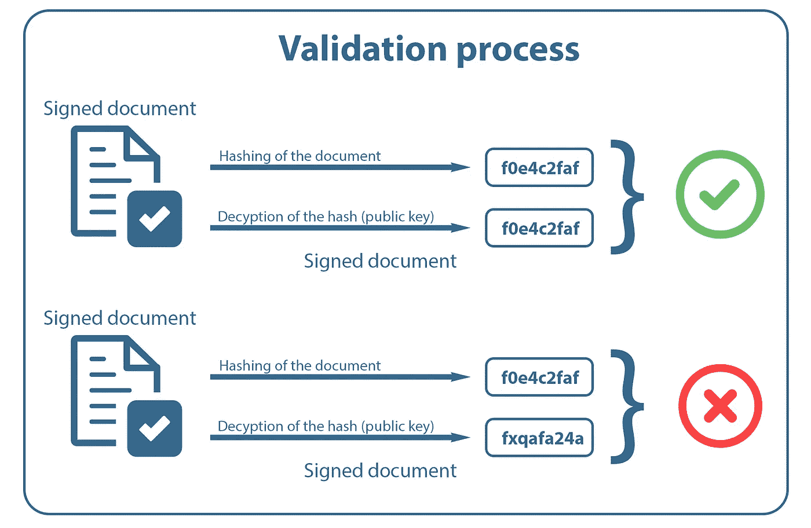

# 你应该知道的 5 个密码学概念

> 原文：<https://medium.com/nerd-for-tech/5-cryptography-concepts-you-should-know-9b2681067a35?source=collection_archive---------0----------------------->

## 尽管不是每个人都必须是网络安全专家，但每个人都应该至少知道这 5 个概念。


照片由[飞:D](https://unsplash.com/@flyd2069?utm_source=medium&utm_medium=referral) 在 [Unsplash](https://unsplash.com?utm_source=medium&utm_medium=referral)

# 介绍

密码术用于将输入(明文)转换成加密的输出(密文)。因此，使用不同的算法将输入转换为输出，大多数情况下使用密钥，加密和解密值需要密钥。密码术中的密钥是算法使用的字符序列。然后，可以使用密文在世界范围内安全地存储和传输数据，只有发送方和接收方能够解密和读取明文。

加密分为三种不同的方法:

*   对称加密
*   不对称加密
*   散列法

# 对称加密


*凯撒密码*

字的加密和解密`FILM`:



*凯撒密码示例*

对称加密的主要优势是速度。在速度很重要的用例中(VPN、数据流等)，通常使用对称加密。因此，目前主要使用两种算法:

*   俄歇电子能谱
*   数据加密标准



对称加密

# 密钥交换

对称加密的概念有一个主要的问题必须解决才能像现在这样使用:*如何获得对方的密钥？*

## 迪菲·赫尔曼

1976 年，这个问题的第一个解决方案是由一个以 Whitfield Diffie 和 Martin Hellmann 命名的算法提供的，该算法被称为 Diffie Hellmann。Diffie Hellmann 的结果是对于通信的两个成员来说是相同的密钥，而不需要预共享密钥或任何秘密。此过程的步骤如下:

1.  公共价值观的一致性
2.  个人秘密值的选择
3.  根据公开值和秘密值计算的值的交换
4.  从步骤 3 的值和自己的秘密值计算密钥，得到通信双方的共同值

为了更容易理解，在下图中用颜色而不是数字显示了这一过程:



Diffie Hellman 密钥交换

## 混合系统

混合系统是同时使用对称和非对称加密的加密系统。大多数情况下，非对称加密系统用于商定一个密钥，然后用于对称系统，因为它要快得多。

# 不对称加密

在非对称加密中，需要一对密钥来进行加密和解密。密钥对由一个公钥和一个私钥组成。公钥用于加密数据，然后只能用私钥解密。公钥可以公开共享，但私钥必须保密，以便有一个安全的加密系统。传输过程包括以下步骤:

1.  接收者共享他的公钥
2.  发送方用公钥加密数据
3.  密文被传送给接收者
4.  接收者用私钥解密密文



该系统的优点是，无需任何安全措施和密钥交换系统就可以共享公钥。缺点是不对称加密的速度。最常见的不对称算法有:

*   南非共和国(Republic of South Africa)
*   偏心轮（eccentric 的简写）

# 散列法

哈希算法用于生成唯一且固定长度的字符串，称为哈希。哈希算法的要求如下:

*   **定长输出**:输出的长度总是一样的
*   **单向函数**:从输入中计算散列值很容易，但反过来计算就不容易了
*   **碰撞阻力**:找到产生相同输出的两个输入应该不容易

当今最流行的散列算法:

*   安全哈希算法 2 (SHA-2)
*   安全哈希算法 3 (SHA-3)
*   消息摘要算法 5(MD5)→不应再使用
*   bcrypt(主要用于密码散列)



输入`Foo`的哈希值示例:

*   SHA-3:

```
195e5c2ddf90d08e0c12357a75fd11180c85b989a9d3b6bc3327aa23a98f278a
```

*   bcrypt:

```
$2a$12$.LJ6zlZXAZ2iRIyzRMcvpeQsPJ6pJ0/zb0daxnhxeGXNqN4KmJ9ny
```

*   MD5:

```
1356c67d7ad1638d816bfb822dd2c25d
```

# 数字签名

数字签名是不同加密概念的一个用例，用于验证数据和文档的真实性。因此，使用了非对称加密和散列函数。签名过程的步骤如下:

1.  计算应该签名的文档的哈希值
2.  用非对称密码系统的私钥加密散列
3.  创建由文档和加密散列组成的签名文档

下图显示了这一过程:



签名过程

要验证已签名的文档，必须完成以下步骤:

1.  使用公钥解密附加到文件的哈希
2.  文档散列的计算
3.  传输和解密的哈希值与从交付的文档中计算的哈希值的比较

如果这两个值匹配，则签名有效，否则签名无效。



签名验证流程