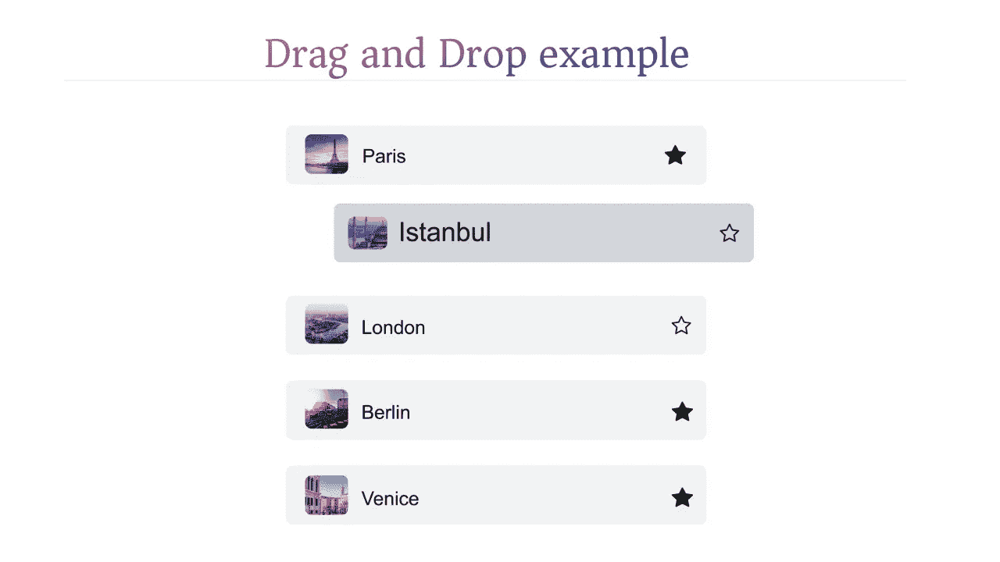

# 添加拖放功能的 5 个简单步骤

> 原文：<https://medium.com/nerd-for-tech/5-easy-steps-to-add-drag-and-drop-a4f952e124a0?source=collection_archive---------3----------------------->

只需 5 个步骤，我们将在 web 应用程序中添加拖放功能

## 在后台

我已经报道了关于今天故事的 youtube 视频，所以如果你不想看，你可以看视频。在今天的故事中，我们将通过 5 个步骤为我们的应用程序添加基本的拖放功能。