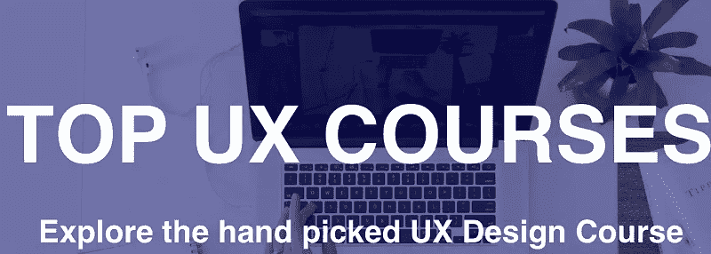
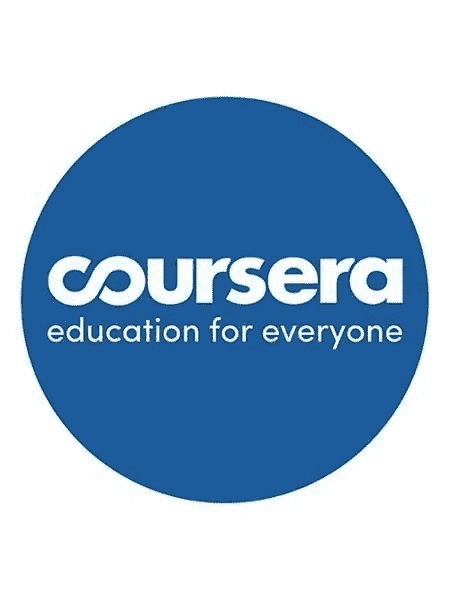
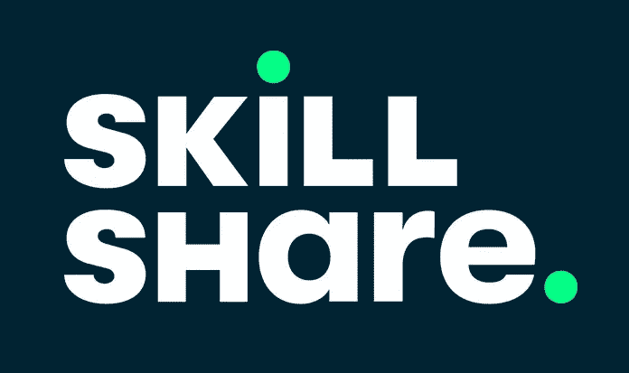
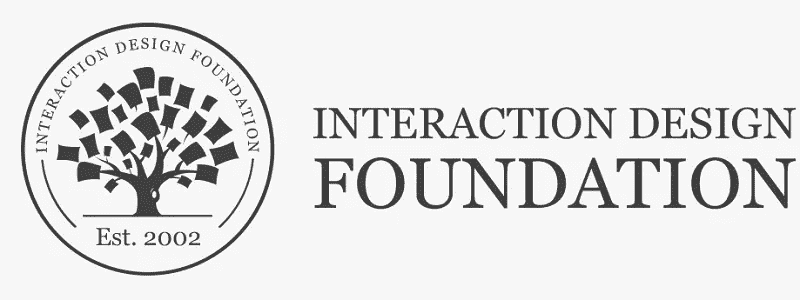

# 帮助你被录用的 5 门 UX 作品集必备课程

> 原文：<https://medium.com/nerd-for-tech/5-essential-ux-portfolio-courses-that-will-help-you-get-hired-4bcea9310fc?source=collection_archive---------24----------------------->

你有没有见过 UX 设计作品集？你对此有什么想法吗？本文将强调 UX 设计及其相关课程的重要性。这些课程对于根据你的要求找到合适的工作至关重要。首先，什么是 UX 设计作品集？这是展示 UX 设计师作品的空间。它展示了与一个独特的案例研究相关的 UX 设计师的设计技巧和方法。你也可以利用这个设计组合空间从事自由职业或工作。它有助于你获得与 UX 设计领域相关的职业。大多数设计师一定想知道开始一门 [UX 设计作品集课程](https://bit.ly/3esptAb)的必要性是什么？为了在这个竞争激烈的设计市场中取得成功，你的作品应该以一种结构良好的方式在正确的时间到达目标受众手中。由 [Wondershare Mockitt](https://bit.ly/3ewCXuz) 提供的这份课程指南有助于建立一个令人印象深刻的作品集，突出你的设计作品，不留任何遗憾。这些课程帮助你将你的设计技巧提高到一个新的水平。它教你 UX 设计的基本要素，并把你和招聘人员联系起来。

# 最佳 5 个 UX 设计作品集在线课程

在这一部分，你将在线学习 UX 设计作品集的前 5 门课程，在一个公共平台上展示你的创新作品。下面讨论的课程指导新手设计师很快成为专业人士。浏览课程，选择最适合你需求的课程。你可以依靠这些课程来创建 UX 设计作品集。

## ***Coursera***

这是一个很好的环境来学习 UX 设计的精髓和它的相关特征。这个在线课程从“用户体验设计介绍”这样的基本概念开始，然后是详细的案例研究。它给你 UX 设计的剩余知识，让你可以毫不费力地建立你的投资组合，根据你的热情抓住一份新工作。Rosa I. Arriaga 博士介绍了这个 UX 设计课程，佐治亚理工学院开发了这个课程。它有最新的课程大纲，即使对于非技术考生也很容易理解。

在这个在线课程中，学生可以注册为期四至十二周的时间课程。课程完成后不久，学院会提供课程完成证书，你可以在工作机会网页和 LinkedIn 上分享。你可以用这些设计知识来开发一个独特的作品集，给全球的设计公司留下深刻印象。现在是时候通过你的设计技巧来接触目标受众，并立刻激励招聘人员了。Coursera 是初学者快速发展设计和创造技能的福音。

## 技能共享

Skillshare 在培养学习者的创造性技能方面起着至关重要的作用。您可以免费注册以获取课程内容。获得高级会员资格，查看超过 20000 个关于 UX 设计的课程。这种在线课程允许学习者在线和离线查看内容。本课程从“UX 介绍:可用性课程的基础”开始，通过一个 90 分钟的视频教授框架、工具和策略，让学习者立刻受到启发。

Skillshare 平台为你提供了一个实现设计技能的空间。它帮助你发现所有的 UX 设计工具。这门课程最初的重点是发展学习者的设计技能，最后指导他们使用更好的策略来说服设计公司在正确的时间抓住这份工作。

## UX 学院

这是专为 UX 设计爱好者设计的最佳学习平台。它从“UX 初学者课程”开始，并在课程结束时为学习者提供所有相关的 UX 工具。这是每周一次的在线课程，由该领域经验丰富的导师授课。课程结束后，你会感到自信、大胆和有创新精神去从事这个 UX 领域的项目。这是开始你的 UX 设计生涯的正确地方，没有任何遗憾。选择初学者指南作为启动课程，然后继续学习其他概念以便更好地理解。你必须明智地报名参加正确的 UX 课程，以获得设计工具的清晰图像。

如果你想通过你鼓舞人心的作品给 UX 设计组合带来改变，那就走进这个学院吧。它在训练你使用 UX 设计工具方面起着至关重要的作用，并为 UX 设计平台提供最新的技术发展。在这个环境中，你可以发现与 UX 设计相关的隐藏事实。它给你完整的 UX 设计知识。选择这所学院，学习超出你预期的 UX 设计技能。

这个独特的计划侧重于 UX 设计，并教授最新的工具技术。课程材料根据设计行业的创新进行更新。教学大纲包括对专业 UX 设计师的所有基本要求，以及接触全球招聘人员的策略。

## 互动设计基金会

交互设计基础是关于用户体验设计的可靠课程之一。它有七周的在线课程，涵盖了从可用性原则到视觉设计的概念。在本课程中，导师会谈论好的和坏的设计，以强调完美设计的必要性，这是在竞争激烈的市场中竞争的必要条件。完成用户体验设计中的每个概念后，您可以找到指向相关课程内容的链接。如果您有兴趣深入了解相关概念，可以点击该链接。

在这个设计基础中，设计专家通过突破极限来训练学习者进行超乎想象的设计。它让你清楚地了解 UX 设计工具，并指导你创造一个更好的设计组合。在这门课程中，你可以找到从初学者到专家的课程内容。本课程将 UX 的新手设计师快速转化为专业人士。

这是交互设计基金会的一门著名课程，课程从“用户体验:初学者指南”开始。这门课程的内容令人印象深刻。课程内容设计是可观的，因为非技术专业的毕业生可以毫无困难地掌握它。每一课都指向一个链接，其中包含对该课中的概念进行深入讨论的内容。借助这一创新课程，您可以获得 UX 设计的坚实基础。

## 职业铸造厂

这是一个 UX 设计的创新学习平台。如果你认真对待你的设计生涯，那么选择职业铸造的 UX 设计项目。这个在线课程能让初学者迅速成为专家。这是一个灵活的在线课程，完全符合你的时间安排，没有任何遗憾。你可以很容易地在毕业时选修这门课程。

完成注册过程后，您可以在线模式访问课程内容。私人导师和专家导师将会解答您对课程内容的疑问。除了辅导之外，Career Foundry 还为你提供了一个从事实时项目的绝佳机会。它给你一个杰出的体验。课程结束后，您可以在 UX 设计中快速创建专业作品集。这个在线课程是正确的选择，你可以发现 UX 设计的提示和技巧，以在你的职业生涯中取得成功。

在课程期间，导师会帮助你发现明智的方法，为你的要求建立一个设计组合。专家导师指南，你发展技能，启发设计领域的招聘人员。本课程提供了一个完整的解决方案，将初学者完美地转变为设计专家。

# 结论

因此，这篇文章让你深入了解了 UX 设计作品集课程。以上讨论的网络课程都很靠谱，你可以毫不犹豫的报读。这些课程培养学习者的设计和创造技能。它帮助你建立一个优秀的用户体验设计组合来吸引世界各地的设计公司。使用这个关于 UX 设计的创新在线课程，与创意和设计的世界联系起来。根据你的需要，遵循正确的路线，你可以成为世界一流的 UX 设计师之一。利用你的技能来做实时项目，并把它们贴在你的作品集里，抓住完美的设计工作。大多数课程为学习者提供实时设计体验。它给学习者的设计技能带来了进步的影响。它帮助学习者跳出框框思考，根据需求构建独特的 UX 设计。选择正确的课程，立刻步入专业氛围。

感谢您花时间阅读这篇文章。[了解更多关于 Mockitt 的信息](https://bit.ly/3ewCXuz)

我们为 UX 初学者创建了一个[终极指南](https://bit.ly/2OLPPlW)，它收集了来自多个 UXers 的知识、经验和建议。

订阅我们的 [YouTube](https://www.youtube.com/channel/UCESxamaRS8nOGpWYvP1VSqA) [脸书](https://www.facebook.com/mockitt) [Instagram](https://www.instagram.com/wondershare.mockitt/)

*原载于*[*https://mockitt.wondershare.com*](https://mockitt.wondershare.com/ui-ux-design/ux-portfolio.html)*。*