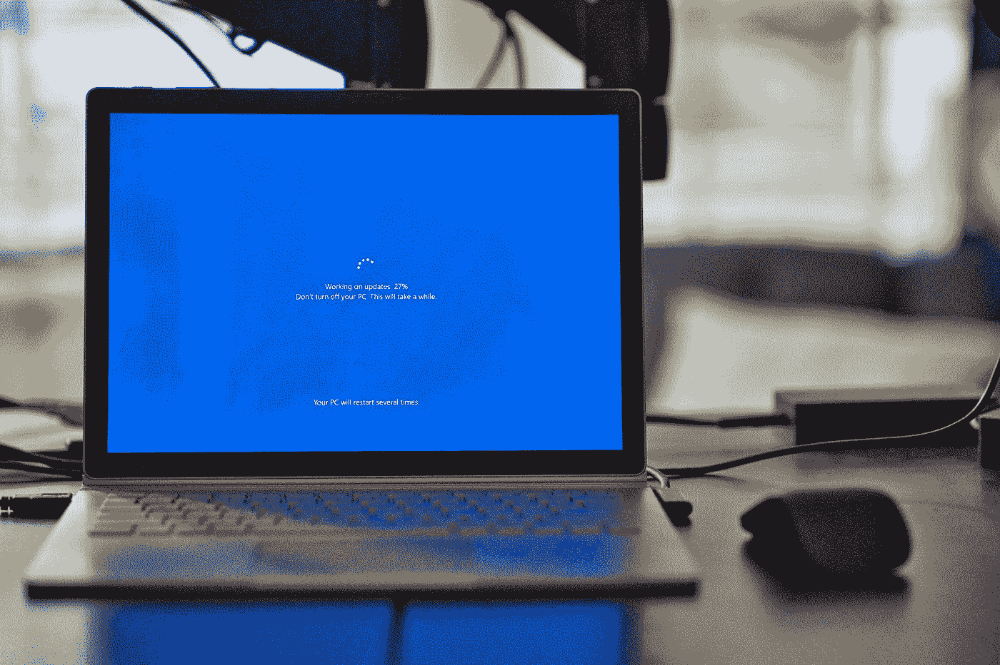

# 5 个免费工具来开发你自己的操作系统

> 原文：<https://medium.com/nerd-for-tech/5-free-tools-to-develop-your-own-operating-system-7025257745af?source=collection_archive---------5----------------------->

## 使用这 5 个优雅的工具中的一个来开发操作系统。网

克林特·帕特森在 [Unsplash](https://unsplash.com?utm_source=medium&utm_medium=referral) 上拍摄的照片

由于原生开发的速度和要求，驱动程序和操作系统的开发通常在 C/C++中完成。但是如果你是一个熟悉。NET 平台，而你想用**编写一个操作系统**，那么这篇文章将…