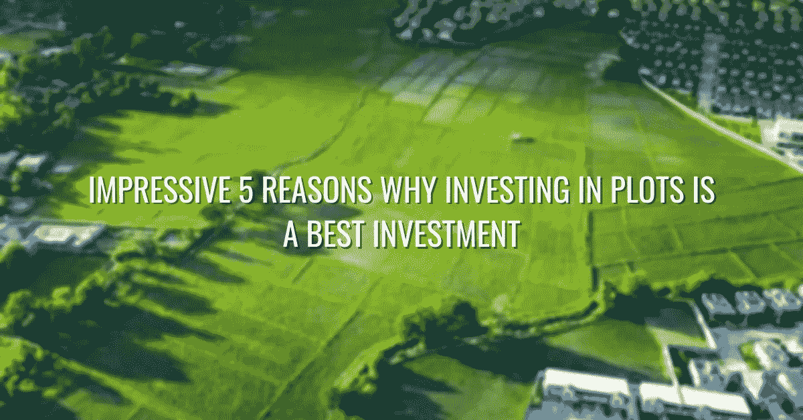

# 投资土地是最佳投资的 5 个令人印象深刻的理由

> 原文：<https://medium.com/nerd-for-tech/5-impressive-reasons-why-investing-in-plots-is-a-best-investment-b902b06242b?source=collection_archive---------8----------------------->

## 介绍

说到投资，你需要考虑很多因素。你想确保投资是合理的，并会为你的钱提供良好的回报。如果你正在考虑投资房地产，那么这里有五个理由说明为什么投资土地是个好主意。当大多数人考虑投资房地产时，他们会考虑购买房屋或公寓。然而，另一个值得考虑的选择是投资小块土地。

投资土地是最佳投资的 5 个令人印象深刻的理由

投资土地是一个很好的选择，会给你带来很好的回报。这里有五个令人印象深刻的理由，说明为什么投资土地是你能做的最好的投资之一:

## **土地价值增加**

随着人口继续增长，对土地的投资和需求只会增加。[世界人口目前接近 80 亿](https://www.hindustantimes.com/world-news/world-is-about-to-reach-8-billion-population-un-report-gives-key-highlights-101667901290526.html)，预计到 2050 年将达到 97 亿。随着人口的不断增长，对土地的需求也将增加。这是因为每个人都需要一个居住的地方，而随着一个地区人口密度的增加，人均可用土地数量减少。人均可用土地的减少推高了土地价格。此外，随着人口的增长，将需要更多的食物来养活每个人。这意味着需要更多的农田，进一步推高土地价格。因此，投资土地是明智的，因为你的土地价值会随着时间的推移而增加。

## **有形资产**

不像股票或债券是无形的，投资土地给你一个有形的资产，你可以看到，触摸和感觉。这可以让你安心，知道你的投资是安全的。随着时间的推移，人口将继续增长，这只会增加对土地的需求，推动价格上涨。因此，如果你在寻找一种安全的投资，可以长期保值，土地是一个不错的选择。

## **低风险投资**

投资土地的风险相对较低，尤其是与股票或债券等其他投资相比。这使得土地投资成为最小化风险的绝佳选择。为了更好的理解，查看一下哪个更好:[投资房地产还是股票？土地通常被视为明智的投资，因为它不太可能贬值。它可用于多种目的，如农业、住房或商业开发。它也是一种有限的资源，这意味着它的价值不会随着时间的推移而下降。](https://www.gsquarehousing.com/blogs/investing-in-real-estate-vs-stocks-which-is-better/)

## **长期投资**

不像许多其他投资，可以很快出售，土地是一项长期投资。土地是一种有限的资源，因此这是一种很好的长期投资，可能会保持其价值。这意味着你可以持有你的投资几年，甚至几十年，而不用担心失去它的价值。随着时间的推移，土地是建立资产净值的绝佳投资。

## **稳健的财务决策**

投资土地不仅在财务上是明智之举，而且在道德和伦理上也是合理的投资。投资土地是确保你未来财务状况的好方法。通过仔细的规划和长远的眼光，你可以从你的投资中获得丰厚的回报。当你投资土地时，你就是在投资我们星球的未来。对于那些希望进行负责任和可持续投资的人来说，这是一个重要的考虑因素。

## **最终想法**

尽管市场可能会动荡不安，千变万化，但对于那些希望保护自己财务未来的人来说，有一项投资仍然是坚定的选择:土地。

土地是一种宝贵的资源，只会随着人口增长和城市扩张而增加。这是一种看得见摸得着的有形资产，是风险最低的投资之一。与股票或其他投资选择不同，土地是一项长期投资——你可以代代相传。因此，如果你正在寻找一个合理的财务决策，考虑投资土地。要做更多的分析，查看一下[为什么人们应该投资土地](https://www.gsquarehousing.com/blogs/7-reasons-why-land-is-the-best-future-investment/)的其他一些额外津贴。请在下面的评论中告诉我们！