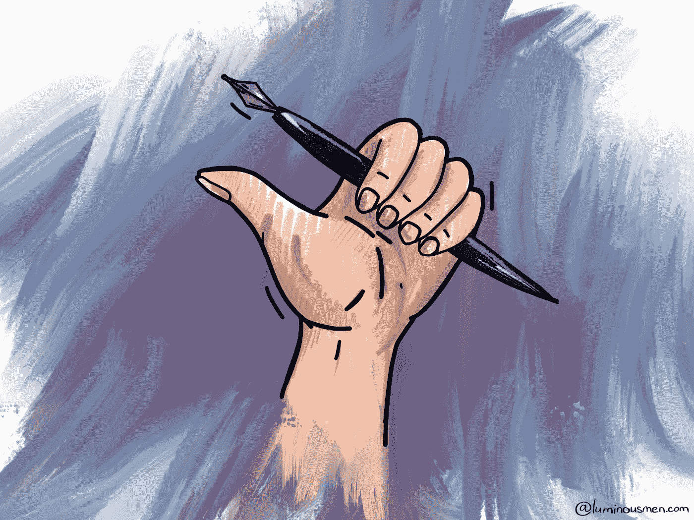

# 写技术书籍的 5 个教训

> 原文：<https://medium.com/nerd-for-tech/5-lessons-learned-from-writing-a-tech-book-59239afa8efb?source=collection_archive---------6----------------------->

所以我写了一本书。

我从没让我认识的人写过书。我决定自己做一个实验，我想告诉你一点。也许有一天你可以从我的例子中学习。

写书真他妈的难，很辛苦，尤其是当你不是斯蒂芬·金的时候。当出版商有严格的最后期限时，这就更难了。幸运的是，我没有这样的条件——我自己出版了这本书，从头到尾做了整个过程。但是我花了一些时间在 Reddit 上寻找像 Packt 和 O'Reilly 这样的出版商的作者。得出了一些我想分享的结论。

# 1.动机

让我们从最有趣的事情开始——你不可能从一本书上赚钱。但是如果你和出版商合作，书是预付的，你会得到佣金。

但是不管你如何出版，有没有出版商，你都会在上面花很多时间，太多了。如果你把花在创造一个概念、R&D、代码编写和测试、设计、格式化、出版以及编写材料本身上的时间转换成时薪，你会意识到你是亏本“工作”的。

这不仅是我的理解，很多作者在同意写一本书的时候也理解。动机如下:

*   新体验
*   声望和机会将“作者”一词添加到您的 LinkedIn 个人资料中，即个人品牌。
*   马斯洛需求层次的 4 个上层
*   如果你在做好事，不要免费做

我的动机是一样的。

技术文献受众极小，没必要对销量多少抱有幻想。毕竟，我是一个不写畅销书的谦虚的工程师。根据我在 Reddit 上的研究判断，许多作者在 R&D 上花的钱比他们最终挣的还多。至少，在他们的第一本书上。

# 2.技能

当你考虑写一本书的时候，下一点需要意识到的是你需要技巧。

技巧不是你要写什么(尽管这是不言而喻的)，而是写作和展示材料的技巧。

我没有这样的技能——所以写作对我来说非常困难，尽管事实上大多数材料或多或少已经准备好了——取自我自己的帖子。很难把同样的东西读第 50 遍，并试着造出清晰连贯的句子，这样读起来或多或少会容易些。我连英语都不提。

无论如何，改进一本书总比发行一本未加工的好。这听起来是显而易见的，但我不得不改进一本已经出版的书。这种方法会破坏你在读者眼中的可信度。亚历山大·索尔仁尼琴描述了最后一步的规则——当 95%的工作完成时，就什么都不剩了，但这 5%的工作在激励方面是最困难的，在读者舒适度方面也是最重要的。

# 3.书籍主题

这是一本关于异步编程的书。我随机选择的主题—我不能说我每天都在编写异步代码，并对这个主题了如指掌，但我认为我对概念有很好的理解，并有编写此类应用程序的经验。在我看来，很少有人在概念层面上理解和写这个话题。事实上，我决定帮助像我这样的人——解决有时出现在我脑海中的问题。此外，大部分材料已经写在我的博客上，这使得整个过程变得更加容易。

一般来说，技术文献很难写好。粗略地了解潜在读者的知识是必要的。你需要选择正确的术语并坚持使用它们。你不应该离题太远(我并没有真正成功)。你不仅要写得清楚，而且要结构正确——从正确的角度切入主题/概念，从一章流畅地转到另一章，并得出结论，即使是显而易见的结论。

这里的逻辑很简单。这些资料应该是你想阅读并建议你的朋友的，是你作为一名工程师在“工作”图书馆购买的。这不仅需要对主题有透彻的了解，还需要用正确的方式来表达，这样读者才能理解材料，不会无聊而死。

# 4.格式化图书

作者的工作并没有在所有章节都写完之后就结束。在 R&D 帮忙，修改格式，参与图书营销，填写产品页面和描述，这符合作者的利益。

自助出版比传统出版复杂得多。没有人给你提供编辑和设计团队，所以你要负责整个项目。如果你碰巧有朋友或同事可以帮你做任何一部分工作，这肯定会让事情变得简单一点。但是自助出版仍然需要大量的工作，有时还需要投资(在设计、格式、图片等方面)。

对我来说，格式化这本书是一场噩梦——我根本找不到像样的工具。我不只是在寻找免费的。我经历了从 latex、pandoc、designer、calibre、google docs、Kindle Create、iBooks Author 和其他几个人的循环。

因此，我在谷歌文档中编写和格式化所有内容，然后将其转移到 Kindle Create for Amazon publication。

所有这些工具的最大问题是代码格式化——在 google docs 中，我设法用小部件来编写它。但是在所有其他地方，你甚至没有选择——使用图片或者写一堆 CSS。

我坚持使用图像，这看起来不光彩，但至少它在所有格式和大小上都有效。在 Kindle Create 中，甚至不能选择文本！

在我完成这本书后，我发现了更好的电子书格式和写作方法。为此，我会推荐使用 leanpub.com。它们不仅为您提供了创建电子书、连接作者和读者、管理销售、登录页面等的强大工具，还通过 Markua(一种针对书籍的增强版降价)等新标准大力推动行业发展。它甚至可以生成所有需要的格式(pdf，epub，mobi ),而且是免费的！

# 5.出版

最终，我在几个网站上以 kindle、pdf 和 epub 格式出版了这本书——T2、亚马逊、T4、leanpub、gumroad 和 T7。

*   亚马逊是最容易出版的资源，但它只有 kindle 格式，版税很低——作者只能得到 30%。
*   Gumroad 有点死气沉沉——我在这个平台上总共只有 6 次浏览，没有销售额。也许只有我和我不流行的主题和书，但无论如何。
*   在我看来，leanpub 是目前市场上对电子书作者最有用、制作精良的服务，我不能再推荐他们了。我喜欢 learnpub 非常简单的方法。设置一切都很容易，看着最终结果也很不错。而且那里的版税是 80%！不，这不是广告。

# 结论

所以结论是——我不能说我为我的书感到非常自豪，但我当然不会为此感到羞耻。对我来说这是一次有趣的经历。可能有一天我会试着再写一遍，也许是更接近我感兴趣的话题的东西。也许火花书？嘿，出版商，我们谈谈吧！😂

## 有用的链接

*   [语法上](https://www.grammarly.com/)是一个检查英文文本的服务。
*   [写那该死的书](https://amzn.to/3p6Mj2O)
*   [技术写作流程](https://amzn.to/366c23W)

**感谢您的阅读！**

有什么问题吗？请在下面留下您的评论，开始精彩的讨论！

有什么问题吗？请在下面留下您的评论，开始精彩的讨论！

看看我的博客或者来打个招呼👋在[推特](https://twitter.com/luminousmen)或订阅[我的电报频道](https://t.me/iamluminousmen)。

[**成为会员**](https://luminousmen.medium.com/membership) **阅读介质上的每一个故事。你的会员费直接支持我和你看的其他作家。你也可以在媒体上看到所有的故事。**