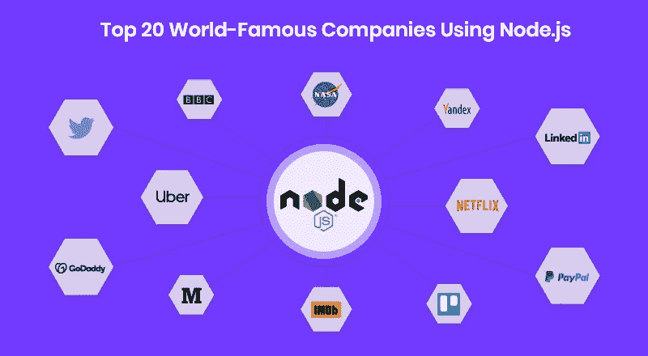

# 使用 Node.js 的 5 家主要公司及其原因

> 原文：<https://medium.com/nerd-for-tech/5-major-companies-that-use-node-js-and-why-211fb5cc267d?source=collection_archive---------12----------------------->

## Node.js 在过去的 5 年里变得非常流行。它很受欢迎，现在许多大企业都在使用它。

# 什么是 Node.js

在我们进入使用 Node.js 的公司和原因之前，让我们先谈谈它是什么。

Node.js 是一个开源的、跨平台的后端 JavaScript 运行时环境，运行在 [V8 引擎](https://en.wikipedia.org/wiki/V8_(JavaScript_engine))上，在 web 浏览器之外执行 JavaScript 代码。这是一个 JavaScript 框架，允许开发人员在虚拟域中测试和调试他们的代码。

该框架有两种访问方式:

1.  开发人员可以编辑 Node.js 源代码。
2.  几乎任何开发人员都可以使用 Node.js，不管他们喜欢什么操作系统。

Node.js 是由[瑞安·达尔](https://en.wikipedia.org/wiki/Ryan_Dahl)于 2009 年开发的。通过 Node.js，JavaScript 开发人员使用服务器端脚本来显示动态网页。这种脚本技术的优点是客户端不需要处理缓慢的加载时间和高 CPU 使用率。

# Node.js 的优势

使用 Javascript 编写前端和后端是使用 Node.js 优势的基础。

1.  **易学:**如果你懂 JavaScript，你会对 Node.js 有一个很好的开始，你确实需要知道后端开发原理，但是编程语言的知识会让事情简单很多。
2.  **社区驱动:** Node.js 是一个开源项目，鼓励支持和贡献，旨在改进和采用该平台。这是其[基金会](https://foundation.nodejs.org/)的使命，旨在持续开发和增强 Node . js。Node package manager(NPM)Node . js 的官方软件包生态系统是世界上最大和增长最快的软件注册中心。
3.  **健壮:**使用 Node.js 可以组织全栈 JavaScript 开发，确保应用程序的速度和性能。
4.  **可扩展性**。Node.js 允许构建可以轻松随业务增长的应用程序。它可以处理多个并发连接。使用 Node.js，您还可以获得负载平衡，这是在资源之间合理分配任务的过程。
5.  **快速:**使用 Node.js 构建的项目以更快的速度进入市场。Node.js 是轻量级的，简单易用，减少了开发时间。一般来说，使用 Node.js 的网站往往更快。

# 使用 Node.js 的公司

现在我们知道了 Node.js 是什么，它的优势是什么，让我们讨论一下使用 Node.js 的 5 家公司，以及为什么:

# 1.网飞

网飞是全球最大的视频流媒体服务公司。迄今为止，网飞有 2.07 亿付费用户。

网飞的用户界面(UI)是使用 Node.js 构建的。这项技术已经证明了它的益处和有效性，Nertflix 已经计划使用它来构建他们技术堆栈的其他层。

网飞团队决定在他们的软件中采用 Node.js，以使应用程序模块化、轻量级和快速。因此，应用程序的启动时间现在减少了 70%。

# 2.美国国家航空航天局

NASA 是美国国家航空航天局。Node.js 帮助美国宇航局在宇航员的太空探险中保持更安全。

Node.js 救命！

太空中发生不幸事件后，NASA 采用了 Node.js 技术。他们意识到他们的数据分散在多个地点，因此他们的一名宇航员差点丧命。

美国宇航局决定将所有东西都转移到云中，并开发了自己的端到端数据系统，以防止未来发生此类事件。结果，NASA 现在有了一个数据库，他们的数据访问时间也减少了 300 %!

# 3.商务化人际关系网

LinkedIn 是一个专业的社交网络平台，雇主可以在这里联系全球的求职者。他们支持 20 多种语言，拥有超过 3.1 亿的月活跃用户和 7.56 亿的会员。

LinkedIn 采用 Node.js 技术来增强其移动应用程序的服务器端功能。因此，LinkedIn 基于节点的新应用速度提高了 20 倍，服务器数量也从 30 台减少到了 3 台。

# 4.通过易趣网购买

易贝是一家电子商务公司，提供企业对消费者和消费者对消费者的互联网销售服务。迄今为止，易贝已在 180 个国家推出，在全球拥有 1.85 亿活跃用户。

根据易贝首席网络工程师 Senthil Padmanabhan 的说法，易贝采用 Node.js 有两个主要原因:

1.  使他们的产品尽可能实时，例如保持与服务器的实时连接。
2.  编排大量特定于易贝的服务，以更好的方式处理受 I/O 约束的操作。

易贝现在正在体验使用 Node.js 的许多好处，包括更好的速度、性能、透明度、可扩展性和对产品的控制。

# 5 .贝宝

PayPal 是最大的互联网支付平台。它提供在线转账等服务，并作为传统支付方式(如汇票和支票)的电子替代方式。PayPal 支持 25 种货币，拥有 3.61 亿活跃用户。

PayPal 采用 Node.js 来构建他们 web 应用程序的消费者端。Node.js 帮助他们将开发人员团结成一个团队，并帮助用 JavaScript 编写服务器和浏览器应用程序。

与之前基于 Java 的应用程序相比，新的 PayPal 应用程序的速度提高了 2 倍，文件减少了 40%，代码减少了 33%。

如您所见，Node.js 是我们日常使用的许多主要产品的重要组成部分。我希望这篇博客能够激励其他开发人员开始学习和使用这个流行的开源、跨平台、后端 JavaScript 运行时环境！