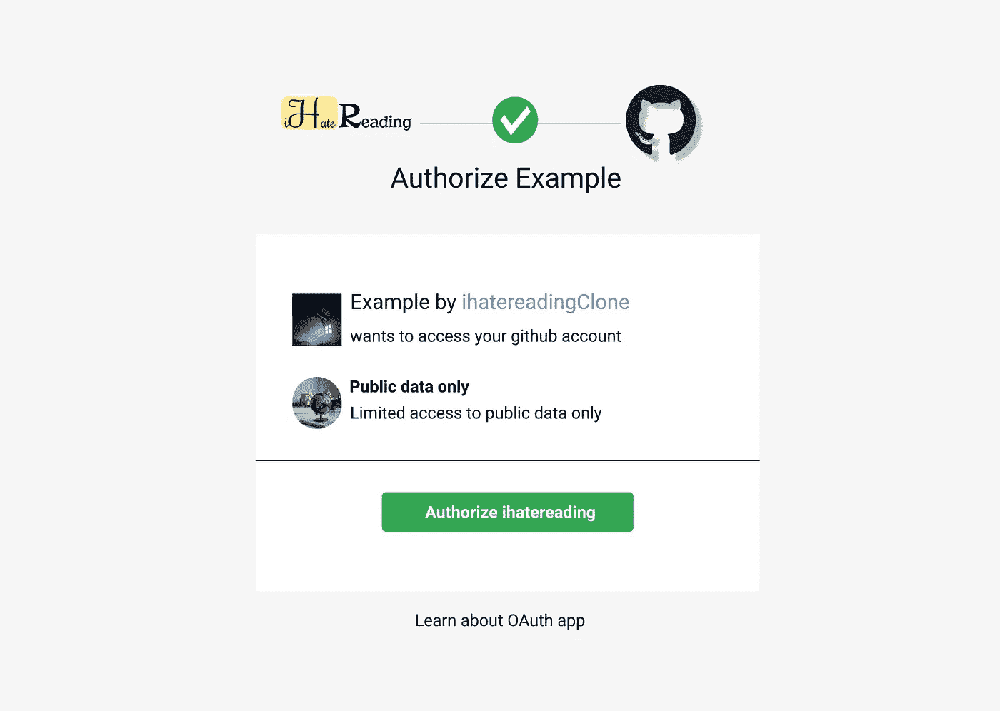

# 5 分钟阅读通过 Express 服务器添加 Github 认证

> 原文：<https://medium.com/nerd-for-tech/5-minutes-read-to-add-github-authentication-via-express-servers-6dd764818124?source=collection_archive---------7----------------------->

不能从浏览器访问 Github API，下面是在前端添加 Github 认证的方法。

[Github 授权 UI 设计](http://ihatereading.in/creativity)

# 在后台

Github 认证和使用 **Github** API 就是一个真实的例子。显然，并不是每一个与你合作的创业公司都需要 Github API，但是大多数技术…