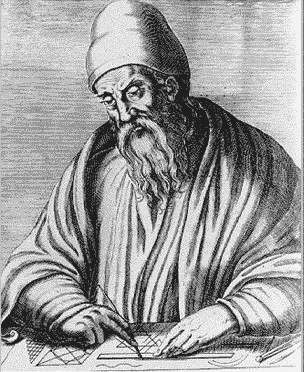

# 关于素数的 5 个最古老的数学未解问题。

> 原文：<https://medium.com/nerd-for-tech/5-oldest-unsolved-problems-in-mathematics-about-primes-3c894b5263d7?source=collection_archive---------9----------------------->

长久以来，数学一直是一门挑战人类历史上最伟大的头脑的学科。可以说，数学中研究最多的领域之一是对素数的研究。

我们对质数模式的好奇已经提出了一些最困难的问题，即使是有史以来最伟大的数学天才也没有解决。今天，我们将看看数学中关于素数的 5 个最古老的问题，对于一个高中生来说，这些问题很容易理解，但即使经过 500-2000 年的艰苦努力，这些问题仍然没有得到证明。

> **1。完全数:
> ‘奇’完全数存在吗？“偶数”完全数是无限的吗？**

想想数字 6，28，496，8128…..
这些有什么特别的？如果你不认可，我建议你暂停一会儿，尝试寻找一个漂亮的潜在资产。

继续前进…

如果你观察这些数的适当约数，你可能会注意到“美丽”的属性。

6 = 1 + 2 + 3，
28 = 1 + 2 + 4 + 7 + 14，
496 = 1+2+4+8+16+31+62+124+248
8128 = 1+2+4+8+16+32+64+127+254+508+1016+2032+4064

*其真约数之和等于该数本身的数称为完全数*。已知的对完全数的最早研究失传于史前。然而，我们知道毕达哥拉斯学派已经研究了完全数。

## ***我们对这样的数字了解多少？***

*   欧几里德证明，对于给定的 n，如果 *(2ⁿ−1)* 是素数，那么
    *【2ⁿ−1】*是完全数。试着把这作为一个练习。

好吧，绕个弯。***梅森素数*** :形式为 *x = 2ⁿ -1* 的素数对于某些 *n.* 梅森猜想当 *n* 是素数时，形式为 *2ⁿ -1* 的所有数都是素数。(我们知道那不是真的。例如 21 = 2047 = 23×89。)
***开放性问题*** :梅森素数有无限多个吗？我们目前知道 47 个梅森素数。

*   18 世纪的欧拉反过来证明了任何完美的质数都是 2ⁿ⁻ (2ⁿ−1).)的形式
    换句话说，偶数完全数和梅森素数之间存在着[一一对应](https://en.wikipedia.org/wiki/Bijection)。

正如你所看到的，自从欧几里德*(约公元前 300 年)*以来，我们已经知道了偶数完全数以及产生它们的方法。 ***我们不知道的是是否存在任何奇完全数！！！*** (实际上，这个问题几乎没有进展)

总之，对完全数的研究提出了两个长期悬而未决的问题，即“*奇完全数的存在性*”和“*无穷多个梅森素数的存在性*”。

欧几里得(约公元前 300 年)，第一个证明了无穷多个素数的存在

> **2。孪生素数猜想:孪生素数无限多**

孪生素数是一对 *(p，p+2)* ，使得 *p* 和 *p+2* 都是素数。

孪生素数猜想的确切起源没有得到证实，孪生素数猜想的第一次陈述是由法国数学家阿尔方斯·德·波利尼亚克在 1846 年提出的。然而，希腊数学家欧几里得给出了已知的最古老的证明，证明存在无穷多个素数，并且他推测存在无穷多个孪生素数”。

这种说法已经存在了 2000 多年，但在证明这种说法方面几乎没有进展。

## 我们所知道的！

1.  有无限多个形式为 *(p，p+k)* 的素数对，其中 *k ≤ 246* 。
2.  假设 *Elliott-Halberstam 猜想(我们强烈认为这是真的)*，有无限多个形式为 *(p，p+k)*
    的素数对，其中 *k ≤ 6* 。这意味着，孪生素数(差 2)、表兄素数(差 4)和性感素数(差 6)的集合是无限的。

可以说，当代最伟大的数学家陶哲轩正在积极研究这个问题。一定要看看这个[视频](https://www.youtube.com/watch?v=MXJ-zpJeY3E)来了解这个数学天才和他在孪生素数方面的工作。

> **3。哪些正 n 多边形是可构造的？**

**可构造多边形**是可以用圆规和直尺构造的[正多边形](https://en.wikipedia.org/wiki/Regular_polygon)。例如，一个正五边形可以用圆规和直尺来构造，而一个正七边形(n=7 条边)就不行。

古希腊人知道如何构建边数 n = 3，4，5 的正多边形，他们也知道如何构建边数是给定正多边形边数两倍的正多边形。因此他们可以为 n={6，12，24… 4，8，16 }构造...5,10,20...} 等等。

自然要问的问题是，n 上的什么值可以被构造。这个问题的第一次真正进展花了将近 2000 年，因为希腊人在 1796 年首次研究了这个问题，当时一名 19 岁的少年建造了一个规则的 17 边形。那个孩子不是别人，正是卡尔·弗里德里希·高斯。几年后，高斯找到了这个普遍问题的答案。

***我们知道什么！*** *高斯证明了一个正 n 边形可以用圆规和直尺* ***构造当且仅当*** *n 是 2 的幂和任意数量不同的* [*费马素数*](https://en.wikipedia.org/wiki/Fermat_prime) *的乘积(包括无)。*

费马素数是以下形式的素数。

因此，**寻找所有可构造多边形的问题归结为寻找所有费马素数**。这是一个独立的开放性问题。
前几个费马数是: *3，5，17，257，65537，4294967297……..
截至 2021 年，已知的费马素数只有 F0 = 3，F1 = 5，F2 = 17，F3 = 257，F4 = 65537。费马猜想所有的费马数都是素数。1732 年，[欧拉](https://primes.utm.edu/glossary/xpage/Euler.html)发现 641 除 F5。此后，我们证明了对于 *n=5，6…31* 费马数是合数。F4 之后没有已知的费马素数。*

当我们能够找到费马素数存在的答案时，我们就有了所有可构造 n 边形集合的答案。

> **4。哥德巴赫猜想。**(1742)

**哥德巴赫强猜想** :
*每一个偶数都可以表示为 2 个素数之和。*

**哥德巴赫弱猜想** :
*每一个大于 5 的奇数都可以表示为三个素数之和。*

这个猜想被称为“弱”,因为如果强猜想被证明，那么这也将是真的。不幸的是，自欧拉以来，经过一代又一代数学家的不懈努力，我们仍然无法证明这两者。
( **注**-*2013 年，* [*哈拉尔德·赫尔夫戈特*](https://en.wikipedia.org/wiki/Harald_Helfgott) *发表了哥德巴赫弱猜想的一个证明。截至 2018 年，该证明在数学界被广泛接受，但尚未在同行评审期刊*上发表。)
无论如何，我们还是等着解决强版吧。

**我们知道什么！**

1.  1930 年，证明了任何大于 1 的自然数都可以写成不超过 C 个素数的和，其中 C < 800000\. [**注**——我们要 C=2】
2.  在过去的十年中，人们发现每一个偶数 *n* ≥ 4 实际上是至多 4 个素数的和(即 C ≤ 6)。后来结果增强到 C≤ 4。

有趣的事实——哥德巴赫猜想是 2007 年西班牙电影 [*费马的房间*](https://en.wikipedia.org/wiki/Fermat%27s_Room) 的部分情节。

> **免责声明** : *文章标题有误导性。在展示了 4 个未证实/未解决的结果后，我想展示一个最近(在 2004 年)解决的持久的数学问题(第 5 个问题)。*
> 
> 5.**素数在 P (2004)**

假设给你一个号码 n =[10089886811898868001](https://primes.utm.edu/curios/page.php/10089886811898868001.html)。你被问到，这个数是否是质数。你直观地做的是，
**算法 A** —检查每一个数 *1 < k < n* 如果 *k* 除以 *n.* 你可以优化这个算法，认识到如果 *n* 不是质数，那么 *n* 将有一个因子 *k，使得 k≤* √ *n*

好吧，等等！首先，什么是**‘P’**？

一个决策问题被说成是在 ***'* P '，**如果存在一个“ ***快速*** ”算法，可以解决决策问题(返回 yes 或 no)。
在这里，判定问题是，给定 *n* ，那么 *n* 是素数吗？

现在，什么是*快速*算法？
对于任何给定的决策问题，你都会有一个输入大小(姑且称之为 *x* )。
对于我们的问题，输入大小是数字 *n* 中的位数。
所以，对于上面的 *n* ， *x=20* 。
一般情况下，对于给定的 *n* ， *x=log(n)*

如果一个算法解决了 *f(x)* 步骤中的决策问题，其中 *f* 是多项式函数，则该算法称为*快速*(多项式时间算法)。

如果我们看一下上面的算法来判断 n 是否是一个质数，我们得到在算法 A 中我们采取了 *n* 步，在算法 b 中采取了√ *n* 步。

因为我们的输入大小是 *log(n)。* 让我们称给定输入尺寸 x 的算法的步数为γ(x)

对于算法 a，γ(x) = n 步= e ˡᵒᵍ⁽ⁿ⁾ = eˣ步
对于算法 b，γ(x) = √n 步= √eˣ步= e^(0.5x)步

这两个都是 *x* 中的指数时间算法，400 多年来，数学家们一直试图弄清楚素数的判定问题是否能在多项式时间内解决。结果答案是“**是的**”。2004 年，当 IITK 的一位教授和他的两名学生宣布这一结果时，这一结果在数学界(特别是数论者)不胫而走。

这个算法(著名的叫做**[**AKS**](https://en.wikipedia.org/wiki/AKS_primality_test)**素性测试**)发表在一篇名为“ ***素数在 P*** 中”的论文中，其中表明这个判定问题(无论 n 是否是素数，都可以在~log(n)步中解决。已经做了很多改进，不会减少到~log(n) steps
(~在外行看来就像一个近似符号；如果对细节感兴趣，请参考 wiki)**

**有趣的事实:
*这个问题是由 IITK 的两位教授解决的，他们的主要兴趣领域包括计算数论。
作者获得 2006 年* [*哥德尔奖*](https://en.wikipedia.org/wiki/G%C3%B6del_Prize) *和 2006 年* [*富尔克森奖*](https://en.wikipedia.org/wiki/Fulkerson_Prize) *。***