# EDA 的 5 个 Python 熊猫技巧——我做过的被谷歌搜索次数最多的问题。

> 原文：<https://medium.com/nerd-for-tech/5-python-pandas-skills-for-eda-the-most-googled-questions-ive-ever-made-61b6a684d879?source=collection_archive---------3----------------------->

## (*本文主要面向初级受众。)

当我尝试执行 EDA(探索性数据分析)时，尤其是处理数据集时，遇到了一些麻烦。我知道**要解决什么**，我也知道我已经谷歌了**如何**解决它，但是有些方法我总是想不起来:*最后，我又谷歌了一遍(*100..)*

所以在这篇文章中，我回答了我在处理数据集时遇到的最多的问题，尤其是关于熊猫的数据帧。

1.  填充/删除缺失值(或重复值)
2.  用 lambda 替换值
3.  用 melt/pivot_table/crosstab 重塑数据框架

# 填充/删除缺失值(或重复值)

1.  **填充缺失值取决于数据的类型。**

df

在

上制作数据帧，请使用以下代码: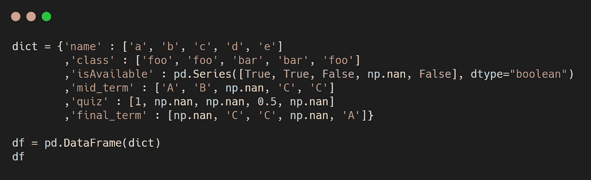

有很多方法可以填充缺失值，例如填充/插值/替换等等。几乎只能使用单一数据类型。
如果你想替换依赖于数据类型的缺失值，那么你可能使用 for 循环或 If 语句。

这里有一个使用' dtype.kind '的短代码，

就是这个代码的结果。如果能立刻处理丢失的数据，那就更好了。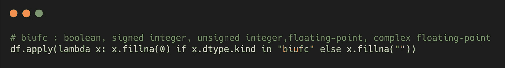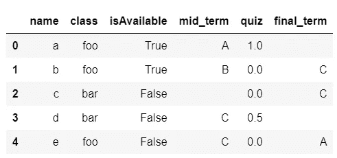

根据数据类型填充 df 的缺失值

 [## 处理丢失的数据- pandas 1.2.3 文档

### 在这一节中，我们将讨论熊猫缺失的(也称为 NA)值。请注意选择使用 NaN…

pandas.pydata.org](https://pandas.pydata.org/pandas-docs/stable/user_guide/missing_data.html) 

**2。删除重复值并保留一部分**

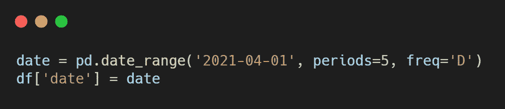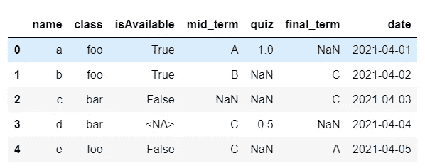

在数据帧上添加“日期”功能— df

如果您尝试访问基于 Nosql 的数据库或处理 Pandas DataFrame 的嵌套数据集，那么可能会出现重复的行。您可以根据特征删除它，并保留第一个/最后一个零件。(*请小心打字重复***)。*)当您按时间序列列对数据帧进行排序，并在重复行之间仅保留“主要或最新”值时，这很有用。*

*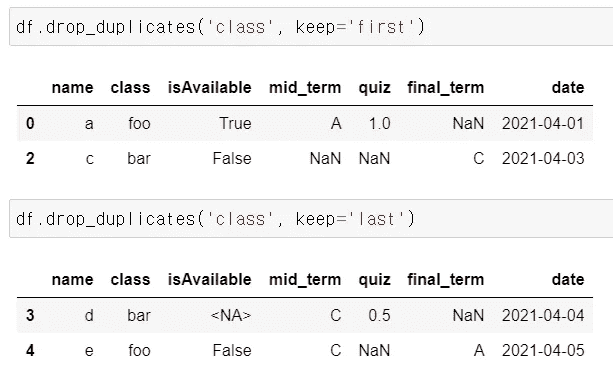*

*通过参数‘keep’删除重复特征的情况— `first`:删除除第一次出现之外的重复特征。- `last`:除最后一次出现外，丢弃重复项。*

# *用 lambda 替换值*

***3。基于条件替换值。***

*对 lambda 使用 apply()方法非常有用，尤其是用条件替换变量。*

*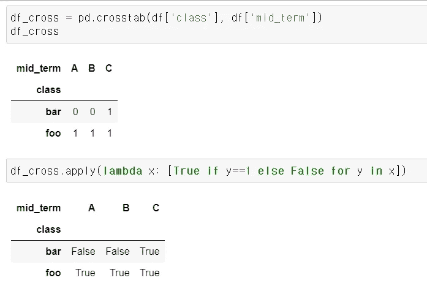*

*使用 lambda 应用“apply()”方法*

*或者您可以使用 lambda 和 numpy 数组，如下所示:*

**

*使用带有 numpy 数组的 lambda*

# *用 melt、pivot_table 和 crosstab 重塑数据框架*

***4。将一些列转换为行。***

*如果你习惯用 Pandas 数据框架计算每一列，那么你可能会对“宽数据框架”感到舒服。同时，如果你习惯于可视化数据，那么“整齐的数据框架”可能是熟悉的。*

*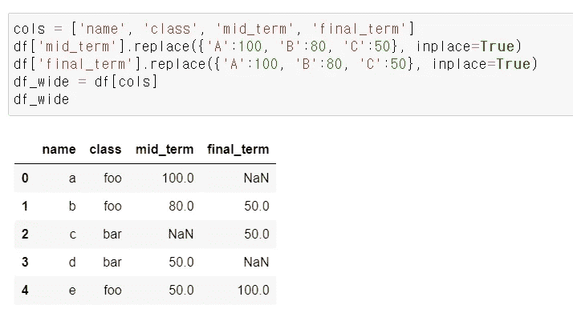*

*宽数据帧示例*

*尝试“melt()”函数可以将宽的数据帧整形为整齐的数据帧。因此，您可以通过保留标识符来轻松转换 DataFrame 的形状。同样，“pivot_table()”函数可以将一个整齐的数据帧整形为宽的数据帧。*

*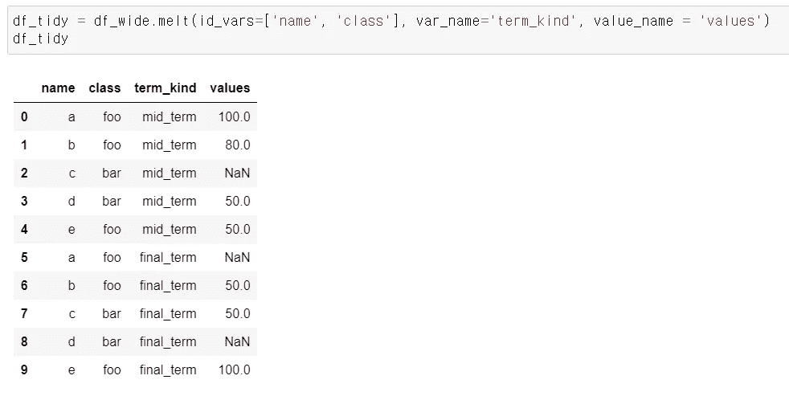*

*使用 melt()函数将宽数据帧整形为整齐的数据帧。*

*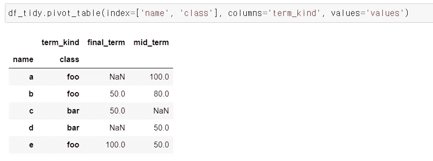*

*使用 pivot_table()函数将数据框从整齐重塑为宽。*

***5。带交叉表的频率表()***

*要查找变量之间的频率，可以使用 crosstab()。它可以应用卡方列联表或巧妙的方法来执行 EDA。*

*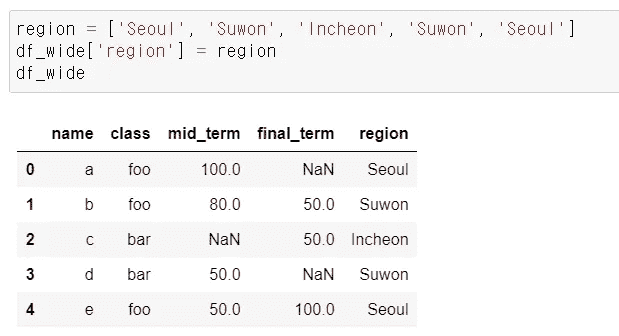*

*在熊猫数据框架中添加“区域”特征。*

*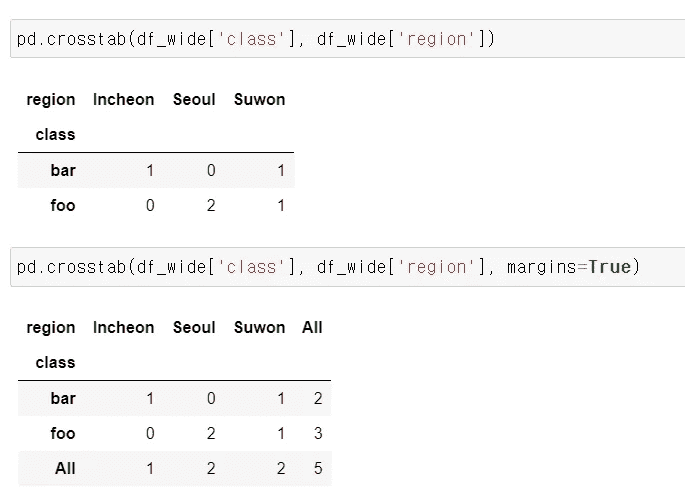*

*正在尝试 crosstab()函数。如果参数“margins”为真，则添加行/列边距(小计)。*

*   *지금은쉬워도손에익기까지꽤오랜시간이걸렸던기초적인·埃达·방법을나누고싶었습니다.·코딩을전혀모르던시절부터지금까지를돌아보면서부족한 영어실력으로 더듬더듬 글을 썼는데 틀린 내용, 부자연스러운 문법 등 언제든지 피드백을 환영합니다!*