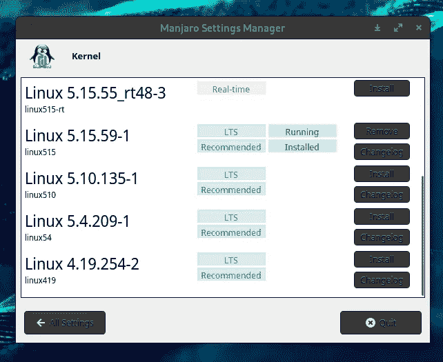

# 我使用 Manjaro Linux 的 5 个原因

> 原文：<https://medium.com/nerd-for-tech/5-reasons-why-i-use-manjaro-linux-677b6878787c?source=collection_archive---------0----------------------->

Manjaro 是一个免费的开源 Linux 发行版，基于 Arch Linux 操作系统，侧重于用户友好性和可访问性。它使用滚动发布更新模型，Pacman 作为其包管理器。

如果你不知道我在说什么，你可以看看这个 2 分钟的关于 Linux 的视频，以及 Fireship 发布的 Linux 发行版。io->[https://www.youtube.com/watch?v=rrB13utjYV4](https://www.youtube.com/watch?v=rrB13utjYV4)

所以，我们继续。我使用 Manjaro Linux 已经有几个月了，我非常喜欢它。在我使用它的时候，我注意到了一些错误，但是从 MacOS 迁移到 Manjaro Linux 的体验是值得的。

你可能在想‘什么！！！谁会在 MacOS 上使用 Linux 发行版？？？‘为什么不用 Ubuntu 什么的？’。首先，Ubuntu 很烂，我用了一个月，一点都不好用，速度慢得令人难以置信，打开任何东西都要花时间，而且，我不得不讨厌基于 Debian 的发行版。对于一个思考的人来说，为什么我不用 macOS 和 Windows 呢，因为这篇文章就在你面前。

# 1.Arch Linux，但对于那些只想得到一个正常工作的发行版的人来说。

Manjaro 是少数几个不基于 Debian 的 Linux 发行版之一。相反，它是建立在我们的主，我们的救世主，我们的 42 拱 Linux 的不断前沿。Arch 是一个伟大而神圣的发行版，但不幸的是，如果你想安装它，你必须做很多工作。你从终端开始，你必须自己安装和设置 GUI 和所有的东西。如果你只是想尝试一下 Arch 或者你是 Linux 的新手，这可能是一件非常痛苦的事情。

就看一个人立拱门有多难->

N3ttX 视频

这是一个非常有趣的视频，讲述了一个人如何建立 Arch(由 [N3ttX](https://www.youtube.com/channel/UC7WJEjm84MCau6z3LPAq70g) 制作)，以及 MEME 警告。

# 2.大量的软件

Arch 发行版不像基于 Debian 的发行版那样有 PPAs，但这并不意味着你对软件的选择有限。Manjaro 的人维护着一个大型的软件仓库。此外，manjaro 用户还可以访问 AUR (Arch 用户库)。AUR 由用户创建的脚本组成，用于安装没有为 Arch 打包的应用程序(或者在本例中是 Manjaro)

# 3.最新软件，就在你家门口！

由于 Manjaro 是一个滚动版本，你可以比 Ubuntu 或 Fedora 等定期发布的发行版更快地获得最新的软件。有些人可能会说一个新的软件包可能会破坏他们的系统，所以 Manjaro 的工作人员在向用户提供新的软件包之前通过测试来避免这种情况

# 4.切换内核非常简单

图片来自作者

要在大多数发行版中切换你的内核，你需要使用一些终极魔法。但是，在你的 Manjaro Linux 中，我们只需要一个内置的 GUI。Manjaro Linux 内置了一个很好的小应用程序，允许你点击几下就可以切换内核。

# 5.你的社区

Manjaro 官方论坛是一个很好的地方，可以帮助那些不熟悉 Manjaro 或 Linux 的新手。他们还有超过 29 种语言的非英语论坛

官方曼哈罗论坛可以在这里找到->[https://forum.manjaro.org/](https://forum.manjaro.org/)

# 剧终

我希望这篇文章能帮助你选择 Linux 发行版。如果你对曼加洛还有什么要说的，请告诉我！

再见！