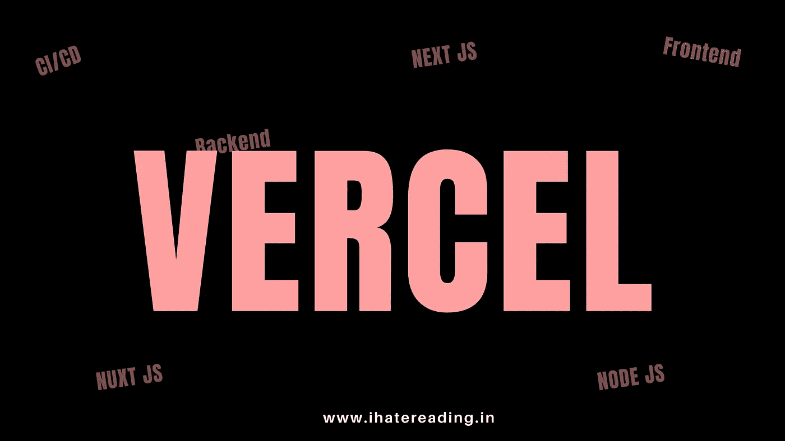

# Vercel 最适合应用部署的 5 个原因

> 原文：<https://medium.com/nerd-for-tech/5-reasons-why-vercel-is-the-best-for-application-deployment-92009b17e601?source=collection_archive---------2----------------------->

无论是 React project 还是 Gatsby 或者 Next JS 或者 Vue JS 或者 Nuxt JS 或者 Nest JS 或者 Node JS Vercel 都是部署你的应用的完美选择。

# 韦尔塞尔

如果你从未听说过或了解过 vercel。那我强烈建议你去看看。Vercel 是部署网站最简单的平台。通过连接 GitHub…