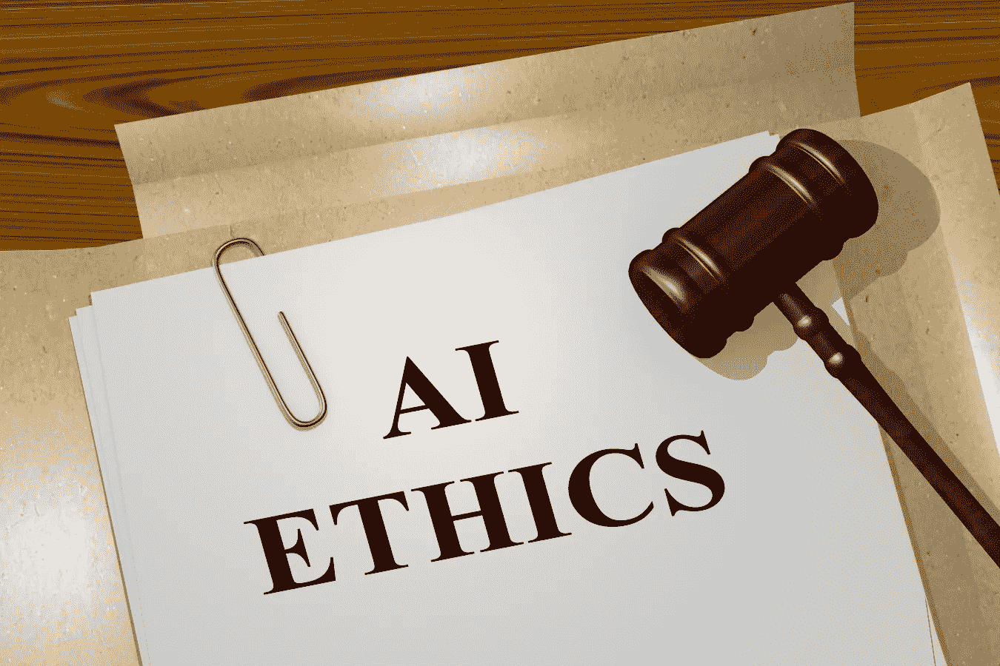
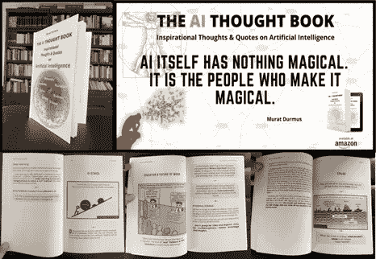

# 20 推荐免费人工智能伦理、数据伦理和 XAI 在线课程，立即开始[22 年 9 月 13 日更新]

> 原文：<https://medium.com/nerd-for-tech/5-recommended-free-ai-ethics-online-courses-to-get-started-right-away-2bc5daf4e417?source=collection_archive---------3----------------------->

(shutterstock: [hafakot](https://www.shutterstock.com/de/g/hafakot)

AI 伦理变得越来越重要。关于 AI 伦理的讨论，目前仍多在学术界进行。但人们已经可以看到，许多公司都在认真处理这个问题。有一件事对我来说很清楚:

> 哲学和伦理学的毕业生将在未来大量需求，以通过人类的镜头调查人工智能相关的过程。

*(摘自文章:* [*公司需要首席 AI-道德官吗？*](/nerd-for-tech/do-companies-need-a-chief-ai-ethics-officer-912b2f7c5d0) *)*

内容:

1.  艾伦理学(赫尔辛基大学)
    2。人工智能伦理:全球视角(aiethicscourse.org)
    3。AI 商业伦理(西雅图大学)
    4。AI(蒙特利尔大学)的偏见和歧视
    5。数据科学伦理(密歇根大学)
    6。人工智能伦理学导论(Kaggle)
    7。人工智能和数据科学中的伦理(LFS112x)
    8。实用数据伦理(快艾)
    9。数据伦理、人工智能和负责任的创新(爱丁堡大学)
    10。确定负责任的人工智能的指导原则。人机交互 III:伦理，需求发现&原型(乔治亚理工)
    12。道德在行动(SDGAcademyX)
    13。用莱姆和 H2O 在 R (Coursera)
    14 中可解释的机器学习。对可解释人工智能的介绍，以及我们为什么需要它。可解释的 AI:场景分类和 GradCam 可视化(Coursera)
    16。可解释的机器学习应用:第 1 部分& 2 (Coursera) 17。伦理决策基础(乔治敦大学)18。哲学与批判性思维
    19。IEEE 人工智能道德认知模块(感谢 Ashley M .的提示)
    20。企业可持续发展、社会创新和伦理介绍

# 1.艾伦理学(赫尔辛基大学)

人工智能伦理学是赫尔辛基大学创建的免费在线课程。该课程面向任何对人工智能的伦理方面感兴趣的人——我们希望鼓励人们学习人工智能伦理的含义，以伦理上可持续的方式开发人工智能可以做什么和不可以做什么，以及如何从伦理的角度开始思考人工智能。

内容:

**第一章:什么是 AI 伦理？**-AI 伦理是什么意思，价值观和规范起什么作用？我们还将看看我们将在本课程中遵循的人工智能伦理原则。

第二章:我们应该做什么？对 AI 来说，行善和无害的原则意味着什么？它们与“共同利益”的概念有什么关系？

第三章:谁该受到责备？ -问责制实际上意味着什么，它如何应用于人工智能伦理？我们还将讨论道德代理和责任的含义以及归咎责任的困难。

**第四章:我们应该知道人工智能是如何工作的吗** -为什么人工智能的透明性很重要，透明性会影响哪些主要问题-人工智能系统的透明性会带来哪些风险？

**第五章:AI 应该尊重和促进权利吗？** -什么是人权，它们如何与人工智能当前的道德准则和原则相联系？我们还将更仔细地研究对人工智能特别重要的三项权利:隐私权、安全权和包容权。

**第六章:人工智能应该是公平和无歧视的吗** -公平对人工智能意味着什么，歧视如何通过人工智能表现出来——我们可以做些什么来减少这些系统的偏见？

**第 7 章:实践中的人工智能伦理** -人工智能伦理目前面临的一些挑战是什么，人工智能指南在形成讨论中扮演什么角色，以及未来事情可能如何发展？

课程: [**艾伦理学**](https://ethics-of-ai.mooc.fi/)

# 2.人工智能伦理:全球视角(aiethicscourse.org)

数据密集型和基于人工智能的技术可以解决世界上最大的挑战，但它们也给个人和群体带来风险。当我们部署新技术时，我们必须考虑人工智能用于识别和纠正伤害的伦理后果。

本课程旨在提高对技术的社会影响的认识，并为个人和机构提供工具来追求负责任的人工智能使用。本课程面向当前和未来的数据科学家、决策者和商业领袖，包含与人工智能相关主题的 **19 个模块**。每个模块包括一个视频讲座，并附有额外的资源，如播客、视频和阅读材料。

课程: [**人工智能伦理学:全球视角**](https://aiethicscourse.org/index.html)

# 3.人工智能商业伦理(西雅图大学)

本课程旨在介绍人工智能技术使用的伦理维度。顺利完成本课程后，学生将 1)对围绕变革性技术的伦理问题保持敏感，2)能够在存在伦理敏感问题时清楚地表达可能的行动方案。

mod 0-路线方向

模式 1——人工智能技术中的价值观和道德借口

模式 2 —变革性技术及其影响

Mod 3 —技术用户

时间承诺:**6–10 小时**

**课程: [**AI 商业伦理**](https://seattleupce.catalog.instructure.com/browse/iett/courses/ai-ethics-for-business)**

# **4.大赦国际的偏见和歧视(蒙特利尔大学)**

**发现即使是计算机算法也可能存在偏差，并对我们的日常生活产生严重影响。在这个 MOOC 中，基于一个涉及该领域各种国际专家的 IVADO 学校，你将学习如何识别和减轻人工智能中的偏见和歧视。**

**参加这门课程，涉及一个非常有影响力但很少讨论的人工智能相关主题。你将从该领域的国际专家那里学习，也是在蒙特利尔举行的 IVADO 国际人工智能偏见和歧视学校的演讲者，并探索机器学习和算法设计中偏见、歧视和公平的社会和技术方面。**

**本课程的主要焦点是:基于性别、种族和社会经济的偏见，以及导致决策的数据驱动预测模型中的偏见。该课程主要面向拥有数学和编程基础知识的专业人士和学者，但丰富的内容对任何以其他方式使用人工智能或对人工智能感兴趣的人都有很大的用处。事实证明，这些社会技术话题让技术专业人士大开眼界！([蒙特利尔大学](https://www.edx.org/school/umontrealx)**

## **你会学到什么**

*   **理解偏见和歧视的所有方面**
*   **探索机器学习中偏见的有害影响(算法决策的歧视性影响)**
*   **识别机器学习中偏见和歧视的来源**
*   **减轻机器学习中的偏差(解决偏差的策略)**
*   **指导算法的伦理发展和评估的建议**

**课程: [**人工智能中的偏见与歧视**](https://www.edx.org/course/bias-and-discrimination-in-ai?source=aw&awc=6798_1609840635_31dea85f7a030de5b2d260dffe87b150&utm_source=aw&utm_medium=affiliate_partner&utm_content=text-link&utm_term=284447_Edukatico+GmbH)**

# **5.数据科学伦理(密歇根大学)**

**学习如何思考围绕隐私、数据共享和算法决策的道德规范。**

**本课程侧重于与数据科学相关的道德规范，将为您提供分析这些问题的框架。这一框架基于道德规范，道德规范是有助于辨别是非的共同价值观。伦理不是法律，但它们通常是法律的基础。**

**包括数据科学家在内的所有人都将从这门课程中受益。不需要任何先验知识。**

## **你会学到什么**

*   **谁拥有数据**
*   **我们如何重视隐私的不同方面**
*   **我们如何获得知情同意**
*   **公平意味着什么**

**课程: [**数据科学伦理**](https://www.edx.org/course/data-science-ethics)**

# **6.人工智能伦理学导论(Kaggle)**

**探索实用的工具来指导人工智能系统的道德设计，作者[亚历克西斯·库克](https://www.kaggle.com/alexisbcook)和[瓦尔·尚卡尔](https://www.kaggle.com/var0101)**

****1。人工智能伦理学导论**
从课程中学到什么。**

****2。以人为中心的人工智能设计服务于人们需求的系统。在几个真实场景中导航问题。****

****3。在 AI 中识别偏差**
偏差可以在流水线的任何阶段悄悄进入。研究一个识别有毒文本的简单模型。**

****4。AI 公平**
了解四种不同类型的公平。评估一个被训练来判断信用卡申请的玩具模型。**

****5。模型卡**
通过传达关于机器学习模型的关键信息来增加透明度。**

**课程:[https://www.kaggle.com/learn/intro-to-ai-ethics](https://www.kaggle.com/learn/intro-to-ai-ethics)**

# **7.人工智能和数据科学中的道德规范(LFS112x)**

**了解如何在您的人工智能和数据科学技术及商业计划中建立和融入道德原则和框架，以增加透明度，建立信任，推动采用，并以责任为导向。**

****谁的电话****

**该课程是为负责构建和采用人工智能工具的企业、政府和技术领导者以及数据科学家设计的。**

**你将学到什么**

**在本课程中，您将了解人工智能的商业驱动因素、人工智能和数据科学的伦理挑战和影响、人工智能世界中的商业和社会动态、构建负责任的人工智能的关键原则等。本课程介绍了一些在数据分析专业实践道德和责任的原则和框架。并提供实用的方法来解决人工智能和数据科学工作带来的技术、商业和领导困境和挑战。**

****它为你准备了什么****

**您将从本课程中了解如何增加透明度、制定标准和分享最佳实践，以建立信任并推动人工智能的采用。**

**课程:[https://training . Linux foundation . org/training/ethics-in-ai-and-data-science-lfs 112/](https://training.linuxfoundation.org/training/ethics-in-ai-and-data-science-lfs112/)**

# **8.实用数据伦理(快速人工智能)**

**这门课程最初于 2020 年 1 月至 2 月在旧金山大学数据研究所面对面教授，面向来自各种背景的工作专业人士(作为一门[晚间证书课程](https://www.usfca.edu/data-institute/certificates))。这门课程没有先决条件。本课程无意面面俱到，但希望能提供关于数据滥用如何影响社会的有用背景，以及批判性思维技能和提问的实践。**

****涵盖话题:****

1.  **[造谣](https://ethics.fast.ai/syllabus/#lesson-1-disinformation)**
2.  **[偏见&公平](https://ethics.fast.ai/syllabus/#lesson-2-bias--fairness)**
3.  **[道德基础&实用工具](https://ethics.fast.ai/syllabus/#lesson-3-ethical-foundations--practical-tools)**
4.  **[隐私&监控](https://ethics.fast.ai/syllabus/#lesson-4-privacy-and-surveillance)**
5.  **[我们的生态系统:指标、风险资本、&为了树木而失去森林](https://ethics.fast.ai/syllabus/#lesson-5-how-did-we-get-here-our-ecosystem)**
6.  **[算法殖民主义，下一步](https://ethics.fast.ai/syllabus/#lesson-6-algorithmic-colonialism-and-next-steps)**

****期望的学习成果****

**1.理解数据滥用的影响，包括不公正的偏见、监视、虚假信息和反馈循环。了解这些影响的促成因素。识别不同类型的偏见。**

**2.在调查数据和数据驱动的算法如何塑造、约束和操纵我们的商业、公民和个人体验方面培养读写能力。**

**3.分析新的场景和潜在的产品，尝试识别和减轻潜在的风险。**

**4.拥有一套道德技术和实践的工具包，以便在工作场所实施**

**查看教学大纲和阅读清单！**

**在这里观看[视频](http://ethics.fast.ai/videos/?lesson=1)！**

# **9.数据伦理、人工智能和负责任的创新(爱丁堡大学)**

****关于本课程****

**跳过本课程**

**你希望你的智能家居了解你多少？你的数据有没有被收割并用于社交媒体上的政治广告？你会乐意被一个预测性的警务人工智能侧写吗？**

****你将学到什么****

**理解并阐明整个数据生命周期中出现的关键、社会、法律、政治和道德问题。**

**理解相关概念，包括:伦理/道德、责任、数字权利、数据治理、人-数据交互、负责任的研究和创新。**

**识别和评估当前数据科学和行业中的伦理问题。**

**对没有明确解决方案的道德问题进行专业的批判性判断和反思。**

**评估你在当前职业实践中面临的道德问题。**

**确定并应用道德驱动的解决方案来解决这些问题。**

**课程:[https://www . EDX . org/course/Data-Ethics-AI-and-Responsible-Innovation](https://www.edx.org/course/Data-Ethics-AI-and-Responsible-Innovation)**

# **10.确定负责任的人工智能的指导原则(微软)**

**在微软，我们已经认识到我们认为应该指导人工智能开发和使用的六项原则——公平、可靠和安全、隐私和安全、包容性、透明度和问责制。对我们来说，这些原则是负责任和值得信赖的人工智能方法的基石，特别是随着智能技术在我们日常使用的产品和服务中变得越来越普遍。我们认识到，每个个人、公司和地区都有自己的信仰和标准，应该在他们的人工智能之旅中得到反映。在您考虑制定自己的指导原则时，我们希望分享我们的观点。**

****学习目标****

**在本模块中，您将:**

**描述以负责任的方式参与人工智能的重要性。**

**确定负责任地开发和使用人工智能的六个指导原则。**

**描述来自经验丰富的高管的负责任的人工智能治理的不同方法。**

**课程:**

**[https://docs . Microsoft . com/en-us/learn/modules/responsible-ai-principles/](https://docs.microsoft.com/en-us/learn/modules/responsible-ai-principles/)**

# **11.人机交互 III:伦理、需求发现和原型制作(乔治亚理工学院)**

****关于本课程****

**本课程将带你学习 CS6750 的第 14 至 18 课:人机交互，如佐治亚理工学院计算机科学硕士在线课程所教授的。**

**在本课程中，您将从学习设计生命周期开始。这是我们调查用户需求、集思广益潜在设计、创建原型并评估这些原型的过程。这个生命周期为这个专业证书的第三和第四门课程提供了结构。**

****你将学到什么****

**设计生命周期的结构:需求发现、头脑风暴、原型和评估。**

**研究伦理的价值和强调用户权利的重要性。**

**机构审查委员会在管理大学研究中的作用。**

**行业道德的重要性以及确保其得以维持的机制。**

**需求发现在设计生命周期中的重要性。**

**主动需求发现机制，包括调查、访谈和焦点小组。**

**寻找个人需求的方法，包括参与观察和学徒。**

**观察有机交互的方法，如自然观察或调查黑客和变通办法。**

**数据清单，一种确保您了解用户及其问题的结构。**

**集体讨论设计想法的方法，包括个人和小组讨论。**

**进一步探索设计思想的方法，比如用户角色和故事板。**

**原型的范围，从低保真度到高保真度。**

**低保真度原型在获得早期反馈中的重要性。**

**课程:[人机交互 III:伦理，需求发现&原型](https://www.edx.org/course/human-computer-interaction-iii-ethics-needfinding?index=product&queryID=9f6bd080b7d40c9a7a6ddb3d3442cccc&position=2)**

# **12.道德在行动**

**世界上伟大的宗教和世俗哲学对道德行为有什么看法？哪些美德是各种信仰共有的？宗教团体在建设一个更加公正和可持续发展的世界中扮演什么角色？**

****关于本课程****

**可持续发展的挑战不仅仅是技术上或政治上的，它们也是道德上的，要求我们审视我们作为人类是谁，以及我们想要成为什么样的人。**

**这种对构成“好人”的因素的研究——被称为美德伦理学——长期以来一直是哲学家和神学家的研究范围。那么，世界上伟大的宗教和世俗哲学对道德行为有什么看法呢？哪些美德在不同的信仰和文化中是共同的？伦理、精神和宗教团体在可持续发展中扮演什么角色？**

**2016 年，来自世界主要宗教传统的杰出领袖、哲学家、学者和科学家应教皇弗朗西斯的邀请前往梵蒂冈参加一系列会议。这些会议被称为道德在行动倡议，旨在促进对话，并就推动我们共同家园和人类大家庭的变革行动所需的价值观达成共识。**

**本课程的特点是道德在行动会议的参与者，以及其他主要的声音，并讨论了世界上一些伟大的传统的观点及其在解决我们世界上最紧迫的挑战，包括贫困，腐败和气候变化的作用。它提出多信仰合作对实现可持续发展至关重要，并呼吁发展一种新的共享美德伦理，使我们所有人都进入一个可持续与和平的未来。**

**本课程面向:**

**希望为可持续发展工作做出贡献的宗教和精神团体和个人**

**希望了解和参与当地信仰团体的发展专业人士**

**对哲学、宗教、神学及其与全球问题的关系感兴趣的高年级本科生和研究生**

**课程: [**伦理在行动**](https://www.edx.org/course/ethics-in-action?index=product&queryID=5b0bf258de9cdec02d2aaeb1fa5d16be&position=2)**

# **13.可解释的机器学习与莱姆和 H2O 在 R (coursera)**

**欢迎参加本实用指南，介绍 R 中的莱姆和 H2O 的可解释机器学习。在本项目结束时，您将能够使用 R 中的莱姆和 H2O 包进行自动和可解释的机器学习，使用 H2O AutoML 快速构建分类模型，并使用莱姆解释和解释模型预测。**

****关于本课程****

**1.简介和项目概述**

**2.导入库并加载 IBM HR 员工流失数据**

**3.使用配方预处理数据**

**4.启动 H2O 集群并创建培训/测试拆分**

**5.运行 AutoML 来定型和调整模型**

**6.排行榜探索**

**7.模型性能评估**

**8.局部可解释的模型不可知解释(LIME)**

**9.应用 LIME 解释模型结果**

**课程:[R 中用莱姆和 H2O 可解释的机器学习](https://www.coursera.org/projects/explainable-machine-learning-lime-h2o)**

# **14.介绍可解释的人工智能，以及我们为什么需要它**

**这是一个在线教程。你将接触到对可解释人工智能的简要介绍，它是如何工作的以及它的重要性。该博客将帮助您了解反向时间注意力模型(RETAIN)模型、局部可解释模型不可知解释(LIME)，以及可解释的人工智能如何为神经网络生成更新、更具创新性的应用。作者 Patrick Ferris 通过单像素攻击等实例解释了所有这些问题。**

**课程:[对可解释人工智能的介绍，以及我们为什么需要它](https://www.freecodecamp.org/news/an-introduction-to-explainable-ai-and-why-we-need-it-a326417dd000/)**

# **15.可解释的人工智能:场景分类和 GradCam 可视化(coursera)**

**在这个 2 小时的动手项目中，我们将训练一个深度学习模型来预测图像中的风景类型。此外，我们将使用一种称为 Grad-Cam 的技术来帮助解释人工智能模型是如何思考的。这个项目实际上可以用于从卫星图像中检测景物的类型。**

****关于本课程****

**1.理解深层神经网络、残差网和卷积神经网络(CNN)背后的理论和直觉**

**2.应用 Python 库导入、预处理和可视化图像**

**3.执行数据扩充以提高模型泛化能力**

**4.以 Tensorflow 2.0 为后端，使用 Keras 构建基于卷积神经网络和残差块的深度学习模型**

**5.编译深度学习模型并使其适合训练数据**

**6.评估经过训练的 CNN 的性能，并使用各种 KPI(如准确度、精确度和召回率)确保其通用性**

**7.理解 GradCam 和可解释人工智能背后的理论和直觉**

**8.使用 Grad-CAM 可视化 CNN 用来进行预测的激活图**

**课程:[可讲解 AI:场景分类和 GradCam 可视化](https://www.coursera.org/projects/scene-classification-gradcam)**

# **16.可解释的机器学习应用:第一部分和第二部分(coursera)**

****第一部分**:在这个 1 小时长的项目课程中，你将学习如何在两个分类回归模型，决策树和随机森林分类器的例子上创建可解释的机器学习应用。您还将学习如何通过提取最重要的特征及其值来解释此类预测模型，这些特征及其值对这些预测模型影响最大。从这个意义上说，该项目将促进你作为机器学习(ML)开发人员和建模人员的职业生涯，因为你将能够更深入地了解你的 ML 模型的行为。该项目也将有利于你的职业生涯作为一个决策者在行政职位，或顾问，有兴趣在部署可信和负责任的 ML 应用程序。**

****关于本课程****

**1.设置阶段(Python Jupyter Lab 基于 web 的服务器环境，导入数据集和文件以训练和测试指定的分类回归变量作为预测模型)。**

**2.训练、测试和评估决策树分类器的准确性(混淆矩阵)。**

**3.训练、测试和评估随机树分类器的准确性(混淆矩阵),作为前一个分类器的替代方案。**

**4.提取特征的排序列表，这些特征对于我们的每个预测模型都是最重要的。**

**5.提取并绘制所选重要特征的值对我们每个预测模型所做预测的影响。**

**到这个项目结束时，你将能够开发可解释的机器学习应用程序，解释单个预测，而不是解释预测模型的整体行为。这将通过众所周知的本地可解释模型不可知解释(LIME)作为机器学习解释和解释模型来完成。特别是，在这个项目中，你将学习如何超越机器学习(ML)模型的开发和使用，例如回归分类器，因为我们为个体预测增加了可解释性和解释方面。**

****关于本课程****

**1.从现有的关于红葡萄酒质量的数据中探索和理解特征和价值**

**2.将可用数据转换为分类数据集和问题**

**3.为培训和验证目的准备数据**

**4.训练、验证、评估和对比三种回归分类器的性能:决策树、随机森林和 AdaBoost**

**5.根据石灰库准备和培训“讲解者”**

**6.显示和解释由三个分类器做出的单个预测的解释**

**[第一部](https://www.coursera.org/projects/interpretable-machine-learning-applications-part-1)**

**[第二部分](https://www.coursera.org/projects/interpretable-machine-learning-applications-part-2)**

# **17.道德决策基础(乔治敦大学)**

****关于本课程****

**跳过本课程**

**全球化极大地增加了跨国公司在政治、经济和社会文化领域的影响力。全球经理人比以往任何时候都更面临着关于其影响的深刻选择。在本课程中，你将使用多种框架分析现实世界的道德困境，并最终完善你自己的道德决策方法。**

**当考虑复杂的伦理问题时，你的初始假设有多大用处？当你优先考虑既定的规则和预期的结果时，你的决定会有什么变化？通过矿产开采和种族歧视的案例研究，你将获得应用伦理学的实践基础和在你的职业生涯中做出合理的道德决策的技能。**

****你将学到什么****

**描述应用伦理学的特点和伦理决策对社会的影响。**

**定义和对比基于规则和结果的道德决策方法。**

**对人权情况采用基于规则和基于结果的方法。**

**分析企业政治参与在平衡人权和承认东道国政府合法性方面的作用。**

**确定和评估全球商业实践如何与互联网上的审查、隐私和公共安全价值观相交叉。**

**课程:[道德决策的基础:政府和政治问题](https://www.edx.org/course/ethical-analysis-of-government-and-political-issues?index=product&queryID=be333314c708fa3ff3e30a254bc648ad&position=3&device=app)**

# **18.哲学和批判性思维**

****关于本课程****

**跳过本课程**

**通过哲学探究，我们能学到什么来帮助我们清晰、严谨和幽默地思考重要的事情？**

**本课程介绍了哲学探究和批判性思维的原理，这将帮助我们回答这个问题。学习我们如何用哲学思想来思考我们自己和我们周围的世界。**

****你将学到什么****

**如何清晰严谨地思考**

**如何识别、分析和构建有说服力的论点**

**如何思考哲学中心问题的解决方案**

**如何与他人就重要的话题进行哲学对话**

**课程:[哲学和批判性思维](https://www.edx.org/course/philosophy-and-critical-thinking?index=product&queryID=50be2b2c74845f790cf6b0865db47c0e&position=7&device=app)**

# **19.IEEE 人工智能伦理认知模块**

**人工智能伦理是人工智能应用的核心。世界各地正在制定法规，这些法规将决定道德和市场准入。本课程将向决策者解释如何在人工智能解决方案中评估伦理性，基于风险的方法之间的差异，以及基于结果的风险模型的优势。它还将介绍 IEEE 认证的人工智能伦理评估解决方案，它如何工作，以及如何用 IEEE 认证测试人工智能解决方案的伦理性。**

****先决条件****

**没有特定的先决条件**

**对产品开发和部署有大致的了解**

**对认证和监管流程的一般理解**

# **课程: [IEEE 人工智能伦理认知模块](https://blended-learning.ieee.org/Portal/Catalog/ViewCourse/11852/IEEE-Awareness-Module-on-AI-Ethics)**

# **20.企业可持续发展、社会创新和伦理介绍**

**关于本课程**

**跳过本课程**

**可持续性是当今社会面临的关键问题之一。政府、媒体、学术界和工业界对可持续性问题的日益关注突出了这一点。**

**在可持续发展的背景下，经常被认为是问题一部分的企业可以成为解决方案的一部分。因此，政策制定者、行业领袖、社会和学术界都在试图了解可持续发展如何影响传统的经营方式，以及传统企业如何受到可持续发展的影响。如何发展可持续的竞争优势是当今全球高管议程中的一个关键挑战。**

**这本 MBA 入门书从三个角度介绍了可持续发展的话题:企业可持续发展(模块的核心)；商业伦理与社会创新。**

**虚拟课堂将参与一场引人入胜的辩论，从不同的经济、环境和社会角度讨论所讨论的话题。在本单元结束时，学员将全面了解可持续性问题、与政策制定者的相关性、企业的作用以及对决策的影响。**

**你会学到什么**

**本模块的参与者预计将:**

**了解现代组织在当今全球商业环境中面临的战略挑战**

**培养对可持续发展思想和三重底线方法的基本理解**

**培养对不同行业可持续发展商业案例的理解**

**培养对商业决策的道德含义的理解**

**通过商业活动培养对社会创新潜力的认识。**

**在本模块中，我们将完成几个案例研究，并听取来自工业界和学术界的一系列演讲者的发言。**

****课程:** [**企业可持续发展、社会创新与伦理概论**](https://www.edx.org/course/introduction-to-corporate-sustainability-social-in?index=product&queryID=ddec1411974e0bdba8ff8ca67054f557&position=8)**

****这可能也是大家感兴趣的“** [***《人工智能思想书》***](https://www.aisoma.de/the-ai-thought-book/) **”(我最新的一本关于‘正念人工智能’的书)****

****

**更多信息及免费摘录下载:[***艾思想书***](https://www.aisoma.de/the-ai-thought-book/)**