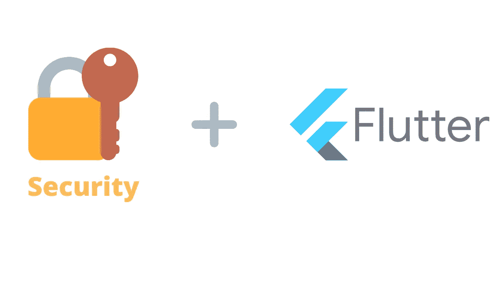
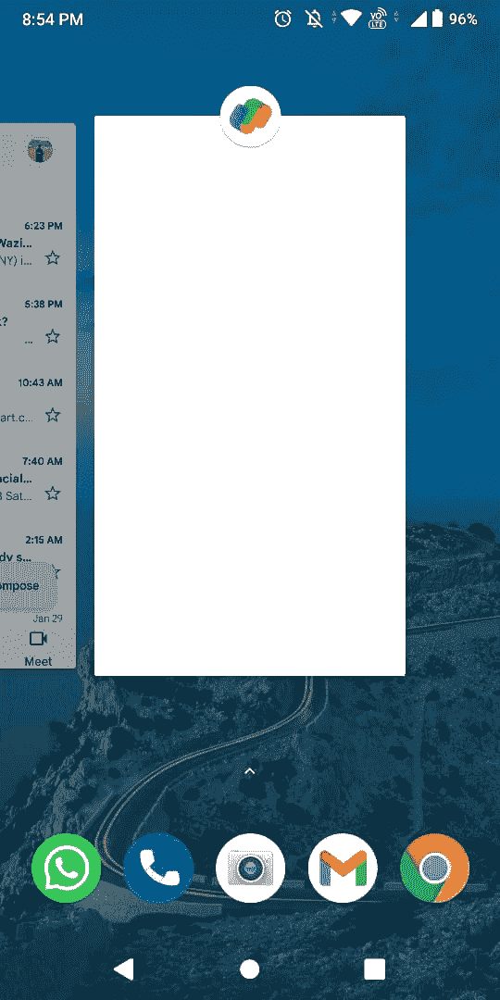
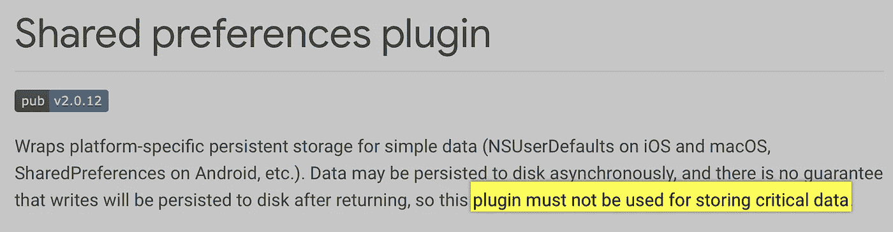

# 保护下一个 Flutter 应用的 5 个步骤

> 原文：<https://medium.com/nerd-for-tech/5-steps-to-secure-your-next-flutter-app-549def2428b3?source=collection_archive---------0----------------------->

## 在将应用程序发布到生产环境之前，保护应用程序是至关重要的



随着全球超过 200 万开发者的加入，Flutter 已经成为最流行的跨平台移动开发框架之一。在 2021 年下半年，Flutter 还宣布了 Flutter Web 和桌面的稳定版本，这增加了它的受欢迎程度。

作为开发人员，我们专注于代码，却常常忽略了应用程序的一个重要方面:**安全性**。确保你的应用程序是安全的，这与添加令人兴奋的新功能同样重要。当发布到生产中时，不安全的应用程序可能容易受到攻击，导致用户数据泄露或资源滥用，这可能代价高昂。

本文将讨论保护您的应用程序的五个步骤，这将使您的应用程序在受到攻击者攻击时能够站稳脚跟。如果你喜欢看视频，一定要看看下面的视频，更详细地分析这些步骤。

# 代码混淆

代码混淆是修改应用程序的二进制文件以使其更难被人类理解的过程。对你的应用程序进行逆向工程可以暴露 API 键、类、函数名和所有的字符串。这些信息对您的业务逻辑至关重要，并可能让攻击者获得敏感的用户数据。模糊处理将这些隐藏在您编译的 Dart 代码中，使攻击者难以对您的专有应用程序进行逆向工程。

*如果你有兴趣了解更多关于如何逆向开发一个 Flutter 应用程序的信息，请点击下面的链接—*

[](https://blog.tst.sh/reverse-engineering-flutter-apps-part-1/) [## 逆向工程颤振应用(第一部分)

### 第 1 章:从兔子洞开始这个旅程，我将介绍一些关于 Flutter 栈的背景故事以及它是如何工作的…

blog.tst.sh](https://blog.tst.sh/reverse-engineering-flutter-apps-part-1/) 

谢天谢地，Flutter 使得混淆应用程序变得非常容易。为了混淆你的应用程序，结合使用`--obfuscate`标志和`--split-debug-info`标志构建一个发布版本。

```
flutter build apk --obfuscate --split-debug-info=/<project-name>/<directory>
```

这将生成符号文件，然后可以使用下面的`flutter symbolize`来对堆栈跟踪进行模糊处理

```
flutter symbolize -i <stack trace file> -d /out/android/app.android-arm64.symbols
```

Android、iOS 和 MacOS 上的发布版本目前支持模糊处理。类似的，Flutter web 应用程序会自动缩小。

# 后台快照保护

当你的应用程序在后台时，你的应用程序最后状态的快照会自动显示在任务切换器中。虽然在应用程序之间切换很有用，但显示敏感的用户数据(如银行账户信息)是不可取的。以前见过这个功能吗？也许下面的图片会让你想起什么—



Google Pay 会隐藏敏感信息(在进行银行转账时),而 Gmail 会显示该应用的最后一张快照。

我们可以使用下面的插件来实现。

[](https://pub.dev/packages/secure_application) [## 安全应用| Flutter 包

### 这个插件允许你保护你的应用程序内容不被观看

公共开发](https://pub.dev/packages/secure_application) 

通常，重新打开应用程序需要用户在本地再次进行身份验证(例如，使用生物特征扫描)，这就引出了我们的第三点。

# 本地认证

本地身份验证是指用户的设备上身份验证。如果您的应用程序有订阅或支付功能，这是有益的，因为它在屏幕锁定后提供了一个额外的身份验证层。

为此，我们将在 iOS 上使用生物认证(触控 ID 或锁码)，在 Android 上使用指纹 API(在 Android 6.0 中引入)。下面的插件实现了 flutter 应用的本地认证。

[](https://pub.dev/packages/local_auth) [## local_auth | Flutter 包

### 这个 Flutter 插件提供了在本地设备上执行用户认证的方法。这意味着参考…

公共开发](https://pub.dev/packages/local_auth) 

# 安全存储

共享首选项是为 Flutter 应用程序存储简单键值对的最常见方式之一。然而，它也有一些风险—



1.  如果你看一下 pub.dev 中 shared_preferences 插件的自述文件，你会发现并不能保证它的写操作会被持久化到磁盘上。
2.  共享首选项或 SQLite 仍然会给关键用户数据带来另一个问题。由于数据没有加密，它可以在任何其他设备上打开，从而导致数据泄漏。我们可以使用下面这个插件来保证加密，它在 iOS 上使用 Keychain，在 Android 上使用 AESEncryption。

[](https://pub.dev/packages/flutter_secure_storage) [## 颤振 _ 安全 _ 存储|颤振包

### Flutter 安全存储提供 API 将数据存储在安全存储中。钥匙串用于 iOS，基于密钥库的解决方案…

公共开发](https://pub.dev/packages/flutter_secure_storage) 

# 生根或越狱保护

安卓设备可以 rooted，iOS 设备也可以越狱，去掉了厂商给用户设置的限制。这可能会引入影响您的应用程序或其数据的恶意软件。在这种情况下，您可能希望检测到这一点并采取相应的措施。

[](https://pub.dev/packages/flutter_jailbreak_detection) [## flutter _ 越狱 _ 检测| Flutter 包

### Flutter 越狱和 root 检测插件。这个插件包装了 Rootbeer 用于 Android 和 DTTJailbreakDetection…

公共开发](https://pub.dev/packages/flutter_jailbreak_detection) 

Flutter 越狱检测使用 Android 上的 [RootBeer](https://github.com/scottyab/rootbeer) 和 iOS 上的 [DTTJailbreakDetection](https://github.com/thii/DTTJailbreakDetection) 来检测你的应用程序当前是否运行在有根设备或越狱设备上。

所以，这是让你的 Flutter 应用程序更加安全和健壮的五个步骤。除此之外，请确保您正在保护应用程序和服务器之间传输的数据。您应该使用 SSL 或 TLS 加密，对网络流量进行限制，并确认您的应用程序的身份验证是可靠的。

# 结论

对于像 Flutter 这样不断发展的框架来说，谈论安全性是一个非常广泛的主题，不可能在一篇博客中概括。同样，无论你认为你的应用程序的安全性有多精确和完美，都不能保证你的应用程序不会被滥用或篡改。然而，作为开发人员，我们有责任在将应用程序发布到生产环境之前确保它尽可能的安全。

如果你以前在你的 Flutter 应用中使用过这些，或者有更多的建议，请在评论中告诉我！

在 Github 知识库中找到实现的代码

[](https://github.com/Imperial-lord/securing-flutter-apps) [## GitHub -帝国-领主/安全-颤振-应用程序

github.com](https://github.com/Imperial-lord/securing-flutter-apps) 

另外，你可以在 LinkedIn 上联系我

[](https://www.linkedin.com/in/ab-satyaprakash/) [## AB Satyaprakash

### 我是数学和计算机专业的毕业生，IIT·古瓦哈蒂。作为一名热情的程序员，我喜欢解决问题和…

www.linkedin.com](https://www.linkedin.com/in/ab-satyaprakash/) 

## 一如既往，祝你黑客生涯愉快！！！😃