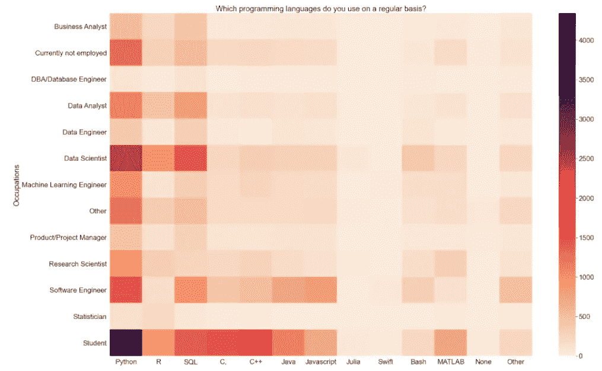
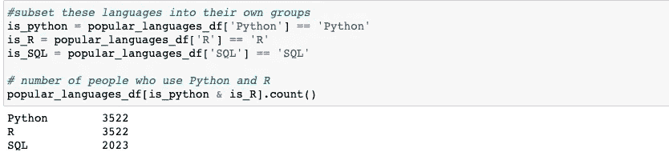
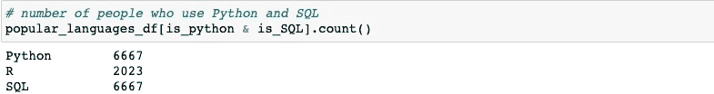
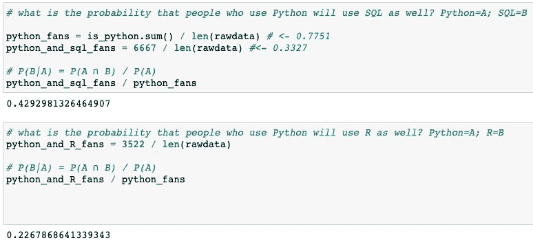
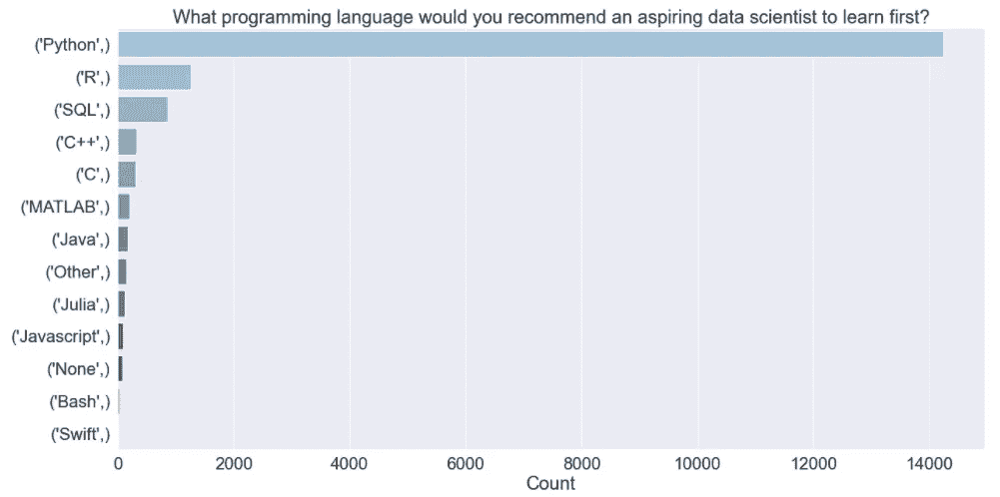
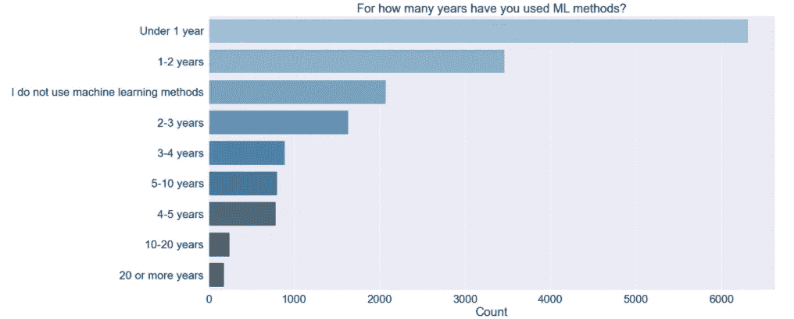
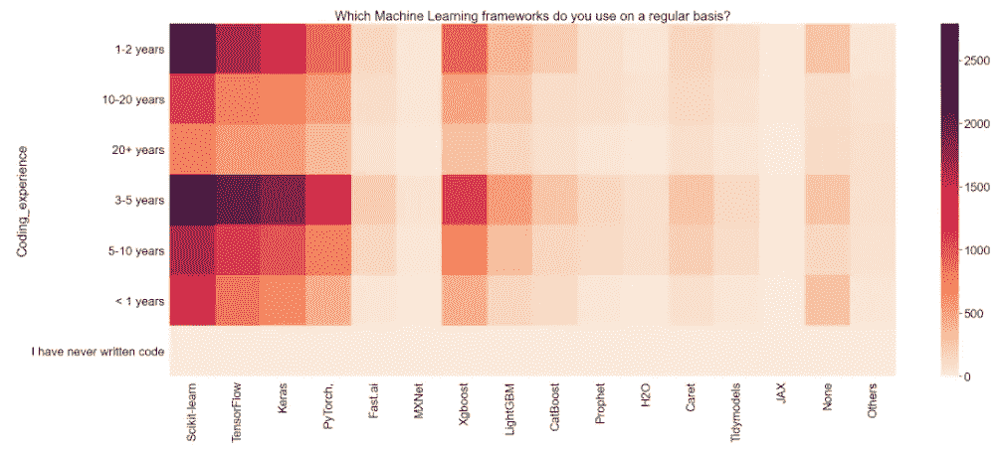
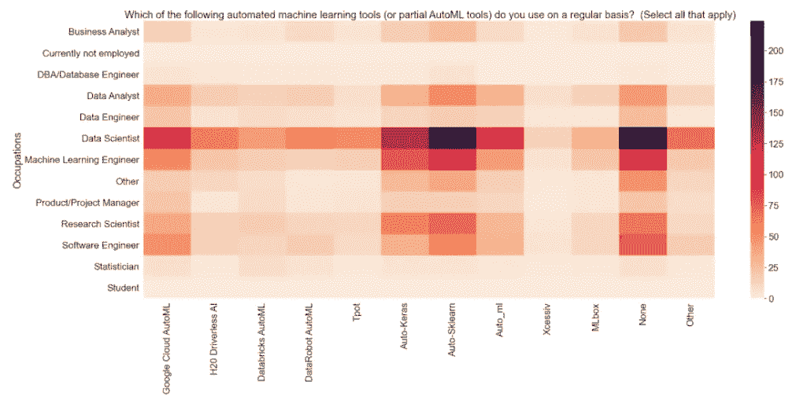
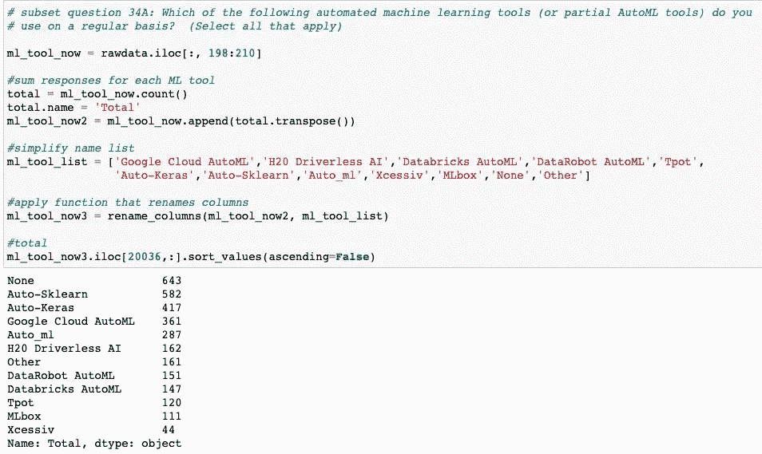

# 通过分析 Kaggle 的 2020 年机器学习和数据科学调查，我学到了 5 件事

> 原文：<https://medium.com/nerd-for-tech/5-things-i-learned-by-analysing-kaggles-2020-machine-learning-and-data-science-survey-63311fbe4345?source=collection_archive---------2----------------------->

休伊·费恩·泰

和格雷格·佩奇一起

自 2017 年以来，Kaggle 每年都通过一项旨在了解数据分析和建模领域总体趋势的大规模调查，征求其电子邮件订户、论坛成员和社交媒体关注者的意见。调查对象通常包括学生以及业务分析师、数据科学家、数据分析师、数据工程师等。通过分析对一些主题的问题的回答，例如从业者目前正在使用的机器学习工具，他们希望变得更加熟悉的工具，以及他们对有抱负的数据科学家的建议，我们可以收集关于数据科学社区主要趋势的有趣见解。

为了简洁起见，本文只考察了该平台 2020 年调查的几个方面。

1.  **Python 无论职业都称王称霸**

Python 是大赢家，有 15，530 名受访者表示他们经常使用它。这个数字代表了这个问题样本量的 80%。下面的热图强调了 Python 在本次调查的所有职业中的普遍性，这种普遍性强调了该语言的多功能性。

上图:作者图片

2.**与 Python + R 相比，人们经常使用 Python + SQL 的可能性高出近两倍**

当我们更深入地研究上面提出的问题*(‘你经常使用哪种编程语言？选择所有适用项)，*很明显，Python 和 SQL 是一种流行的组合，6667 人表示他们经常同时使用这两种语言。虽然可以在 R 中运行 SQL 查询，但在调查受访者中，R + SQL 配对的频率大约是 Python + SQL 配对的一半(22.7%对 42.9%)。

上图:作者图片

**3。** **学 Python**

鉴于 Python 在调查受访者中压倒性的受欢迎程度，很大比例的受访者强烈推荐它给有抱负的数据科学家也就不足为奇了。回答这个问题的 17821 人中有 14241 人提出了这个建议。

上图:作者图片

**4。在过去的五年里，机器学习从业者似乎有了很大的增长**

尽管机器学习研究自 20 世纪 50 年代以来就一直在进行，但一系列因素导致了它最近的受欢迎程度激增。首先，电脑更便宜，功能更强大。曾经需要专业昂贵设备的操作现在可以通过个人笔记本电脑进行。云计算基础设施变得更加先进和民主化。与此同时，数字革命带来的大数据规模使得企业能够比以前更快、更便宜地吸收和分析更多的数据点。

鉴于机器学习的复兴，只有 12.67%的受访者表示他们不使用机器学习方法也就不足为奇了。包括学生在内的大多数受访者在过去五年中都这样做过。

许多拥有五年或更少编码经验的受访者定期使用机器学习框架，如 Scikit-learn 和 TensorFlow*(分别有 6746 / 10250 名 Scikit-learner 用户和 4484 / 6934 名 tensor flow 用户)*。前者包含一个强大的 Python 工具库，可用于执行分类、回归和聚类等操作。后者是谷歌在 2015 年发布的开源库，被像 [AirBnB](https://www.youtube.com/watch?v=tPb2u9kwh2w) 这样的公司用来建立和训练模型，以解决图像分类等问题。

只有 3%的受访者表示他们不会经常使用机器学习框架。

上图:作者图片

**5。** **很难说自动或半自动机器学习工具是否仍然是一个利基工具包**

机器学习的一个挑战性方面是确定要使用的适当算法或工具，因为每种方法都有[权衡](https://ai.stanford.edu/~zayd/why-is-machine-learning-hard.html)。可以想象，这个迭代过程是资源密集型的，需要很长时间。然而，没有多少受访者表示他们定期使用自动/部分自动机器学习工具，如 [Auto SK Learn](https://machinelearningmastery.com/auto-sklearn-for-automated-machine-learning-in-python/) 、 [Google Cloud AutoML](https://cloud.google.com/automl) 和 [Auto-Keras](https://colab.research.google.com/github/phossen/autokeras/blob/master/AutoKeras.ipynb) ，尽管这些工具可以减少与模型开发相关的时间，并加快生产就绪模型的创建。

上图:作者图片

值得注意的是，到调查的这个点*(问题 34 问的是自动化或部分自动化的 ML 工具)*，不回答的比例在 95%以上。此时，许多受访者可能已经产生了一种调查疲劳的感觉。

上图:作者图片

感谢阅读。

*数据来源:* [*Kaggle*](https://www.kaggle.com/c/kaggle-survey-2020)