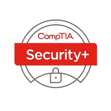

# 作为网络安全专业的学生，我希望知道的 5 件事

> 原文：<https://medium.com/nerd-for-tech/5-things-i-wish-i-had-known-as-a-cyber-security-student-e1204d0bc5c9?source=collection_archive---------10----------------------->

坦纳·琼斯[@技术专家](/@all-tech-guy)

图片:【https://unsplash.com/@jefflssantos 

作为一名刚刚从韦伯州立大学(Weber State University)获得信息管理学位的毕业生，我正在寻找全职工作，我发现自己缺乏获得第一份工作所需的必要技能。在科技领域，有无穷无尽的技能可以学习。只要在谷歌上简单搜索一下科技技能，你就会发现自己不知所措。应该学哪种编程语言？Python，Ruby，Java，JavaScript 还是 C？我需要学习一门编程语言吗？技术领域是巨大的，并将继续增长。

下面的 5 个建议是给那些目前正在学习信息技术并想在毕业前接触该领域的人的。出人头地。以后你会感谢自己的！

1.  找一两个实习机会。
2.  获得认证。
3.  关注科技新闻。
4.  像黑客一样思考。
5.  掌控你的学习。

#1:接触信息技术领域的最佳方式是通过实习获得实践经验。实习让你接触到现实世界的问题以及当前的技术。实习是一个学习和尽可能多地提问的机会。#1 提示:做一块海绵！吸收信息，学习新技能，提高你的市场竞争力。无论你想做什么工作，人际关系网都是取得成功的关键。你知道什么很重要，但你认识谁也很重要*。建立关系网，联系你的同事和主管。#2 提示:找一个导师！*

#2:在技术领域，认证是鼓励的，但不是 100%必要的。根据我的经验，大多数入门级的工作都需要初级证书，如安全证书或网络证书。原因是基础知识是关键。互联网上的一切都需要计算机网络知识和基本的安全威胁和影响。

一个很好的资源是:[刀子乐队教授](https://www.professormesser.com/)。

有免费视频和负担得起的学习指南，让你的学习更容易。安排一个日期[在这里](https://www.comptia.org/home)来评估你当前的理解，并创建你的学习时间表来准备通过测试。获取通过面试所必需的基础知识。

#3:科技世界的变化比其他行业快得多。了解当前的问题、政策和创新是非常重要的。热门话题是隐私、个人/用户数据、人工智能和电动/自动驾驶汽车。听播客是了解最新信息的好方法。你会喜欢自己做一些研究，但这里有一个我最喜欢的新闻网站列表:

 [## 边缘

### The Verge 成立于 2011 年，与 Vox Media 合作，涵盖了技术、科学、艺术…

www.theverge.com](https://www.theverge.com/)  [## TechRadar

### 关于技术产品、电脑、电脑、视频和小工具的新闻和研究…

global.techradar.com](https://global.techradar.com/es-us)  [## 产品评论、操作方法、交易和最新科技新闻

### 冷冻食品谬论？冠状病毒起源的故事并没有积累足够的证据表明冷冻食品…

www.cnet.com](https://www.cnet.com/) 

#4:像黑客一样思考的能力至关重要。要成为更好的安全专家，像坏人一样思考是很重要的。数据泄露正在增加，除非做出改变，否则只会继续增长。看看网络安全管理软件产品·哈克。这是影响美国政府和微软、思科等公司的最新一起黑客攻击。了解数据泄露是如何发生的至关重要！像黑客一样思考可以让你更好地保护自己免受攻击。开始像黑客一样思考的一个很好的工具是 [tryhackme](https://tryhackme.com/) 或 [hackthebox](https://www.hackthebox.eu/) 。这些平台允许你通过寻找漏洞并利用它们来进入系统来练习黑客攻击。这两个都是让你开始的好工具！

#5:在安全领域，掌控自己的学习是绝对必要的。新的威胁、技术和策略频繁出现，安全专业人员需要能够适应。在你的职业生涯中，你会不断学习。这是我在学校学到的最有价值的事情之一:学会爱学习。(说快 5 倍…)

感谢阅读！我希望这 5 个简单的提示能帮助你成为一名安全专家。