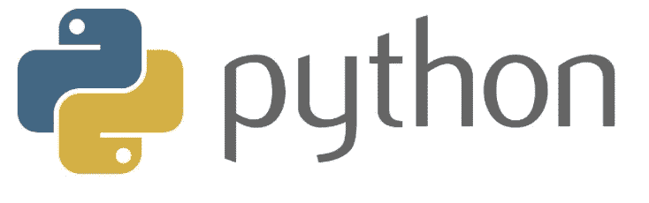

# 提升 Python 编程的 5 件事

> 原文：<https://medium.com/nerd-for-tech/5-things-to-know-to-master-python-902f431fab8e?source=collection_archive---------2----------------------->

## 掌握现代语言的特质:Python

Python 是解释型的，有趣的，最流行的，学起来也很有趣**新一代语言**

ython 是一个流行词。作为最受欢迎的现代语言，拥有最大的开发人员社区之一，并且能够执行机器学习，这使得 Python 与众不同，应该学习编程语言。按照定义，它看起来像是完美的编程语言，具有所有…