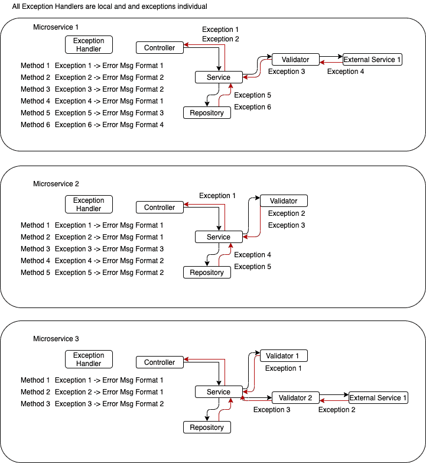
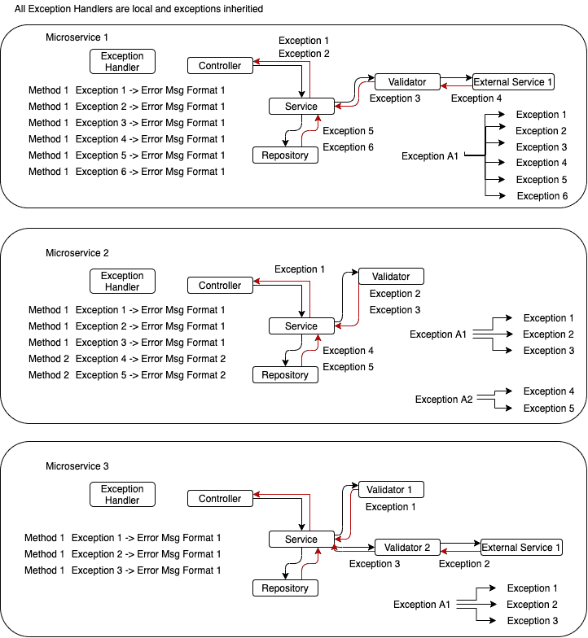
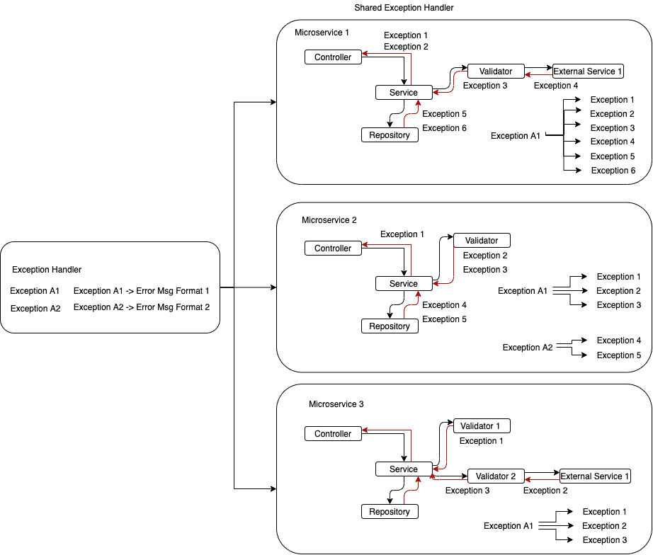

# 出色错误处理的五个步骤

> 原文：<https://medium.com/nerd-for-tech/5-things-you-need-to-do-to-achieve-consistent-error-handling-in-your-organisation-fcee79232ed?source=collection_archive---------19----------------------->

对于任何严肃的生意来说，一个至关重要的因素是清晰的沟通。

像工程中的大多数事情一样，这很难。它涉及几个到数百个工程团队，所有团队都试图在他们自己之间以及向他们的客户进行清晰和信息丰富的对话，讨论他们的服务中正在发生的事情以及他们下一步可以做什么。很难。

虽然实现有效沟通主要是一项人类和组织的工作，但你的技术堆栈能够也应该支持这种良好的行为。这篇博客文章提出了一个系统，可以解决一个巨大的通信馅饼切片。错误处理。

异常处理程序
实现错误处理的一致性并不容易，通常会导致代码重复、大量微服务、不一致的消息传递和潜在的 PII 泄漏。Eek！

但是通过一点巧妙的设计，解决这个问题会带来一个快速的胜利和一个很好的机会来标准化你的消息传递，保持你的微服务小并且简化你的开发者的生活。

异常处理程序将异常转换成消息。

```
@ExceptionHandler(NotCuteEnoughException.class)
ErrorResponse handle(NotCuteEnoughException e) {
return ErrorResponse
  .builder()
  .reason(ErrorCode.PET_NOT_CUTE_ENOUGH.value())
  .errorMessage("ya dog ugly")
  .build();
}@ExceptionHandler(TooFluffyException.class)
ErrorResponse handle(TooFluffyException e) {
 return ErrorResponse
   .builder()
   .reason(ErrorCode.TOO_FLUFFY)
   .errorMessage(”ya dog stinky”)
   .build();
}
```

像这样的解决方案很常见。他们的工作，并可能符合你的票的所有接受标准。如果我们得到一个与你的狗不够可爱或不够蓬松无关的错误，会发生什么？

您需要一个新的异常处理程序，它可以产生新的任意错误响应和错误响应格式。下一个例外是什么？另一个。

很难在一篇简短的博客文章中说明这种方法到底有多大的不可扩展性。如果我决定遵循 CPRS 模式，将微服务一分为二，会发生什么？这是一个潜在的重复。如果我们需要调用一个外部的“宠物验证服务”，而这个调用是由 8 个微服务发出的，会发生什么？另一套 8 个复制品。我可以继续一段时间，但关键是它变大了。



**第一步:从您的异常中引用数据** 这里第一个也是最明显的一点是，您的异常可以保存数据。通过您的异常并使其更加通用，我们可以快速将三个异常处理程序合并为一个。

```
class PetAintRightException extends RuntimeException { 
ErrorCode errorCode;PetAintRightException(){
    super("Somethings not quite right!");
    this.errorCode= ErrorCode.PET_AINT_RIGHT;
  }
}@ExceptionHandler(PetAintRightException.class) 
ErrorResponse handle(PetAintRightException e) {
 return ErrorResponse
   .builder()
   .reason(e.getErrorCode())
   .errorMessage(e.getMessage())
   .build();
}
```

现在，我们只有一种方法来处理所有与宠物相关的问题，不需要每次遇到新的与宠物相关的错误时都创建一个新的异常处理程序。但也没那么描述性吧？这里究竟出了什么问题？宠物不够可爱吗？不够蓬松？太蓬松？谁知道呢？

通过使用一般异常，很明显我们不能真正得到更具体的错误消息或错误代码。

使用继承来组织你的异常
使用继承来处理异常有几个主要的好处。

我们可以使用继承来针对不同的异常使用相同的处理程序。

```
**--- Exceptions ---** abstract class PetAintRightException extends RuntimeException {
ErrorCode errorCode;PetAintRightException(String message, ErrorCode errorCode) {
  super(message)
  this .errorCode = errorCode
 }
}class PetNotCuteEnoughException extends PetAintRightException {PetNotCuteEnoughException (String pet) {
   super(pet + “not cute enough!”), ErrorCode.PET_NOT_CUTE_ENOUGH)
  }
}class PetNotFluffyException extends PetAintRightException {PetNotFluffyException(String pet) {
   super(pet + “is not fluffy enough!”), ErrorCode.PET_TOO_BALD)
  }
}**---- Handler ---**@ExceptionHandler(PetAintRightException.class) 
ErrorResponse handle(PetAintRightException e) {
 return ErrorResponse
   .builder()
   .reason(e.getErrorCode())
   .errorMessage(e.getMessage())
   .build();
}
```

不错！现在，处理程序将异常转化为错误，而不必硬编码任何东西！



正如您在上面看到的，我们通过共享一个处理程序获得了一致的消息格式，但保留了对带有自定义异常的消息的控制。

虽然这个解决方案的方法更少，看起来更好，但它仍然不完美。如果我们公开的 REST 端点是面向公众的，我们需要隐藏 fidos PII 怎么办？

**第三步:根据受众定位你的继承结构**

```
abstract class PetCustomerException extends PetException {PetCustomerException(String pii, String message,ErrorCode ec) {
  super(**RandomizationService.randomize(pii)** + message);
  this .errorCode = errorCode;
  }
}abstract class PetStoreOwnerException extends PetException {PetStoreOwnerException(String pii, String message, ErrorCode ec) {
  super(pii + message)
  this .errorCode = errorCode;
  }
}PetExpiredCustomerException extends PetCustomerException {

  PetHasExpiredCustomerException(String name) {
    super(name, “ has moved to a nice farm up state!"), ErrorCode.PET_MOVED_UPSTATE);
  }
}class PetExpiredStoreOwnerException extends PetStoreOwnerException {

PetHasExpiredStoreOwnerException(String name) {
    super(name, “ has expired!”, ErrorCode.PET_DEAD);
  }
}
```

这个方案稍微*大一点*，但是这是无法避免的。从前端客户端保护细节并不是一件好事。你想想，处理员只有一个工作。通知消息的接收者哪里出错了以及如何处理。因此，为每种类型的受众配备一个处理程序代表了优秀的凝聚力。虽然这些错误可以很好地分为“面向客户的”和“非面向客户的”，但是没有理由就此止步。您可以很容易地将其分解为“StoreToStoreExceptions、WebsiteExceptions、MobileExceptions、ContentManagerExceptions”以及您可以想象出的许多类型的客户端。

但房间里还有一头大象(双关语)。如果我们需要从外部验证宠物 id 怎么办？还是把外部 id 翻译成内部 id？如果我们从公司的 15 个不同的微服务中调用这个服务会怎么样？

**步骤 4:将抽象异常和异常处理程序发布为可共享库**

错误处理是许多级别的共享库的一个很好的候选，我可以在另一篇文章中详细讨论。它具有很强的内聚性、最小的依赖性、松散耦合性和非单调性。它还代表了每个微服务都需要做的事情，并控制着作为开发人员您并不真正想要关心的事情，但如果您真的需要，可以通过覆盖来轻松地重新获得控制权。

有了中央错误处理库，你至少可以让每个微服务遵循公司指定的错误处理消息格式。你得到的最多是一个超级干净的开发体验，让你以最小的努力获得最大的控制权，更短的产品开发生命周期，以及组织中所有团队熟悉的格式。



**第五步:对你组织中的错误进行分类** 在一个共享库中，很容易找到一组类似于 HTML 的有意义的错误代码。

```
PS-4041 Pet not found because it ran away (PS-4041 runbook)
PS-4042 Pet not found it was taken already (PS-4042 runbook)
PS-4043 Pet not found because its living with a nice farmer up state (PS-4043 runbook)
```

这有助于创建语义，将错误链接到您的操作手册，并在整个组织中创建一致的信息。虽然这一过程在整个组织中很难管理，但一旦它到位，它确实有助于为您的客户和公司内部创造清晰度。

# **结论**

在组织层面上实现一个错误处理库会给你带来:

1.  更精简、更性感的微服务
2.  减少后端程序员、产品负责人和团队领导的工作量
3.  组织内部问题的更好分组和语义含义
4.  与客户和公司内部的沟通更加一致。

请将此分享给你所有的媒体朋友，点击下面的按钮，让它传播得更广。此外，添加您用来使微服务更小的任何其他技巧！

如果你喜欢这篇文章或者想给我很多钱，请在 [LinkedIn 这里](https://www.linkedin.com/in/gary-cassar-55648b67)加我。