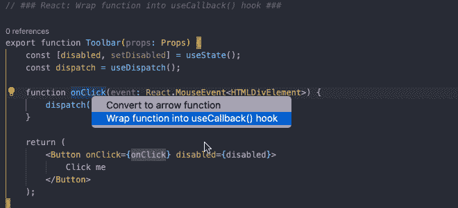
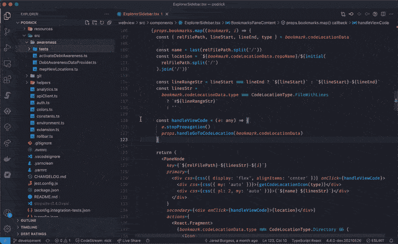

# 5 VS 简化重构的代码扩展

> 原文：<https://medium.com/nerd-for-tech/5-vs-code-extensions-that-make-refactoring-easy-92964ae86edf?source=collection_archive---------6----------------------->

图像由约书亚阿拉贡在 Unsplash。

如果你正在寻找清理我们的代码、降低复杂性和改进功能的方法——这些重构扩展将帮助你走得更快。

**1。** [**JavaScript 助推器**](https://marketplace.visualstudio.com/items?itemName=sburg.vscode-javascript-booster)

JavaScript Booster 是一个代码重构工具，它具有几个编码动作，例如将 var 转换为 const 或 let，删除冗余的 else 语句，合并声明和初始化。只要注意左边的灯泡并按下它，就可以了解如何在光标下转换代码。

**2。** [**步长**](https://bit.ly/3ytcHrS)

Stepsize 允许您标记并报告技术债务和代码以进行重构。如果你遇到需要重构的代码，但你没有时间马上去做，你可以让它可见，并直接在 VS 代码中提出问题。

*   在您工作和创建问题时，为代码添加书签
*   标记您的问题
*   带他们参加 sprint 规划会议，与你的队友分享知识

**3。** [**Abracadabra，重构这个！**](https://marketplace.visualstudio.com/items?itemName=nicoespeon.abracadabra&ssr=false#overview)

有了 Abracadabra，你可以在 VS 代码中快速安全地重构现有代码。

VS 代码附带了一些基本的重构。Abracadabra 为你的编辑器提供了快捷方式，可以立即触发最有用的编辑器，快速修复，在适当的时候提出重构建议，根据你的需要定制 UX 的选项，以及可以使用的重构。js，。jsx，。ts，。tsx 和。vue 文件。

**4。** [**拾遗**](https://marketplace.visualstudio.com/items?itemName=wix.glean)

Glean 为您的 React 代码库提供了重构工具:将 JSX 提取到一个新组件中，将类组件转换为功能组件，用钩子进行包装。它允许将 JSX 提取到新组件中，将类组件转换为功能组件，反之亦然，用条件包装 JSX，同时重命名状态变量及其设置器，等等。

**5。** [**索伦特**](https://marketplace.visualstudio.com/items?itemName=SonarSource.sonarlint-vscode)

SonarLint 让您在编码问题出现之前就对其进行修复:SonarLint 就像拼写检查器一样，在您编写代码时突出显示错误和安全漏洞，并提供清晰的修复指导，因此您甚至可以在代码提交之前就对其进行修复。VS 代码中的 SonarLint 支持 JavaScript、TypeScript、Python、Java、HTML & PHP 代码的分析。

