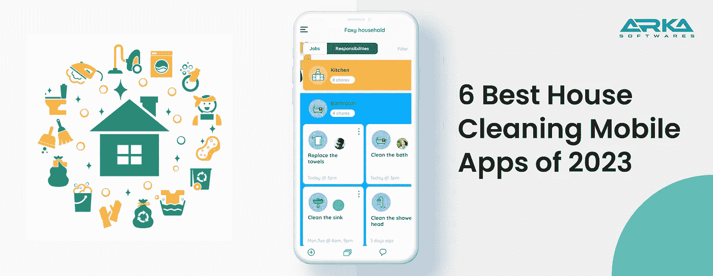

# 2023 年 6 款最佳房屋清洁应用

> 原文：<https://medium.com/nerd-for-tech/6-best-house-cleaning-apps-of-2023-bd7add3d6869?source=collection_archive---------4----------------------->

随着房屋清洁解决方案和服务的引入，家庭服务业务正在扩大。经证实的市场分析估计，2018 年全球验房市场价值**2816.5 亿美元。**

2019-2026 年，预计增长 18.91%，达到[**11334.0 亿美元**](https://www.verifiedmarketresearch.com/press-release/home-services-market-2/) 。面对繁重的工作，接连不断的儿童活动，以及一长串的家务，很容易推迟打扫房间。

是的，你可以雇佣清洁工。然而，你可能仍然需要准备雇佣一个清洁工。

# 六大家政应用

没有什么比在一个干净整洁的房子里放松更好的了。但是定期监控所有的家务可能需要大量的工作。一个家政调度应用程序可以通过提供额外的服务，如房屋清洁计划、推荐和布局，帮助你增加客户并增加收入。

以下是适用于 Android 和 iOS 智能手机的 [**顶级房屋清洁应用**](https://www.arkasoftwares.com/blog/best-cleaning-service-apps-in-dubai/) ，帮助你掌控一切，从清洁室内装潢到处理堆积如山的衣物。

## 1- [**我们家**](https://play.google.com/store/apps/details?id=com.getfairshare.ourhome) **(是家庭最好的家政 app)**

当保持房子整洁不仅仅是一个用户的职责时，你需要一个应用程序来承担家务和其他责任。

一款软件允许你委派任务，并为完成任务的家庭成员提供报酬。添加一个清洁任务，交给他们，观察他们选择一个奖励。优秀的家庭和大家庭手机 app 是我们的家。

您可以交换有关任务的消息，创建任务提醒，查看整体进度，将东西添加到标准购物清单，以及在不同设备之间进行同步。完成一项工作后，点击泡泡，列出一份好的待办事项清单，把它划掉。

**优点**

*   简单易用
*   非常适合整个家庭，包括孩子。
*   免费且无广告。

**缺点**

*   没有可用的日历视图。
*   要访问该应用程序，孩子们需要一个电子邮件帐户。

## **2- Do！(是最好的家务工具！)**

一份家庭待办事项清单必须简单明了，方便快捷，并且随时可用。凭借其笔和纸音频效果，该做！**家庭清洁 app** 模拟传统待办事项的外观和体验。此外，通过在智能手机上使用 Today 应用程序，创建和查看活动变得非常简单。

将颜色编码方案添加到您的待办事项列表中进行管理。这将很容易区分清洗厨房和浴室的工作。

使用应用内支付，做到！可在 iOS 和 Android 智能手机上免费下载。广告被删除，无限的任务组可用于高级订阅。

**优点**

*   极简风格。
*   简单快速的工作添加。
*   您设备的主页应该有一个小部件。

**缺点**

*   要完成活动，需要双击。
*   许多广告，如果你购买，让他们删除。

## 3- [**家居清洁 App**](https://apps.apple.com/app/home-cleaning/id896122367) **(最简单的家政 App)**

你是否试图在预算紧张的情况下保持整洁，并在搜索**最佳房屋清洁应用**？这将有助于如果你有家庭清洁软件，因为它使清洁更容易在有限的收入和很少的资源。

借助对账单，家庭清洁软件会让你列出待办事项和预算。

因此，它会让你知道你是在挥霍还是支出不足。您可以添加参与者或用户的联系号码，使用起来很简单。

你也可以使用电子邮件来保存和分发清单。例如，你可以给其他人发邮件，告诉他们如何清洁。

**优点**

*   方便用户。
*   许可证可以保持预算。
*   几个标准清单。
*   包括联系人
*   通过电子邮件保存和分发数据。

**缺点**

*   仅在苹果版本中提供。
*   没有举报的选择。

通过应用内支付，iOS 设备可以免费下载房屋清洁服务。

## 4-****(给孩子做家务)****

**你的孩子做家务是为了换取回报吗？和你的孩子一起维护家庭会给他们需要的技能。**

**只需一个应用程序，Homey 简化了分配工作和直接发送报销。**

**每个家庭成员都有一个他们可以管理家务的个人资料。登录后，孩子们可以访问分配给他们的任务、金钱等。**

**教育孩子关于责任和金钱的理想应用是这个。有了 Homey，你可以鼓励孩子做家务，比如割草、倒垃圾或打扫房间。**

**为了教育孩子家庭中的每个人都必须参与到家庭中来，你也可以分配必须完成的任务。**

**通过应用内支付，Homey 可以在 iOS 和 Android 智能手机上免费下载。您必须每月支付 4.99 美元或每年支付 49.99 美元来获得标准功能和额外的近亲。**

****优点****

*   **为每个使用该应用的人快速制定目标。**
*   **转移完成任务的津贴或奖励需要在应用程序内支付。**
*   **儿童友好型。**

****缺点****

*   **有一个经常性或每年的会员需求，因为应用程序运行所需的财务连接需要它。**
*   **只有几个免费功能。**

## **5- [**洗衣日**](https://apps.apple.com/app/laundry-day-care-symbol-reader/id974530923) **(爱护你的衣服吧)****

**你可能注意到了你衣服的洗衣标签上的一些符号。您可以使用此应用程序来检测这些迹象，并根据您的选择接受护理建议。**

**你将能够更好地确定你的衣服需要清洗的种类。例如，你可能需要知道在洗衣服的时候是用冷水还是热水洗衣服。在这种情况下，洗衣房干洗店会伸出援手，提供建议。**

**即使是精心挑选的符号也会提供护理建议。对于苹果设备,《洗衣日》的下载价格为 0.99 美元。**

****优点****

*   **使用内置扫描仪读取服装标签。**
*   **解读衣服上的洗涤符号。**

****缺点****

*   **在显示器上，图标很小，阅读起来很困难。**
*   **不是免费版。**

## **6-****(最棒的日常家务任务跟踪器)******

****良好保养的基础是养成良好的习惯。你希望每天清洗厨房吗？当你收到邮件时，你想要分类它吗？使用 Done app，你可能会每天保持一个整洁的房子，它可以记录这些做法。****

****你输入你想要养成的习惯，并在习惯跟踪器中设定你想要练习的频率。该应用程序会跟踪你的进度，并在需要添加内容时通知你。****

****为了确定需要改进的地方，您可以随着时间的推移监控您的模式。对于 iOS 设备，Done 可以通过应用内购买免费下载。****

******赞成者******

*   ****帮助你逐渐养成良好的清洁习惯。****
*   ****使用您的条目轻松跟踪您的习惯。****

******缺点******

*   ****学习如何有效地利用界面需要一些练习。****
*   ****不是安卓应用。****

# ****应该如何制定清洁计划？****

****需要对房屋清洁计划进行系统的组织，允许消费者决定他们希望如何清洁房屋——通过区域、公寓或收尾工作。****

****至关重要的是要考虑他们的日常工作，以提供最好的清洁建议和设计。调查他们希望多长时间做一次家务是必要的。****

****需要仔细的研究和卓越的客户服务来创建一个提供最佳日程和适应性的日历。****

****保持你的房子干净，足以在任何特定的一天的任何特定的时刻容纳你，这就是它的全部。这会让你过上你想要的生活，而不用担心你必须完成的任务。****

# ****结论****

****根据 [Technavio](https://www.technavio.com/report/online-on-demand-home-services-market-size-industry-analysis) 的分析，2021 年**到 2025 年**之间，按需家庭服务的世界市场预计将超过**47，300 亿美元**。以此图为指导。****

****用户经常需要更多时间来做家务和清洁工作。每个人都关心其他几项任务，这使得管理日常家务变得困难。****

****这构成了问题的根源。这就是一款**家庭清洁 app** 进入我们生活的点。****