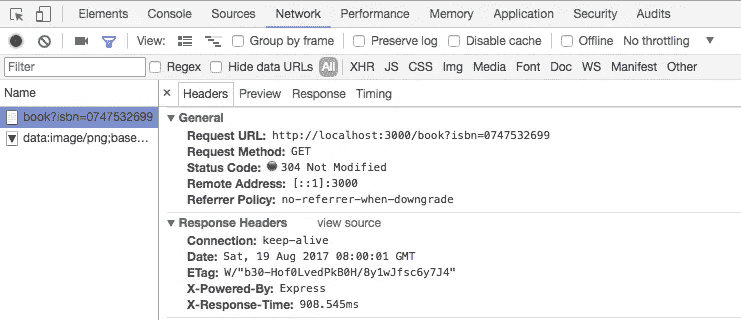
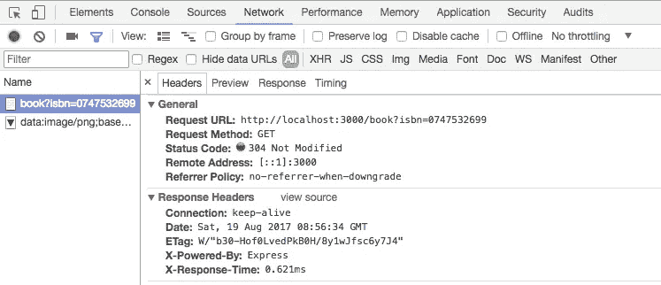
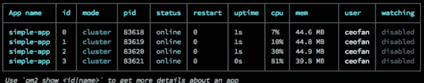

# 提升节点的 6 个技巧。Js 性能

> 原文：<https://medium.com/nerd-for-tech/6-tips-to-boost-node-js-performance-32fd05ab9809?source=collection_archive---------1----------------------->


近年来，JavaScript 已经从一种卫星语言变成了许多技术项目的核心。越来越多的开发者不仅在前端也在后端采用了这种技术，根据 [StackOverflow](https://insights.stackoverflow.com/survey/2019#technology-_-programming-scripting-and-markup-languages) 或者根据 [Tiobe](https://www.tiobe.com/tiobe-index/) 的说法#7，这使它成为世界上最受欢迎的语言(显然 JS 的人使用了很多 StackOverflow，呵呵)。

JavaScript 是学习基础的简单语言(斯坦福是这么说的！)和 Node.js 一起让你构建各种应用。

然而，掌握 JavaScript 和 Node.js 并不是那么简单，在今天的文章中，我想为您带来 6 个性能技巧/提示/秘密，供您应用到您的 Node.js 项目中。

我们要学习的技巧是:

1.  **缓存**
2.  **指标**
3.  **异步架构**
4.  **使用现代协议**
5.  **使用集群**
6.  **监控应用**

# #1 —缓存

在应用程序中使用缓存层有助于提高访问用户请求和/或应用程序需要的循环数据的速度，Node.js 中最常用的缓存机制形式之一是 Redis。

[Redis](https://redis.io/) 是一种内存存储机制，可以用作数据库、缓存和消息代理。它支持字符串、哈希、列表、集合、有序集、位图、日志、地理空间索引和数据流等数据结构。还有一个场合，我想给大家带来一个 Redis 教程。

现在，在不使用 Redis 的情况下比较下面的代码。这是一个使用 Google Books API 的客户端，总是会获得书籍:

```
*'use strict';**//dependencies****const*** *express = require('express');****const*** *responseTime = require('response-time')****const*** *axios = require('axios');****var*** *app = express();**//creates a middleware to capture the response time**app.****use****(responseTime());****const*** *getBook = (req, res) => {**let isbn = req.query.isbn;**let url = `https://www.googleapis.com/books/v1/volumes?q=isbn:${isbn}`;**axios.get(url)**.****then****(response => {**let book = response.data.items**res.send(book);**})**.****catch****(err => {**res.send('Book not found');**});**};**app.get('/book', getBook);**app.listen(3000,* ***function****() {**console.log('Server on port 3000!')**});*
```

这段代码的性能还不错，去 Google 一下得到这个信息用了不到 1s 的时间:



现在，相同的代码，但是使用 Redis，创建一个中间缓存层:

```
*‘use strict’;****const*** *express = require(‘express’);****const*** *responseTime = require(‘response-time’)****const*** *axios = require(‘axios’);****const*** *redis = require(‘redis’);****const*** *client = redis.createClient();****var*** *app = express();**app.****use****(responseTime());****const*** *getBook = (req, res) => {**let isbn = req.query.isbn;**let url = `https://www.googleapis.com/books/v1/volumes?q=isbn:${isbn}`;****return*** *axios.get(url)****.then****(response => {**let book = response.data.items;**// Set the isbn string as our cache key. Content is the title.**// Cache expiration for 1h (60min x 60s)**client.setex(isbn, 3600, JSON.stringify(book));**res.send(book);**})****.catch****(err => {**res.send(‘Book not found !!!’);**});**};****const*** *getCache = (req, res) => {**let isbn = req.query.isbn;**//Check cache data first**client.get(isbn, (err, result) => {****if*** *(result) {**res.send(result);**}* ***else*** *{**getBook(req, res);**}**});**}**app.get(‘/book’, getCache);**app.listen(3000,* ***function****() {**console.log(‘Server on 3000!’)**});*
```

它们之间的区别在于，在第二段代码中，我总是根据 ISBN 检查缓存中是否已经有了书名。如果我有它，我返回缓存中的内容，否则，我将 Google 它，除了返回之外，我还将它保存在缓存中，以便以后更快地查询。

结果，当数据已经被缓存时，速度快得惊人，不到 1 毫秒。是的，不到一毫秒！！！



# #2 —索引

任何曾经使用过数据库的人都一定听说过索引。即使它是所有主索引/主键中最基本的。但是，在实际应用中，这往往是不够的。

我们以 MongoDB 为例，这是一个经常与 Node.js 结合使用的 NoSQL 数据库。在与他谈论索引之前，我们先了解一下如何了解他的集合是否需要新的索引。为了分析 MongoDB 中查询的性能，我们使用解释函数，如下所示:

```
*db.users.find({email: 'user@email.com'}).explain("executionStats")*
```

查询将被执行，作为回报，我们将获得其计划和执行的数据。

```
*db.users.find({email: 'user@email.com'}).explain("executionStats")**{**"queryPlanner" : ...**},**"winningPlan" : {**"stage" : "COLLSCAN",**"filter" : {**"email" : {**"$eq" : "user@email.com"**}**},**"direction" : "forward"**},**"rejectedPlans" : [ ]**},**"executionStats" : {**"executionSuccess" :* ***true****,**"nReturned" : 1,**"executionTimeMillis" : 0,**"totalKeysExamined" : 0,**"totalDocsExamined" : 1039,**"executionStages" : {**...**},**...**}**},**"serverInfo" : {**...**},*"ok" : 1}
```

从上面的摘录中，有两个要点需要分析:

*   **nReturned** :返回的文档数，本例中只有 1 个；
*   **totalDocsExamined** :为找到我们想要的东西而扫描的文档总数，在本例中是 1039；

你理解这出戏吗？MongoDB 必须一个接一个地查看 1039 个文档，才能找到我们想要的东西！

下面是用户集合的电子邮件字段中的快速索引创建代码:

```
*db.getCollection("users").createIndex({ "email": 1 }, { "name": "email_1", "unique":* ***true*** *})**{**"createdCollectionAutomatically" :* ***false****,**"numIndexesBefore" : 1,**"numIndexesAfter" : 2,**"ok" : 1**}*
```

相同查询的结果，1 个文档被查询，1 个被返回:

```
*db.users.find({email: 'user@email.com'}).explain("executionStats")**{**"queryPlanner" : ...,**"winningPlan" : {**"stage" : "FETCH",**"inputStage" : {**"stage" : "IXSCAN",**"keyPattern" : {**"email" : 1**},**"indexName" : "email_1",**"isMultiKey" :* ***false****,**"isUnique" :* ***true****,**...**}**},**"rejectedPlans" : [ ]**},**"executionStats" : {**"executionSuccess" :* ***true****,**"nReturned" : 1,**"executionTimeMillis" : 0,**"totalKeysExamined" : 1,**"totalDocsExamined" : 1,**...**}**}**},**"serverInfo" : {**...**}*
```

关于执行时间，两者都是瞬时的(executionTimeMillis: 0)，但是因为基本上没有什么数据。在巨量(大数据)中，时差也会很明显。

# #3 —异步架构

异步编程是为了理解每件事都有它的时间，但这并不意味着我们应该让我们的用户等待一个答案。Node.js 为 JavaScript 世界带来了默认的异步编程模型，包括回调、承诺和异步/等待。然而，仅仅使用这些特性，而不考虑你的体系结构，使其异步工作，会留下很多“性能在桌面上”。

首先，我们来谈谈异步处理。

如果您的后端对请求有很高的需求，并且每个请求都需要一定量的处理才能返回，那么您不应该同步响应。每个尝试过同步处理大量并发请求的人都会遇到同样的问题:请求丢弃、超时溢出和用户不满意。你应该使用专业的排队解决方案，如 Kafka、RabbitMQ 或 AWS SQS(点击名称查看教程)。或者，将这个解决方案带到分布式系统的另一个层次，使用无服务器在后台处理请求的结果。

使用这些解决方案，您接收请求，将其排队等待处理(这将由使用队列的工作人员来完成)，并对稍后将返回请求的用户做出响应。当工作人员完成他们的工作时，是时候给用户一个更好的响应了。

但是如何向用户返回异步响应呢？

这就是我想提出的第二点:异步数据。

当你想向用户发送消息/数据/任何东西，而不需要他不时主动向你发送请求(著名的轮询)时，最有效的方法是与他建立一个开放的通信通道，这通常是通过 WebHooks、WebSockets 或 Socket.io 等技术实现的。

例如，一旦建立了带有 WebSockets 的客户机-服务器通道，服务器就可以将请求与数据流相关联，并且每当有新闻时，就在需要的确切时刻轻松地将其发送给一个或多个客户机，从而产生实时更新的愉快感觉。

请注意，这种架构的实现和实施并不简单。此外，对于小项目来说，这没有意义，因为对于请求来说，要经历更多的负载和层次，这比仅仅接收请求和返回响应要花费更多的时间。然而，由于我上面提到的问题，对于大型应用程序来说，这些最初的损失得到了很多回报，此外还保持了很高的信心，即收到的所有内容迟早都会得到处理。

# # 4 —使用现代协议

HTTP/2 通常称为 SPDY，是 IETF HTTP 工作组开发的最新 web 标准协议。HTTP/2 使网络浏览更快、更容易，并且使用更少的带宽。它关注性能，尤其是解决在最常用的 HTTP，1 版本中仍然存在的问题。x.

目前，像谷歌、脸书和 Youtube 这样的大公司已经在他们的页面上实现了这个协议，并鼓励越来越多的开发者使用它。它比通常的要复杂一些，例如，它需要一个加密连接(SSL)。

下面是 Node.js 中的一个 HTTP/2 服务器的例子，来自[官网](https://nodejs.org/api/http2.html):

```
***const*** *http2 = require('http2');****const*** *fs = require('fs');****const*** *server = http2.createSecureServer({**key: fs.readFileSync('localhost-privkey.pem'),**cert: fs.readFileSync('localhost-cert.pem')**});**server.on('error', (err) => console.error(err));**server.on('stream', (stream, headers) => {**// stream is a Duplex**stream.respond({**'content-type': 'text/html',**':status': 200**});**stream.****end****('<h1>Hello World</h1>');**});**server.listen(8443);*
```

要在代码中生成所需的证书(PEM 文件),可以通过命令行使用 OpenSSL:

```
***openssl*** *req -x509 -newkey rsa:2048 -nodes -sha256 -subj '/CN=localhost'**-keyout localhost-privkey.pem -out localhost-cert.pem*
```

另一个技巧是查看 CPRM，这是一个基于 HTTP / 2 的实现，越来越受微服务的欢迎。

# #5 —使用集群

默认情况下，Node.js 运行在一个线程上，因此运行在一个处理器内核上，如果它运行在一个有多个内核的机器上，效率会很低。

但这已经很久没有通过在 Node.js 中实现线程集群来解决了，它允许您创建共享服务器端口的子进程，允许 Node 在具有多种颜色的服务器上处理大量请求。

当我们使用 PM2 时，我们可以上传一组相同的进程，而无需对您的代码进行任何更改，只需在使用该实用程序启动您的进程时传递一个参数:

```
***pm2******start*** *app.js -i 0*
```

因此，PM2 会自动将你的应用程序缩放到运行它的机器的所有颜色。



值得注意的是，在集群中上传应用程序需要一些小心，因为，例如，它们不能共享内存中的数据，只能使用公共服务，如数据库、Redis、队列等。对于任何想要开发集群的人来说，一个技巧是遵循 12 因素应用程序方法。

# #6 —监控应用

对生产应用程序影响最大的事情之一就是程序错误。不仅仅是因为它们破坏了用户体验，还因为它们降低了应用程序本身的性能，因为错误会导致线程中断，产生副作用，并且通常是不可见的。

记住这一点，最后一个技巧是最重要的:监控你的应用程序！

当我谈到监控时，它不仅仅是查看服务器上的内存和 CPU 使用情况，而是使用一些专业的监控解决方案，如 New Relic、Dynatrace、Stackify、Ruxit、LogicMonitor 和 Monitis。

至少从系统的角度来看，只有使用实时监控工具，您才能确保您的应用程序运行良好，并且您的用户得到良好的服务。

如果你不能租用这样的工具，我们至少需要用日志暴露错误。我说的不是 console.log，而是使用更专业的日志包，比如 Winston，我在博客上做了一个教程(点击名称)。

下面是使用 Winston 的一个基本示例:

```
***const*** *winston = require(‘winston’);**let logger =* ***new*** *winston.Logger({**transports: [****new*** *winston.transports.File({**level: ‘verbose’,**timestamp:* ***new******Date****(),**filename: ‘filelog-verbose.log’,**json:* ***false****,**}),****new*** *winston.transports.File({**level: ‘error’,**timestamp:* ***new******Date****(),**filename: ‘filelog-error.log’,**json:* ***false****,**})**]**});**logger.stream = {**write:* ***function****(message, encoding) {**logger.info(message);**}**};*
```

如果可能的话，我特别发现将日志存储在云中比将日志文件存储在服务器上更实际。为此，我推荐 AWS CloudWatch 日志，Winston 也支持它。

监控范围内的另一个好的技巧是定期对您的应用程序进行压力测试。